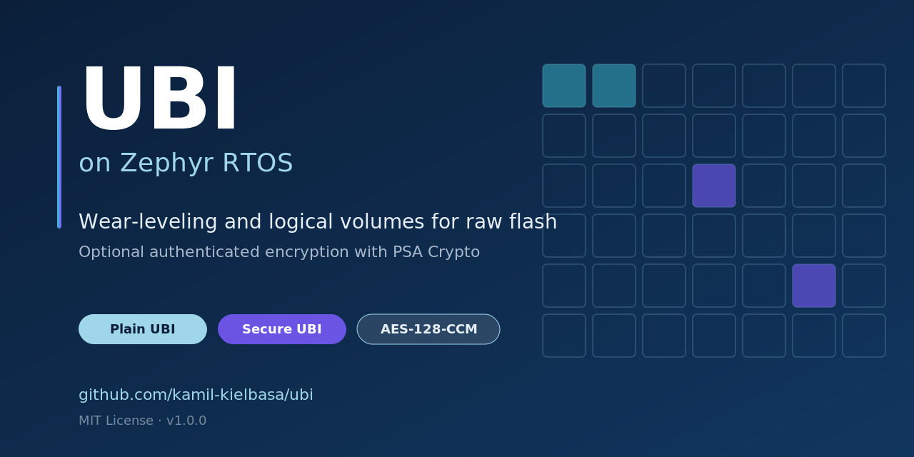

# UBI on Zephyr


[](https://kamil-kielbasa.github.io/ubi/)
[](https://codecov.io/gh/kamil-kielbasa/ubi)


<p align="center">
  
</p>

UBI is a lightweight **wear-leveling and logical volume management layer** for raw flash on [Zephyr RTOS](https://www.zephyrproject.org/). It sits between application-level storage logic and the physical flash device, providing logical eraseblocks, metadata redundancy, bad block handling, and crash-safe LEB-to-PEB mapping.

> **Release status: v1.0.0 (in preparation).** The library API and on-flash format are stabilising for v1.0.0. CI, coverage, and metrics badges above reflect the current `main` branch.

<p align="center">
  
</p>

## Key Properties

| Property | Value |
|----------|-------|
| Logical volumes | Multiple named volumes on a single flash partition |
| Wear-leveling | Greedy min-EC strategy across all PEBs |
| Bad block handling | Automatic detection and isolation |
| Metadata redundancy | Dual-bank reserved PEBs (configurable 2–4 copies) |
| Crash recovery | Sequence-number-based conflict resolution on init |
| Dynamic volume resize | Grow and shrink volumes at runtime |
| Authenticated encryption | Optional AES-128-CCM backend encrypting all on-flash structures ([Secure Overview](https://kamil-kielbasa.github.io/ubi/architecture/secure_overview.html)) |
| Filesystem | **No** — raw block-level I/O, not file-level |
| Flash footprint | ~9.5 KB plain / ~29 KB secure (library only; PSA Crypto/mbedTLS provided by platform, not counted) |
| Static RAM (BSS) | Depends on Kconfig (see [Configuration](https://kamil-kielbasa.github.io/ubi/guide/configuration.html#memory-sizing-guide)) |
| Runtime RAM | Proportional to PEB count + volume count (see [Configuration](https://kamil-kielbasa.github.io/ubi/guide/configuration.html)) |
| Thread safety | Per-device mutex; not ISR-safe |

## When to Use

- You need **logical volumes with wear-leveling** on raw NOR/NAND flash under Zephyr.
- You want to store firmware images, configuration blobs, or structured binary data with raw block access.
- You are building a higher-level storage layer and need a reliable block abstraction underneath.

## When NOT to Use

- You need a **ready-made filesystem** — use LittleFS or FAT instead.
- Your flash has a built-in **FTL** (eMMC, SD cards) — UBI adds no value.
- You only need a **key-value store** — Zephyr NVS is simpler and sufficient.
- Your device has **no flash wear concerns** (e.g., very low write frequency on high-endurance NOR).

## Quick Start

```c
#include <ubi.h>
#include <zephyr/drivers/flash.h>
#include <zephyr/storage/flash_map.h>

#define UBI_PARTITION_NAME ubi_partition
#define UBI_PARTITION_DEVICE FIXED_PARTITION_DEVICE(UBI_PARTITION_NAME)

int main(void)
{
    const struct device *flash_dev = UBI_PARTITION_DEVICE;
    struct flash_pages_info page_info = { 0 };
    flash_get_page_info_by_offs(flash_dev, 0, &page_info);

    struct ubi_flash_desc flash = {
        .partition_id = FIXED_PARTITION_ID(UBI_PARTITION_NAME),
        .erase_block_size = page_info.size,
        .write_block_size = flash_get_write_block_size(flash_dev),
    };

    struct ubi_device *ubi = NULL;
    ubi_device_init(&flash, NULL, &ubi);

    struct ubi_volume_config cfg = {
        .name = "my_vol",
        .type = UBI_VOLUME_TYPE_DYNAMIC,
        .leb_count = 4,
    };
    int vol_id;
    ubi_volume_create(ubi, &cfg, &vol_id);

    const char data[] = "Hello, UBI!";
    ubi_leb_write(ubi, vol_id, 0, data, sizeof(data));

    char buf[64];
    ubi_leb_read(ubi, vol_id, 0, 0, buf, sizeof(data));

    ubi_device_deinit(ubi);
    return 0;
}
```

Error handling is omitted for brevity. All API functions return `0` on success or a negative `errno` code on failure. See [`sample/`](sample/) for a complete buildable example.

## Documentation

Full documentation is published at **<https://kamil-kielbasa.github.io/ubi/>**. Quick links to the most-used pages:

- [What is UBI?](https://kamil-kielbasa.github.io/ubi/getting_started/what_is_ubi.html) — 5-minute orientation, when (and when not) to use UBI.
- [Quick Start](https://kamil-kielbasa.github.io/ubi/getting_started/quick_start.html) — build, run the sample, write your first volume.
- [Cookbook](https://kamil-kielbasa.github.io/ubi/guide/cookbook.html) — STM32U5 / nRF5340 setup, A/B firmware, GC loop, key rotation, freshness store.
- [Plain Architecture](https://kamil-kielbasa.github.io/ubi/architecture/plain_architecture.html) — on-flash layout, wear-leveling, dual-bank, recovery.
- [Secure Architecture: Overview](https://kamil-kielbasa.github.io/ubi/architecture/secure_overview.html) — what Secure UBI does, key hierarchy, threat model, application contract.
- [Secure UBI Workflow](https://kamil-kielbasa.github.io/ubi/guide/secure_workflow.html) — prerequisites, `crypto_cfg`, callback contracts, key rotation, event handling.
- [Secure On-Flash Format Specification](https://kamil-kielbasa.github.io/ubi/reference/onflash_format_spec.html) — normative byte-level reference.
- [Configuration](https://kamil-kielbasa.github.io/ubi/guide/configuration.html) · [API Reference](https://kamil-kielbasa.github.io/ubi/reference/api.html) · [Glossary](https://kamil-kielbasa.github.io/ubi/reference/glossary.html) · [Test Strategy](https://kamil-kielbasa.github.io/ubi/project/test_strategy.html) · [Contributing](https://kamil-kielbasa.github.io/ubi/project/contributing.html)

## Project Quality

| Metric | Value |
|--------|-------|
| Test suites | 33 suites, 325 tests (251 plain + 74 secure) |
| Line coverage | 85.0% plain / 77.3% secure (target ≥ 80%) |
| Branch coverage | 51.8% plain / 40.7% secure (target ≥ 70%) |
| CI | GitHub Actions — build, test, coverage, cross-compile STM32U5 + nRF5340 |
| Primary test platform | Zephyr `native_sim` with flash simulator |
| Hardware validation | `b_u585i_iot02a` (STM32U5), `nrf5340dk` (nRF5340) cross-compilation |

## License

MIT License. See [LICENSE](LICENSE) for details.

## Acknowledgments

This project would not exist without the work of the Linux kernel
community, and in particular the original authors and maintainers of
the **Linux UBI subsystem**. The core idea — a thin layer over raw
flash that provides logical volumes, wear-leveling, and crash-safe
LEB-to-PEB mapping — is, to the author, simply brilliant. All credit
for that concept belongs to them; this project only adapts it to a
different environment.

UBI on Zephyr is directly inspired by Linux UBI. For Zephyr's
resource-constrained targets the implementation had to be substantially
simplified — fewer moving parts, a smaller in-RAM footprint, no
filesystem layer on top — but the underlying model (PEBs, LEBs,
EC/VID headers, dual-bank reserved metadata, sequence-number
recovery) is the same one Linux UBI established. From the author's
perspective this was a missing piece on Zephyr: a building block that
**scales to large flash devices** by giving the application a
virtualised view of flash with wear-leveling underneath.

**Secure UBI** is then the author's own addition on top of that
foundation. The motivation is straightforward: Zephyr lacks a
storage / volume-management layer that delivers all of the above
benefits *and* full on-disk encryption end-to-end. Secure UBI fills
that gap by authenticating and encrypting every on-flash structure —
device header, volume headers, EC headers, VID headers, and LEB
payloads — through the PSA Crypto API, so the same wear-leveling
and dual-bank guarantees apply to ciphertext rather than plaintext.

## Contact

Kamil Kielbasa — kamkie1996@gmail.com
