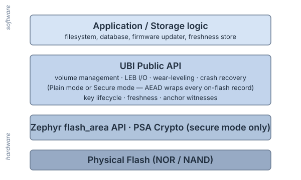

# UBI for Zephyr


[](https://kamil-kielbasa.github.io/ubi/)
[](https://codecov.io/gh/kamil-kielbasa/ubi)
[](https://github.com/kamil-kielbasa/ubi/releases)
[](LICENSE)

A flash virtualization layer for Zephyr RTOS — global wear-leveling, runtime-resizable named volumes, and self-healing bad-block management on raw NOR/NAND, with an optional secure variant providing AEAD over every on-flash structure.

Inspired by Linux's `drivers/mtd/ubi`, written from scratch for Zephyr's `flash_area` API and resource constraints. MIT licensed.

<p align="center">
  
</p>

## Why this exists

Zephyr's storage stack has a missing middle layer:

- `flash_area` is too low — raw partitions, no wear-leveling, no bad-block handling.
- LittleFS, NVS, ZMS, FCB are too high — each bakes a specific abstraction (filesystem, key-value, circular log) and consumes raw flash directly. None provide multi-volume layout sharing one wear-leveling pool, and none scale cleanly to large external NOR/NAND with mixed write workloads.

UBI fills that gap. It provides multiple independent named volumes sharing one global wear-leveling pool, runtime-resizable, with bad-block handling and crash-safe metadata. Higher-level abstractions — a future UBIFS-style filesystem, an LSM-tree-based store, custom indexed databases — can build on top of UBI rather than reinventing wear-leveling each time.

**UBI is not a filesystem.** It is a block virtualization layer. That is the point.

## What you get

- **Multi-volume** — N independent named volumes per partition, created and resized at runtime.
- **Global wear-leveling** — one wear budget across the whole device, regardless of which volume is hot.
- **Block-level access** — direct LEB addressing, without filesystem or record overhead; suitable as a substrate for any higher-level structure (filesystems, indexed databases, encrypted vaults).
- **Self-healing** — automatic bad-block detection, torture-test confirmation, and isolation; transparent to the application.
- **Crash-safe metadata** — reserved PEBs for redundancy, monotonic sequence numbers, replay-safe recovery.
- **Thread-safe** — per-device mutex; safe for use from multiple Zephyr threads.
- **Coexistence** — multiple `ubi_device` handles per application, each on its own partition. Plain and secure devices can run side by side, e.g. a plain device on internal flash for hot configuration alongside a secure device on external NOR for firmware images and secrets.
- **Optional secure backend** — opt-in via `CONFIG_UBI_SECURE`. AEAD over every on-flash byte, anti-rollback, key rotation, sticky read-only on failure. See [Optional secure backend](#optional-secure-backend) below.

## Optional secure backend

With `CONFIG_UBI_SECURE=y`, every commit-visible on-flash structure — UBI metadata, reserved PEBs, and LEB data — is wrapped in **AES-128-CCM via PSA Crypto**, with location and identity bound into the AAD. On top of bulk authenticated encryption you get:

- **Versioned keys** with an allowlist and per-block refcounting. Key-lifecycle events (`KEY_ROTATE_SOON`, `KEY_ROTATE_NOW`, `KEY_RETIRABLE`) are delivered to the application.
- **Anti-rollback** via an application-supplied freshness callback bound to the device-header revision and the VID-header global sequence number (attach-time check + post-commit sync).
- **Fail-closed read-only mode** on AEAD failure, RNG failure, or write-budget exhaustion. Reads remain available; writes are refused until reset.

Threat model and the application contract are in [Secure Architecture](https://kamil-kielbasa.github.io/ubi/architecture/secure_overview.html).

## Quick comparison

| Need | Reach for |
|---|---|
| Files and directories | LittleFS |
| Small key-value config | NVS or ZMS |
| Circular log of small records | FCB |
| Multiple volumes / large external flash / mixed workloads | **UBI** |
| Tamper-evident, rollback-detectable storage substrate | **UBI secure** |
| Small internal flash, single workload, fixed layout forever | NVS / ZMS — UBI is overkill |

Full side-by-side: [comparison page](https://kamil-kielbasa.github.io/ubi/getting_started/comparison.html).

## Quick Start

```c
#include <ubi.h>
#include <zephyr/sys/util.h>

int main(void)
{
    struct ubi_device *ubi = NULL;

    int err = ubi_device_init(&flash_desc, NULL, &ubi);
    if (err) {
        return err;
    }

    const struct ubi_volume_config cfg = {
        .name      = "my_vol",
        .type      = UBI_VOLUME_TYPE_DYNAMIC,
        .leb_count = 4,
    };
    int vol_id = -1;
    ubi_volume_create(ubi, &cfg, &vol_id);

    const char msg[] = "Hello, UBI!";
    ubi_leb_write(ubi, vol_id, 0, msg, sizeof(msg));

    char buf[ARRAY_SIZE(msg)] = { 0 };
    ubi_leb_read(ubi, vol_id, 0, 0, buf, sizeof(buf));

    ubi_device_deinit(ubi);
    return 0;
}
```

Full error handling and the `flash_desc` setup (partition lookup, erase / write block sizes) are in the runnable [`sample/`](sample/). All API functions return `0` on success or a negative `errno` code on failure.

## Footprint

UBI library only, Cortex-M33, `-Os`, STM32U585 (`b_u585i_iot02a`):

- Plain build: ~9.5 KB flash, ~1.5 KB BSS
- Secure build: ~28.6 KB flash, ~1.8 KB BSS

PSA Crypto and mbedTLS are provided by the platform and not counted. See [Architecture — Resource profile](https://kamil-kielbasa.github.io/ubi/architecture/secure_overview.html) for what the secure delta pays for.

## Status

**v1.0.0** — public API and on-flash format (plain + secure) are stable; breaking changes require a major bump.

- 55 test suites, 609 tests total (270 plain + 339 secure).
- Validated on Zephyr `native_sim` (flash simulator), STM32U585 (`b_u585i_iot02a`), and nRF5340 (`nrf5340dk`).

## Documentation

Full documentation: <https://kamil-kielbasa.github.io/ubi/>

- **New here?** — [What is UBI?](https://kamil-kielbasa.github.io/ubi/getting_started/what_is_ubi.html) and [Comparison vs LittleFS / NVS / ZMS](https://kamil-kielbasa.github.io/ubi/getting_started/comparison.html).
- **Want to integrate?** — [Quick Start](https://kamil-kielbasa.github.io/ubi/getting_started/quick_start.html) and the [Cookbook](https://kamil-kielbasa.github.io/ubi/guide/cookbook.html) (STM32U5 / nRF5340 setup, A/B firmware, GC loop, key rotation, freshness store).
- **Going to production with secure?** — [Secure Architecture](https://kamil-kielbasa.github.io/ubi/architecture/secure_overview.html), [Secure UBI Workflow](https://kamil-kielbasa.github.io/ubi/guide/secure_workflow.html), and the normative [On-Flash Format Specification](https://kamil-kielbasa.github.io/ubi/reference/onflash_format_spec.html).
- **Reference** — [API](https://kamil-kielbasa.github.io/ubi/reference/api.html) · [Configuration](https://kamil-kielbasa.github.io/ubi/guide/configuration.html) · [Glossary](https://kamil-kielbasa.github.io/ubi/reference/glossary.html) · [Plain Architecture](https://kamil-kielbasa.github.io/ubi/architecture/plain_architecture.html) · [Test Strategy](https://kamil-kielbasa.github.io/ubi/project/test_strategy.html) · [Contributing](https://kamil-kielbasa.github.io/ubi/project/contributing.html).

## Security

For vulnerability reporting and the supported-version policy, see [SECURITY.md](SECURITY.md).

## License

MIT License. See [LICENSE](LICENSE) for details.

## Acknowledgments

The plain UBI design — PEBs, LEBs, EC/VID headers, dual-bank reserved
metadata, sequence-number recovery — is adapted from the **Linux UBI
subsystem** (`drivers/mtd/ubi`). All credit for the underlying model
belongs to its original authors and maintainers; this project ports the
idea to Zephyr's resource constraints (smaller in-RAM footprint, no
filesystem layer, simpler scan/recovery).

**Secure UBI** is original work — an extension of the plain UBI concept
where every commit-visible on-flash structure (device / volume / EC /
VID headers and LEB payloads) is AEAD-wrapped through PSA Crypto, so
the same wear-leveling, dual-bank, and runtime-resizable-volume
guarantees apply to ciphertext rather than plaintext, with one set of
on-flash invariants for both modes.

## Contact

Kamil Kielbasa — kamkie1996@gmail.com
