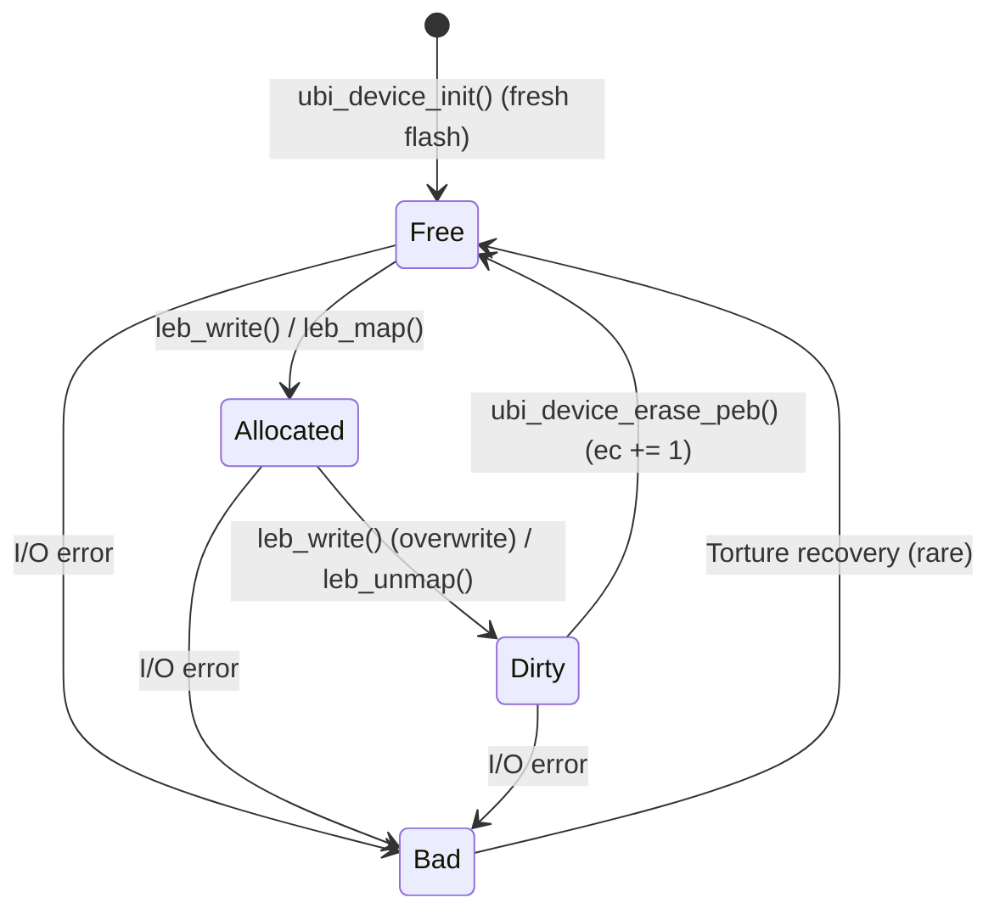
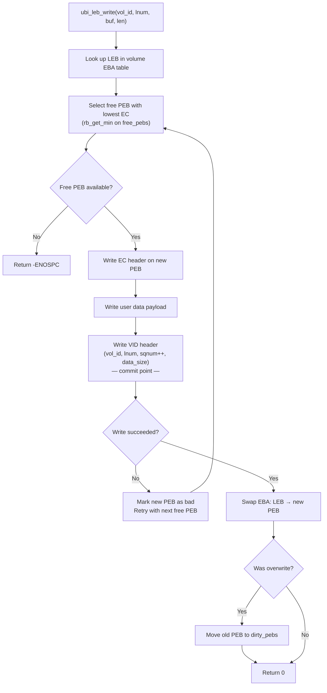
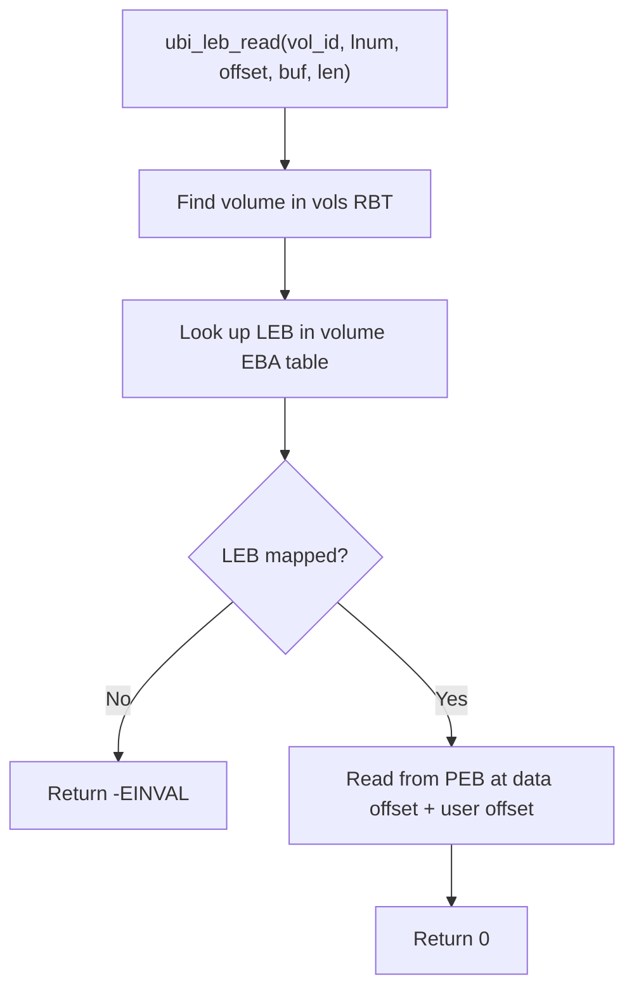
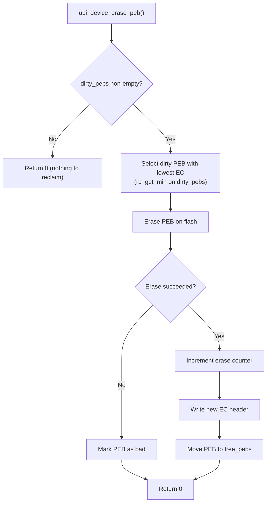

# Architecture Guide

**What this page covers:** UBI internals — on-flash layout, in-RAM data structures, initialization, wear-leveling, dual-bank metadata redundancy, recovery, and failure handling.

**Prerequisites:** Read the [Overview](overview.md) first for the mental model (PEB, LEB, EC, VID, EBA).

**What you will learn:** How UBI maps logical blocks to physical blocks, how it recovers from crashes, and how wear is distributed across the flash.

## 30-Second Summary

UBI divides a flash partition into Physical Erase Blocks (PEBs). The first N PEBs (configurable, default 2) store mirrored device and volume metadata. All remaining PEBs hold user data. Each data PEB carries an Erase Counter (EC) header and a Volume Identifier (VID) header followed by the payload. At init, UBI scans every PEB and builds an in-RAM red-black tree cache of free, dirty, and bad blocks plus per-volume LEB-to-PEB mappings. Writes always pick the free PEB with the lowest erase count (wear-leveling). Crash recovery relies on monotonically increasing sequence numbers in VID headers — the higher sqnum always wins.

## Core Invariants

These rules hold at all times after a successful `ubi_device_init()`:

| Invariant | Description |
|-----------|-------------|
| One LEB, one PEB | Each mapped LEB points to exactly one active PEB. No two LEBs share a PEB. |
| Higher sqnum wins | During init, if two PEBs claim the same (vol_id, lnum), the one with the higher sequence number is kept; the other becomes dirty. |
| Erase before reuse | A dirty PEB must be erased before it can return to the free pool. No in-place overwrites. |
| Bad PEBs are terminal | Once a PEB is classified as bad, it never returns to the free or dirty pool (unless torture recovery succeeds). |
| Reserved PEBs are mirrors | The first N reserved PEBs hold identical copies of device + volume metadata. They are never used for data. |
| Free pool is EC-ordered | `free_pebs` is a red-black tree keyed by erase count. `rb_get_min()` always returns the least-worn block. |
| Mutex serialization | All public API calls acquire a per-device mutex. UBI is thread-safe but not ISR-safe. |

---

## Flash Storage Primer

Raw flash memory (NAND or NOR) differs from block devices like SD cards or eMMC in several important ways:

- **Erase before write** — a flash cell must be erased before it can be written. Erasing sets all bytes to the hardware-defined erased value (typically `0xFF` for NOR flash, but this may differ on other technologies).
- **Erase granularity** — erasure operates on large blocks (erase blocks), typically 4 KB to 256 KB.
- **Write granularity** — writes operate on smaller units (write blocks), typically 1 to 16 bytes.
- **Limited endurance** — each erase block supports a finite number of erase cycles (typically 10,000 to 100,000) before it becomes unreliable.
- **Bad blocks** — blocks can fail at any point during the device lifetime.

Without wear-leveling, repeatedly writing to the same logical location would exhaust a small set of physical blocks while the rest remain unused. UBI solves this by dynamically remapping logical blocks to physical blocks, always choosing the least-worn block for new writes.

**Key terminology:**

| Term | Meaning |
|------|---------|
| PEB  | Physical Erase Block — a hardware erase unit on the flash chip |
| LEB  | Logical Erase Block — a virtual block exposed to the application |
| EC   | Erase Counter — tracks how many times a PEB has been erased |
| VID  | Volume Identifier — metadata linking a PEB to a volume and LEB |
| EBA  | Erase Block Association — the mapping table from LEBs to PEBs |

---

## Architecture Overview

```
+-----------------------------------------------------+
|                   Application                       |
+-----------------------------------------------------+
            |                          ^
            | ubi_leb_write()          | ubi_leb_read()
            | ubi_volume_create()      | ubi_volume_get_info()
            | ubi_device_init()        | ubi_device_get_info()
            v                          |
+-----------------------------------------------------+
|                     UBI Layer                       |
|                                                     |
|  +---------------+  +---------------+  +---------+  |
|  | Volume Mgmt   |  | LEB I/O       |  | Wear-   |  |
|  | create/remove |  | read/write    |  | Level   |  |
|  | resize/info   |  | map/unmap     |  | Engine  |  |
|  +---------------+  +---------------+  +---------+  |
|                                                     |
|  +----------------------------------------------+   |
|  |           PEB Management (RBT Cache)         |   |
|  |  free_pebs | dirty_pebs | bad_pebs | vols    |   |
|  +----------------------------------------------+   |
+-----------------------------------------------------+
            |                          ^
            | flash_area_write()       | flash_area_read()
            | flash_area_erase()       |
            v                          |
+-----------------------------------------------------+
|          Zephyr Flash Area API (Flash Map)          |
+-----------------------------------------------------+
            |                          ^
            v                          |
+-----------------------------------------------------+
|              Flash Hardware (NOR / NAND)            |
+-----------------------------------------------------+
```

**Source files:**

| File | Role |
|------|------|
| `lib/include/ubi.h` | Public API — all structures and function declarations |
| `lib/src/ubi_core_init.c` | Device initialization — format, scan, mount |
| `lib/src/ubi_core_runtime.c` | Device runtime — get_info, erase_peb, deinit, test API |
| `lib/src/ubi_volume.c` | Volume management — create, resize, remove, get_info |
| `lib/src/ubi_leb.c` | LEB operations — read, write (copy-on-write), map, unmap (idempotent), is_mapped, get_size |
| `lib/src/ubi_cache.c` | Red-black tree comparator and search helpers |
| `lib/src/ubi_internal.h` | Shared internal types (`ubi_device`, `ubi_volume`) and helpers |
| `lib/src/ubi_cache.h` | RBT and linked-list item types |
| `lib/src/ubi_io.h` | On-flash header structures and constants |
| `lib/src/ubi_io_metadata.c` | Metadata I/O — device and volume header read/write |
| `lib/src/ubi_io_data.c` | Data I/O — EC/VID header and LEB data read/write, flash write/erase fault injection |
| `lib/src/ubi_flash_res_peb.h` | Reserved PEB state types and API declarations |
| `lib/src/ubi_flash_res_peb.c` | Reserved PEB scanning, recovery, overwrite, and commit |
| `lib/src/ubi_partition_guard.h` | Single-handle-per-partition registry API |
| `lib/src/ubi_partition_guard.c` | Static bitfield registry preventing double-init of the same partition |
| `lib/src/ubi_mem.h` | Memory abstraction layer API — device, volume, leaf, scratch allocators |
| `lib/src/ubi_mem.c` | Static (k_mem_slab) and heap (k_malloc) backend implementations |

---

## On-Flash Layout

UBI reserves the first N PEBs for device and volume metadata, stored in a dual-bank configuration for crash resilience. N is configurable via `CONFIG_UBI_DEV_HDR_NR_OF_RES_PEBS` (default 2, range 2–4). The remaining PEBs (N through total-1) are data blocks available for volume use.

```
Flash Partition (default: N=2 reserved PEBs)
+====================+====================+=====+====================+
| PEB 0 (Reserved)   | PEB 1 (Reserved)   | ... | PEB total-1        |
| Device Header Bank | Device Header Bank |     | Data Block         |
+====================+====================+=====+====================+

Reserved PEB Layout (reserved PEBs are mirrors):

Offset 0x000  +----------------------+
              | Device Header (32 B) |  magic, version, revision, vol_count, CRC
              +----------------------+
Offset 0x020  | Volume 0 Hdr  (48 B) |  magic, vol_id, name, type, leb_count, CRC
              +----------------------+
Offset 0x050  | Volume 1 Hdr  (48 B) |
              +----------------------+
              |         ...          |  (up to CONFIG_UBI_MAX_NR_OF_VOLUMES)
              +----------------------+


Data PEB Layout (PEB N through PEB total-1):

Offset 0x000  +----------------------+
              | EC Header    (16 B)  |  magic, version, erase_counter, CRC
              +----------------------+
Offset 0x010  | VID Header   (32 B)  |  magic, vol_id, leb_num, sqnum, data_size, CRC
              +----------------------+
Offset 0x030  |                      |
              |     User Data        |  up to (erase_block_size - 48) bytes
              |                      |
              +----------------------+
```

When a data PEB is **free** (not assigned to any volume), its VID header area is erased (filled with the hardware-reported erased byte value). The EC header is always present on valid PEBs.

---

## Header Structures

All headers are aligned to 16 bytes and protected by CRC-32/IEEE (`crc32_ieee()` from Zephyr's `<zephyr/sys/crc.h>`). The CRC covers all fields except the `hdr_crc` field itself.

### Erase Counter (EC) Header — 16 bytes

Present on every data PEB. Tracks how many times this block has been erased.

```
Offset  Size  Field
------  ----  -----
0x00    4     magic       (0x55424923)
0x04    1     version     (1)
0x05    3     padding
0x08    4     ec          erase counter value
0x0C    4     hdr_crc     CRC-32 of bytes 0x00..0x0B
```

### Volume Identifier (VID) Header — 32 bytes

Present on data PEBs that are mapped to a volume. Links a PEB to a specific volume and LEB.

```
Offset  Size  Field
------  ----  -----
0x00    4     magic       (0x55424921)
0x04    1     version     (1)
0x05    3     padding
0x08    4     lnum        logical erase block number within the volume
0x0C    4     vol_id      volume identifier
0x10    8     sqnum       global sequence number (monotonically increasing)
0x18    4     data_size   size of user data in bytes
0x1C    4     hdr_crc     CRC-32 of bytes 0x00..0x1B
```

The `sqnum` field is critical for crash recovery. During the PEB scan at init, if two PEBs claim the same (vol_id, lnum) pair, the one with the higher `sqnum` wins.

### Device Header — 32 bytes

Stored on all reserved PEBs (default: PEB 0 and PEB 1). Describes the overall UBI device.

```
Offset  Size  Field
------  ----  -----
0x00    4     magic       (0x55424925)
0x04    1     version     (1)
0x05    3     padding
0x08    4     offset      offset of the first volume header
0x0C    4     size        device size
0x10    4     revision    header revision counter (incremented on each metadata update)
0x14    4     vol_count   number of volumes
0x18    4     padding
0x1C    4     hdr_crc     CRC-32 of bytes 0x00..0x1B
```

### Volume Header — 48 bytes

One per volume, stored sequentially after the device header on the reserved PEBs.

```
Offset  Size  Field
------  ----  -----
0x00    4     magic       (0x55424926)
0x04    1     version     (1)
0x05    1     vol_type    0 = static, 1 = dynamic
0x06    2     padding
0x08    4     vol_id      unique volume identifier
0x0C    4     leb_count   number of LEBs allocated to this volume
0x10    12    padding
0x1C    16    name        null-terminated volume name (max 16 bytes including '\0')
0x2C    4     hdr_crc     CRC-32 of bytes 0x00..0x2B
```

---

## In-RAM Data Structures

When `ubi_device_init()` runs, it scans the flash and builds an in-RAM cache of PEB states. This cache is the heart of UBI — all runtime decisions (which PEB to write to, which blocks are dirty, etc.) are made from these structures without re-reading flash.

### Overview

```
struct ubi_device (112 B)
|
|-- mutex                       Zephyr mutex for thread safety
|-- mtd                         Flash partition config (partition_id, block sizes)
|
|-- free_pebs (Red-Black Tree, keyed by erase counter)
|   |
|   |   Holds PEBs that are erased and available for new writes.
|   |   The minimum node (lowest EC) is selected for writes (wear-leveling).
|   |
|   |       ec:3         Nodes are struct ubi_rbt_item {
|   |      /    \            .key   = erase_counter,
|   |   ec:1   ec:7         .value.pnum = PEB index
|   |          /    \    }
|   |       ec:5  ec:12
|   |
|   `-- Each node points to a physical PEB on flash:
|           ec:1 --> PEB 5  [EC hdr: ec=1 | VID: 0xFF (empty) | ...]
|           ec:3 --> PEB 8  [EC hdr: ec=3 | VID: 0xFF (empty) | ...]
|           ec:5 --> PEB 14 [EC hdr: ec=5 | VID: 0xFF (empty) | ...]
|
|-- dirty_pebs (Red-Black Tree, keyed by erase counter)
|   |
|   |   Holds PEBs that contain stale data and need erasure before reuse.
|   |   Populated when a LEB is overwritten or unmapped.
|   |
|   |       ec:4
|   |      /    \
|   |   ec:2   ec:9
|   |
|   `-- Each node points to a PEB with outdated data:
|           ec:2 --> PEB 3  [EC hdr: ec=2 | VID: old data | ...]
|           ec:4 --> PEB 11 [EC hdr: ec=4 | VID: old data | ...]
|
|-- bad_pebs (Singly-Linked List)
|   |
|   |   Holds PEBs with I/O errors (invalid EC headers, failed erases/writes).
|   |   Entries are struct ubi_list_item { .pnum, .erase_count }
|   |
|   `-- [PEB 22, ec:~7] --> [PEB 45, ec:~3] --> NULL
|
|       NOTE: Bad block list is NOT persisted to flash.
|             It is lost on reboot and rebuilt during the next init scan.
|
|-- vols (Red-Black Tree, keyed by volume ID)
|   |
|   |   Maps volume IDs to struct ubi_volume pointers.
|   |
|   |     vol_id:0             Nodes are struct ubi_rbt_item {
|   |      /     \                 .key   = volume_id,
|   |  vol_id:1  vol_id:5         .value.vol = &ubi_volume
|   |                          }
|   |
|   `-- Each ubi_volume (48 B) contains:
|
|       struct ubi_volume
|       |-- vol_idx         Index in the reserved PEB header table
|       |-- vol_id          Unique volume identifier
|       |-- cfg             { name[16], type (static|dynamic), leb_count }
|       |-- eba_tbl_count   Number of mapped LEBs
|       `-- eba_tbl (Red-Black Tree, keyed by LEB number)
|           |
|           |   Per-volume mapping from logical to physical blocks.
|           |
|           |     leb:2             Nodes are struct ubi_rbt_item {
|           |    /     \                .key   = LEB_number,
|           | leb:0   leb:5            .value.pnum = PEB_index
|           |                      }
|           |
|           `-- Each node points to the PEB holding that LEB's data:
|                   leb:0 --> PEB 7  [EC hdr | VID: vol=0,leb=0,sq=42 | payload]
|                   leb:2 --> PEB 19 [EC hdr | VID: vol=0,leb=2,sq=50 | payload]
|                   leb:5 --> PEB 31 [EC hdr | VID: vol=0,leb=5,sq=55 | payload]
|
`-- global_sqnum            Monotonically increasing sequence number for writes
`-- vol_next_id             Next volume ID to assign
```

### How the Structures Relate to Flash

Every PEB on flash is tracked by exactly one of these structures at any time:

```
                          +------------------+
                          |   Physical Flash |
                          +------------------+
                          | PEB 0  (reserved)|----> Device + Volume headers (Bank 1)  \
                          | PEB 1  (reserved)|----> Device + Volume headers (Bank 2)   > N reserved
                          |  ...  (if N > 2) |----> Cold spares                       /
                          |------------------|
  free_pebs RBT --------->| PEB N  (free)    |  EC hdr present, VID = 0xFF
  free_pebs RBT --------->| PEB N+1 (free)   |  EC hdr present, VID = 0xFF
                          |------------------|
  vol[0].eba_tbl -------->| PEB 4  (vol0/L0) |  EC hdr + VID(vol=0,leb=0) + data
  vol[0].eba_tbl -------->| PEB 5  (vol0/L1) |  EC hdr + VID(vol=0,leb=1) + data
                          |------------------|
  vol[1].eba_tbl -------->| PEB 6  (vol1/L0) |  EC hdr + VID(vol=1,leb=0) + data
                          |------------------|
  dirty_pebs RBT -------->| PEB 7  (dirty)   |  EC hdr + VID (stale data)
                          |------------------|
  bad_pebs list --------->| PEB 8  (bad)     |  Unreadable or failed I/O
                          +------------------+

  Rule: PEB 0..N-1 are always reserved (N = CONFIG_UBI_DEV_HDR_NR_OF_RES_PEBS).
        Every other PEB is in exactly ONE of:
        - free_pebs      (erased, ready for use)
        - Some volume's eba_tbl  (in use, holds live data)
        - dirty_pebs     (contains stale data, awaiting erasure)
        - bad_pebs       (defective, excluded from use)
```

### Memory Usage

| Structure | Size per entry | Allocated via |
|-----------|---------------|---------------|
| `ubi_device` | 112 B | `ubi_mem_device_alloc` → device slab (static) / k_malloc (heap) |
| `ubi_volume` | 48 B | `ubi_mem_volume_alloc` → volume slab (static) / k_malloc (heap) |
| `ubi_rbt_item` | 16 B | `ubi_mem_leaf_alloc` → leaf slab (static) / k_malloc (heap) |
| `ubi_list_item` | 12 B | `ubi_mem_leaf_alloc` → leaf slab (static) / k_malloc (heap) |

Under the static backend (`CONFIG_UBI_MEM_BACKEND_STATIC`, default), all pools are pre-allocated at compile time. Under the heap backend, allocations are dynamic. See [Configuration — Memory Sizing Guide](configuration.md#memory-sizing-guide) for pool sizing details.

### Memory Backends

All UBI runtime allocations route through the `ubi_mem` abstraction layer (`lib/src/ubi_mem.h`), which supports two backends selected via Kconfig:

```
ubi_mem (CONFIG_UBI_MEM_BACKEND_STATIC)
|
|-- device_slab    [K_MEM_SLAB: D blocks of sizeof(ubi_device)]
|-- volume_slab    [K_MEM_SLAB: D×V blocks of sizeof(ubi_volume)]
|-- leaf_slab      [K_MEM_SLAB: D×(P+V) blocks of sizeof(ubi_leaf_item)]
`-- scratch_slab   [K_MEM_SLAB: 1 block of DEV_HDR_SIZE + V×VOL_HDR_SIZE]

    D = CONFIG_UBI_MAX_NR_OF_DEVICES
    V = CONFIG_UBI_MAX_NR_OF_VOLUMES
    P = CONFIG_UBI_MAX_NR_OF_DATA_PEBS
```

`ubi_rbt_item` (16 B) and `ubi_list_item` (12 B) share 16-byte blocks via `union ubi_leaf_item`. PEB state transitions (dirty→bad, bad→free, mapped→bad) retype items in-place rather than freeing and re-allocating, eliminating allocation failures on critical error paths.

When the static backend is used, `ubi_device_init()` validates that the flash geometry fits within the configured pool limits before scanning PEBs.

---

## PEB Lifecycle

A Physical Erase Block moves through the following states during normal operation:



**Detailed ASCII reference:**

```
                          +-------+
           ubi_device_    |       |   ubi_device_init()
           erase_peb() -->| FREE  |<-- (fresh flash: all PEBs start here)
           (ec += 1)      |       |    
                          +---+---+
                              |
                              | leb_write() or leb_map()
                              | (rb_get_min selects lowest EC)
                              v
                        +-----------+
                        |           |
                        | ALLOCATED |   In a volume's eba_tbl
                        | (in use)  |   VID header links to vol_id + leb_num
                        |           |
                        +-----+-----+
                              |
                              | leb_write() (overwrite) or leb_unmap()
                              | Old PEB moved to dirty_pebs
                              v
                          +-------+
                          |       |
                          | DIRTY |   Stale data, awaiting erasure
                          |       |
                          +---+---+
                              |
                              | ubi_device_erase_peb()
                              | (erase flash, increment EC, write new EC hdr)
                              v
                          +-------+
                          | FREE  |   Back in free_pebs, ready for reuse
                          +-------+

  At ANY point, if a flash I/O operation fails:

                          +-------+
              I/O error   |       |
           ------------>  |  BAD  |   Moved to bad_pebs linked list
                          |       |   Excluded from all future operations
                          +-------+
```

---

## Device Initialization

`ubi_device_init()` is the most complex function in UBI. It handles two fundamentally different scenarios: initializing a brand-new (never-used) flash device, and re-mounting an existing device after a reboot.

### Flow Overview

```
ubi_device_init(mtd, &ubi)
        |
        v
  Allocate ubi_device, init mutex, init RBTs
        |
        v
  Check: is device mounted?
  (read reserved PEBs 0..N-1, look for valid device headers)
        |
        +--- NO (fresh flash) -------> Phase 0: First-Time Mount
        |                                  |
        +--- YES (reboot) --+              |
        |                   |              v
        |                   |     Write device header to reserved PEBs
        |                   |     Erase data PEBs N..total-1
        |                   |     Write EC headers (ec=0) to each
        |                   |              |
        v                   v              |
  +--------------------------------------------+
  | Phase 1: Read Device Header                |
  |   Read device header from reserved PEBs    |
  |   For each volume in vol_count:            |
  |     Read volume header                     |
  |     Allocate ubi_volume + ubi_rbt_item     |
  |     Insert into vols RBT                   |
  +--------------------------------------------+
                    |
                    v
  +--------------------------------------------+
  | Phase 2: Compute Average Erase Count       |
  |   Scan PEBs N..total-1                     |
  |   Read EC headers, sum valid erase counts  |
  |   ec_avg = ec_sum / ec_count               |
  |   (Used as fallback EC for bad blocks)     |
  +--------------------------------------------+
                    |
                    v
  +--------------------------------------------+
  | Phase 3: PEB Scan & Classification         |
  |   For each PEB from N to total-1:          |
  |                                            |
  |   3.1  EC header invalid?                  |
  |         --> bad_pebs (ec = ec_avg)         |
  |                                            |
  |   3.2  EC valid, VID erased (empty)?       |
  |         Probe data area prefix:            |
  |         - prefix erased → free_pebs        |
  |         - prefix non-erased → dirty_pebs   |
  |           (uncommitted write)              |
  |                                            |
  |   3.3  EC valid, VID invalid CRC?          |
  |         --> bad_pebs (ec from EC hdr)      |
  |                                            |
  |   3.4  EC valid, VID valid:                |
  |     3.4.1  Track max sqnum for global_seqnr|
  |     3.4.2  Volume not found in vols RBT?   |
  |             --> dirty_pebs (orphaned)      |
  |     3.4.3  LEB >= vol.leb_count?           |
  |             --> dirty_pebs (out of range)  |
  |     3.4.4  LEB not in vol.eba_tbl?         |
  |             --> insert into vol.eba_tbl    |
  |     3.4.5  LEB already in vol.eba_tbl?     |
  |             Compare sqnum:                 |
  |             - new < existing: new-->dirty  |
  |             - new > existing: old-->dirty, |
  |               new replaces in eba_tbl      |
  +--------------------------------------------+
                    |
                    v
            Return ubi_device*
```

### First-Time Mount vs. Reboot

| Aspect | First-Time Mount | Reboot (Re-mount) |
|--------|------------------|--------------------|
| Device header on reserved PEBs | Not present | Already written |
| Phase 0 | Erase all data PEBs, write EC headers with `ec=0` | Skipped entirely |
| Phase 1–3 | Runs (all PEBs will be free) | Runs (reconstructs volumes from existing data) |
| Volume data | None — empty EBA tables | Reconstructed from VID headers on flash |
| Dirty PEBs | None | May exist from incomplete writes before reboot |
| Bad PEBs | Detected from Phase 3 scan | Detected fresh (previous list was in RAM only) |

### Sequence Number Conflict Resolution

When two PEBs claim the same `(vol_id, leb_num)` pair (e.g., a write was interrupted and both the old and new PEB survive), UBI resolves the conflict using the `sqnum` field in the VID header:

- The PEB with the **higher** `sqnum` is the newer write and is kept in the EBA table.
- The PEB with the **lower** `sqnum` is moved to `dirty_pebs` for later erasure.

This ensures that even after an unexpected power loss, the most recent successful write survives.

---

## Erased-State Detection

UBI does not assume that erased flash reads as `0xFF`. The erased byte value is queried at runtime via Zephyr's `flash_area_erased_val()` API. Two internal helpers abstract all erased-state checks:

- **`ubi_get_erased_val(mtd, &val)`** — queries the hardware-reported erased byte value for the partition, once.
- **`ubi_buf_is_erased(buf, len, val)`** — returns `true` if every byte in `buf` equals `val`.

During PEB scan, the erased value is obtained once and passed to all classification helpers. Reserved PEB scan likewise derives the erased magic pattern from the actual erased byte value.

---

## Thread Safety

Since v0.5.0, all public API functions acquire a per-device Zephyr mutex (`struct k_mutex`) before accessing any shared state. This means:

- Multiple threads can safely call UBI functions on the same device concurrently.
- The mutex provides mutual exclusion (one thread at a time), not read-write differentiation.
- The mutex is initialized in `ubi_device_init()` and held for the duration of each API call.
- Callers do not need to provide their own locking.

### Single Handle Per Partition

Only one `struct ubi_device *` handle may be active per flash partition at any time. `ubi_device_init()` returns `-EBUSY` if a handle for the given `partition_id` already exists. The guard is released when `ubi_device_deinit()` completes.

### Deinit Contract

`ubi_device_deinit()` acquires the device mutex before freeing resources. Any in-flight operations that already hold the mutex will complete before teardown proceeds. The caller must ensure that no other thread will **start** new operations after calling `deinit`.

---

## Wear-Leveling

UBI implements a **greedy minimum-erase-count** wear-leveling strategy.

### Write Path

When writing to a LEB, UBI always selects the free PEB with the **lowest** erase counter:

```c
struct rbnode *min = rb_get_min(&ubi->free_pebs);
```

Since `free_pebs` is a red-black tree keyed by erase count, `rb_get_min()` returns the least-worn block in O(log n) time.

### Erase Path

When erasing dirty PEBs, UBI also processes the one with the **lowest** erase counter first:

```c
struct rbnode *min = rb_get_min(&ubi->dirty_pebs);
```

After erasing, the PEB's erase counter is incremented and it is moved back to `free_pebs`.

### Effect

This two-sided greedy approach naturally distributes wear across all PEBs:

- Least-worn blocks are consumed first for writes, giving them more cycles.
- Least-worn dirty blocks are recycled first, keeping the counter distribution tight.
- Over time, all PEBs converge toward a similar erase count.

### Write Flow (Mermaid)

Copy-on-write: the new PEB is fully written before the old mapping is swapped. On write failure, the previous mapping and data remain intact. The write order is EC → DATA → VID; the VID header acts as the commit point that makes the new mapping visible.



### Read Flow (Mermaid)



### Erase / Reclaim Flow (Mermaid)



---

## Dual-Bank Mechanism

UBI stores device and volume metadata on reserved PEBs as mirrors. The number of reserved PEBs is configurable via `CONFIG_UBI_DEV_HDR_NR_OF_RES_PEBS` (default 2, range 2–4). Two PEBs are always kept **active** (containing identical copies); additional PEBs serve as **cold spares** that are promoted when an active PEB fails.

### PEB Classification

| State | Description |
|-------|-------------|
| Active | Contains a valid device header (correct magic + CRC). Participates in dual-bank writes. |
| Spare | Erased/empty (hardware erased value). Never written until an active PEB fails. |
| Corrupt | Contains invalid data (bad magic or CRC). Candidate for in-place recovery or abandonment. |

### Write Sequence

When metadata changes (volume created, removed, or resized), UBI writes to both active PEBs sequentially:

```
1. Erase active reserved PEB (bank 1)
2. Write updated headers to active reserved PEB (bank 1)
3. Erase active reserved PEB (bank 2)
4. Write updated headers to active reserved PEB (bank 2)
```

If a write fails (dead PEB), UBI promotes a cold spare to replace it.

### Init-Time Recovery

At `ubi_device_init()`, UBI scans all reserved PEBs (indices `0..N-1`):

```
scan_reserved_pebs()
  |
  +-- All N PEBs valid?  --> Normal init (no recovery needed)
  |
  +-- >= 1 active + corrupt or spare PEBs?
  |     |
  |     +-- Read full content from active PEB (highest revision)
  |     +-- For each corrupt PEB: erase + write canonical data
  |     |     +-- Erase/write succeeds --> PEB recovered in-place
  |     |     +-- Erase/write fails ----> PEB is dead, promote spare
  |     +-- At least 2 active PEBs after recovery? --> Init succeeds
  |
  +-- 0 active PEBs?  --> Init fails (unrecoverable)
```

### Runtime Recovery

Volume operations (`ubi_vol_hdr_append`, `ubi_vol_hdr_remove`, `ubi_vol_hdr_update`) call `validate_reserved_pebs()` before committing. If a degraded state is detected, recovery is attempted transparently.

### Read-Only Degraded Mode

When only 1 active PEB remains and 0 spares are available, the system enters **read-only degraded mode**.

All public mutators pass through a **central mutation gate** (`ubi_mutation_allowed()` in `ubi_internal.h`) before performing any flash I/O. The gate classifies each operation into one of three mutation classes and applies the degraded-mode policy:

| Mutation class | Operations | Degraded-mode policy |
|----------------|-----------|---------------------|
| `UBI_MUT_RESERVED_METADATA` | `ubi_volume_create`, `ubi_volume_resize`, `ubi_volume_remove` | Blocked (`-EROFS`) |
| `UBI_MUT_DATA_PATH` | `ubi_leb_write`, `ubi_leb_map`, `ubi_leb_unmap` | Allowed |
| `UBI_MUT_MAINTENANCE` | `ubi_device_erase_peb` | Allowed |

`ubi_device_erase_peb()` is intentionally allowed in degraded mode. After its normal dirty-PEB maintenance cycle, it attempts to recover the reserved PEB bank by calling `ubi_dev_hdr_read()`, which internally scans all reserved PEBs and attempts erase+rewrite of any corrupt copies. If recovery succeeds, the `read_only_degraded` flag is cleared and the device returns to normal operation. This allows self-healing without requiring a reboot — the application's regular garbage-collection loop serves as the recovery trigger.

Read-only operations are not gated and always succeed:

| Operation | Degraded mode behavior |
|-----------|----------------------|
| `ubi_leb_read` | Works normally |
| `ubi_leb_is_mapped` | Works normally |
| `ubi_leb_get_size` | Works normally |
| `ubi_device_get_info` | Works normally (`read_only_degraded = true`) |
| `ubi_volume_get_info` | Works normally |

### State Summary

| Active PEBs | Spares | State | Can update metadata? |
|---|---|---|---|
| 2 | N−2 | Healthy | Yes |
| 1 | ≥1 | Degraded | Yes (spare promoted during recovery) |
| 1 | 0 | Critical | No — read-only mode |
| 0 | any | Dead | No — cannot init |

### PEB State Transitions

```
+-------------------+
|   SPARE (empty)   |
|   erased          |
+--------+----------+
         |
         | (promoted during recovery
         |  or overwrite when active fails)
         v
+-------------------+    power loss / bit rot     +-------------------+
|      ACTIVE       | --------------------------> |     CORRUPT       |
|  valid dev hdr +  |                             | bad magic or CRC  |
|  valid vol hdrs   |                             |                   |
+--------+----------+                             +--------+----------+
         ^                                                 |
         |        erase + write canonical content          |
         +<------------------------------------------------+
         |        (in-place recovery from other active)
         |
         +-- erase/write fails --> PEB is DEAD (stays corrupt)
```

---

## Volume Management

### Volume Types

| Type | Enum | Description |
|------|------|-------------|
| Static | `UBI_VOLUME_TYPE_STATIC` (0) | Fixed content. Cannot be resized after creation. |
| Dynamic | `UBI_VOLUME_TYPE_DYNAMIC` (1) | Content can change. Supports runtime resizing. |

### Create

`ubi_volume_create()` assigns a unique volume ID, writes a new volume header to both active reserved PEBs (incrementing the device revision), and adds the volume to the in-RAM `vols` RBT. The PEBs for the volume are **not** pre-allocated — they are claimed from `free_pebs` on-demand when LEBs are written or mapped.

If a volume with the same name and identical configuration (type, leb_count) already exists, the function returns successfully with the existing volume's ID (idempotent behavior). If a volume with the same name but different configuration exists, the function returns `-EEXIST`. Volume creation is transactional: RAM structures are allocated before the flash commit, so a failed create leaves no persistent metadata.

### Resize

`ubi_volume_resize()` is only supported for dynamic volumes and rejects `leb_count == 0`. It updates the `leb_count` in the volume header on both active reserved PEBs and adjusts the in-RAM configuration. Shrink is transactional: the flash metadata update commits before trimming EBA entries and reclaiming PEBs to dirty. Grow checks capacity accounting (`bad_peb_count` subtracted from usable PEBs).

### Remove

`ubi_volume_remove()` removes the volume header from the active reserved PEBs, then reclaims mapped PEBs to `dirty_pebs` and frees in-RAM structures. Reclaim and index cleanup after a successful metadata remove are best-effort — errors are logged but the operation returns success once the flash metadata is gone.

