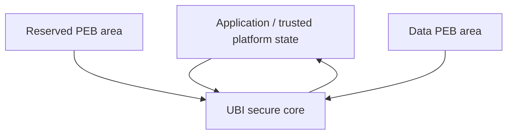

# UBI Secure On-Flash Architecture

**Status:** architecture specification  
**Scope:** secure UBI device format for Zephyr  
**Audience:** UBI developers, maintainers, and reviewers

---

## 1. Two-minute overview

A UBI device works in exactly one mode:

- **PLAIN**
- **SECURE**

In **SECURE** mode, UBI stores the same logical objects as plain UBI, but each object is wrapped in authenticated encryption:

- secure device header,
- secure volume header,
- secure erase-counter (EC) header,
- secure volume-identifier (VID) header,
- secure LEB record.

The inner meaning of UBI stays the same:

- `struct ubi_dev_hdr` remains the device-level metadata payload,
- `struct ubi_vol_hdr` remains the volume-level metadata payload,
- `struct ubi_ec_hdr` remains the erase counter payload,
- `struct ubi_vid_hdr` remains the live-mapping payload,
- LEB data remains the user payload.

SECURE mode adds a versioned on-flash wrapper around those payloads, based on:

- **AES-CCM**,
- a **13-byte nonce**,
- a **16-byte tag**,
- a **32-byte plaintext common prefix** that is authenticated through AAD.

The design has four central ideas:

1. **Plain UBI payloads stay semantically unchanged.**  
   Secure records are separate record types that wrap the current plain structures.

2. **Only authenticated, commit-visible state is trusted.**  
   Parsing can look at plaintext prefixes, but UBI may trust them only after AEAD verification succeeds.

3. **VID is the commit point for data PEB writes.**  
   Data are written before VID. A successful secure VID write makes the new mapping visible.

4. **LEB key-usage recovery comes from secure VID metadata, not from LEB payload prefixes.**  
   For every `{key_version, volume_id}` pair, UBI recovers two monotonic values from authenticated VID-side metadata:
   - `leb_write_counter`
   - `leb_total_payload_bytes`

That is why the document says:

> the authoritative LEB high-watermark state lives in authenticated, commit-visible VID secure metadata.

In plain language, this means:

- the next secure LEB write counter is **not** recovered from the LEB data area,
- it is recovered from the **secure VID record** that already acts as the mapping commit record,
- therefore init does **not** need to trust unauthenticated LEB-local metadata in order to continue writing safely.

---

## 2. High-level picture

### 2.1 Layer view



What crosses the boundary:

- **Application → UBI**
  - versioned root key material,
  - allowlist of acceptable key versions,
  - rollback policy,
  - optional PSA key handles.

- **UBI → Application**
  - `device_revision`,
  - `global_sqnum`,
  - key lifecycle events,
  - security events,
  - retirement notifications.

### 2.2 Flash view

```text
UBI partition
================================================================================

Reserved PEBs (CONFIG_UBI_DEV_HDR_NR_OF_RES_PEBS, range 2..4)
+--------------------------------------------------------------------------------+
| Reserved PEB 0  | secure device header + secure volume headers                 |
| Reserved PEB 1  | secure device header + secure volume headers                 |
| Reserved PEB 2  | optional spare mirror bank                                   |
| Reserved PEB 3  | optional spare mirror bank                                   |
+--------------------------------------------------------------------------------+

Data PEBs
+--------------------------------------------------------------------------------+
| Data PEB N     | secure EC header | secure VID header | secure LEB record      |
| Data PEB N+1   | secure EC header | secure VID header | secure LEB record      |
| ...                                                                          ...|
+--------------------------------------------------------------------------------+
```

### 2.3 One data PEB

```text
Offset from start of physical eraseblock
================================================================================

0x0000  +------------------------------+
        | secure EC header             |
        | prefix32 | ct(EC) | tag16    |
        +------------------------------+

0x0040  +-----------------------------------------------+
        | secure VID header                             |
        | prefix32 | ct(VID + VID secure meta) | tag16  |
        +-----------------------------------------------+

0x00A0  +---------------------------------------------------------------+
        | secure LEB record                                              |
        | prefix32 | ciphertext(payload_bytes) | tag16                   |
        | or                                                            |
        | prefix32 | chunk0 ct | tag0 | chunk1 ct | tag1 | ...          |
        +---------------------------------------------------------------+
```

For the base single-tag layout, secure data-PEB metadata consumes **208 B**:

- secure EC header: **64 B**
- secure VID header: **96 B**
- secure LEB prefix: **32 B**
- secure LEB tag: **16 B**

---

## 3. What SECURE mode guarantees

SECURE mode is designed to provide:

- confidentiality of secure payloads,
- integrity and authenticity of all secure records,
- location binding to physical flash placement,
- parent/child data binding between authenticated records,
- authenticated recovery state for future writes,
- exported freshness signals for the application,
- fail-closed write behavior when required entropy or keying material is unavailable.

SECURE mode intentionally keeps one boundary clear:

- UBI **does not assume** an external journal or monotonic secure counter,
- UBI **does use** fresh RNG salt in every write nonce to keep the design lightweight,
- the application decides whether a rollback happened by evaluating the authenticated values that UBI exports:
  - `device_revision`,
  - `global_sqnum`.

This document is therefore a specification for **authenticated on-flash object encryption for UBI**, plus the recovery state that such a format needs.

---

## 4. Terminology and invariants

### 4.1 Terms

**Physical eraseblock index**  
The numeric index of a physical eraseblock inside the UBI partition. This document writes it out in full; it does not rely on the shorter `pnum` nickname.

**Flash offset**  
A byte offset from the beginning of the UBI partition.

**Commit-visible**  
State that survives power loss and is visible to init without consulting transient RAM state.

**Authenticated object**  
A secure record whose AEAD verification succeeded with an allowlisted key version.

**Live mapping**  
The winning `(volume_id, lnum)` mapping selected by the highest authenticated `vid_sqnum`.

**Dirty PEB**  
A data PEB that still contains stale or interrupted state and must be erased before reuse.

**Free data PEB**  
A data PEB with a valid secure EC header, an erased secure VID area, and an erased secure LEB-prefix area. In practice, the first 32 bytes of the secure LEB region must still be `0xFF`.

**Uncommitted data PEB**  
A data PEB with a valid secure EC header and an erased secure VID area, but with non-erased bytes in the secure LEB-prefix area. This represents an interrupted `DATA -> VID` write and must not be classified as free.

### 4.2 Core invariants

After successful initialization:

1. Every live LEB maps to exactly one data PEB.
2. Among competing authenticated VIDs for the same `(volume_id, lnum)`, the higher `vid_sqnum` wins.
3. A dirty PEB must be erased before it can re-enter the free pool.
4. Reserved PEBs are used only for secure device/volume metadata.
5. For secure LEB writes, the authoritative next write counter and total written bytes are recovered from authenticated VID-side metadata.
6. A key version becomes **retirable** only when no authenticated on-flash object still references it.
7. The device must not perform a secure write if it cannot construct a fresh nonce.

---

## 5. Cryptographic profile

### 5.1 Algorithm choice

UBI SECURE uses **AES-CCM**.

This is a good match for UBI because UBI stores explicit records, not streams:

- metadata records are naturally packet-sized,
- AAD is explicit,
- the nonce is explicit,
- the format naturally fits the "authenticate then decrypt one complete record" model,
- most embedded platforms that expose hardware AEAD support tend to support CCM well enough for this workload.

### 5.2 CCM parameters

This architecture fixes:

- nonce length = **13 bytes**
- tag length = **16 bytes**

That implies the standard CCM relation:

```text
n + q = 15
13 + 2 = 15
```

With `q = 2`, one CCM invocation can cover:

```text
payload_len < 2^(8*q) = 65536 bytes
```

So the architecture requires:

```text
secure_leb_payload_bytes < 65536
```

This must be enforced both:

- as a compile-time guard for supported geometries, and
- as a runtime rejection if a larger geometry is somehow presented.

### 5.3 Why UBI tracks both operations and total bytes

CCM has two properties that matter here:

1. every invocation under one key requires a unique nonce,
2. the security margin degrades as more data and more messages are processed under the same key.

For that reason, UBI tracks two monotonic usage dimensions for LEB keys:

- **number of secure LEB write operations**
- **total plaintext bytes encrypted with that LEB key**

Those two dimensions are represented as:

- `leb_write_counter`
- `leb_total_payload_bytes`

Both are recovered from authenticated VID-side metadata and both are checked before a new write is committed.

For metadata keys, the payload size is fixed and small, so UBI tracks only **operation count**.

---

## 6. Key material and key hierarchy

### 6.1 Root key requirement

The root key material for one key version is written as:

```text
IKM[v]
```

The contract is:

- `IKM[v]` must be unique per device,
- the application may satisfy that by provisioning a device-unique root secret directly,
- or by deriving `IKM[v]` from a device-unique secret such as HUK/DHUK.

This is mandatory. Without device-unique keying, a full flash clone could be readable on another device with the same root key material.

### 6.2 Child keys

UBI derives child keys from `IKM[v]` using **HKDF-SHA-256** with **canonical binary context strings**.

Recommended canonical form:

```text
info = "UBI" || 0x00 || domain_id || 0x00 || version || optional_domain_context
```

Derived keys:

```text
K_dev[v]
K_vol[v]
K_ec[v]
K_vid[v]
K_leb[v][volume_id]
```

The LEB key is volume-specific. That is why the LEB usage budget is tracked per:

```text
{key_version, volume_id}
```

### 6.3 Optional chunk subkeys

If chunked secure LEB mode is enabled, the base LEB key remains:

```text
K_leb[v][volume_id]
```

Each chunk then derives a deterministic subkey:

```text
K_leb_chunk[v][volume_id][chunk_index]
    = HKDF(K_leb[v][volume_id],
           info = "UBI\0LEB-CHUNK\0" || be16(chunk_index))
```

This keeps the on-flash prefix unchanged while still giving each chunk its own cryptographic context.

### 6.4 Why secure records are separate types

The architecture keeps **plain** and **secure** record types separate.

That is deliberate.

The plain structures remain the semantic payloads already used by UBI:

- `struct ubi_dev_hdr`
- `struct ubi_vol_hdr`
- `struct ubi_ec_hdr`
- `struct ubi_vid_hdr`

The secure records are distinct wrapper types that add:

- common prefix,
- secure-only metadata,
- tag,
- AAD rules,
- versioning.

This makes the secure format easier to maintain, easier to version, and easier to reason about than trying to overload the plain record definitions themselves.

---

## 7. Secure record formats

### 7.1 Common prefix

Every secure record begins with the same **32-byte prefix**:

```c
struct ubi_crypto_prefix32_v1 {
    uint32_t magic;            /* format magic */
    uint8_t  wrapper_version;  /* secure wrapper version */
    uint8_t  domain;           /* DEV / VOL / EC / VID / LEB */
    uint8_t  key_version;      /* version of IKM[v] */
    uint8_t  flags;            /* record flags */
    uint8_t  salt[6];          /* fresh RNG salt */
    uint8_t  counter[6];       /* monotonically increasing per usage state */
    uint8_t  reserved[12];     /* zero in v1 */
};
```

Properties:

- `magic` is **32-bit**, not 16-bit,
- `wrapper_version` versions the secure on-flash format,
- `salt` stays **6 bytes**,
- `counter` stays **6 bytes**,
- the prefix is plaintext for parsing,
- the prefix becomes trustworthy only after AEAD verification succeeds,
- all multi-byte integers in the prefix are serialized in **big-endian**.

### 7.2 Secure record names

The document uses these names consistently:

- **secure device header**
- **secure volume header**
- **secure EC header**
- **secure VID header**
- **secure LEB record**

### 7.3 Secure device header

```text
+----------+------------------------+--------+
| prefix32 | ciphertext(dev_hdr)    | tag16  |
+----------+------------------------+--------+
32 B       32 B                     16 B
total = 80 B
```

### 7.4 Secure volume header

```text
+----------+------------------------+--------+
| prefix32 | ciphertext(vol_hdr)    | tag16  |
+----------+------------------------+--------+
32 B       48 B                     16 B
total = 96 B
```

### 7.5 Secure EC header

```text
+----------+------------------------+--------+
| prefix32 | ciphertext(ec_hdr)     | tag16  |
+----------+------------------------+--------+
32 B       16 B                     16 B
total = 64 B
```

### 7.6 Secure VID header

The secure VID header contains two plaintext domains encrypted together:

- inner `struct ubi_vid_hdr`
- secure VID-side LEB metadata

```c
struct ubi_vid_secure_meta_v1 {
    uint64_t leb_write_counter;
    uint64_t leb_total_payload_bytes;
};
```

```text
+----------+----------------------------------------+--------+
| prefix32 | ciphertext(vid_hdr + vid_secure_meta)  | tag16  |
+----------+----------------------------------------+--------+
32 B       48 B                                     16 B
total = 96 B
```

These two fields are the **authoritative** write-usage recovery state for:

```text
{key_version, volume_id}
```

They exist for one reason:

- init already needs to authenticate secure VID records,
- therefore init can recover future LEB write state without reading and authenticating every LEB payload.

In v1, every committed secure VID record and its corresponding secure LEB record use the same `key_version`. That invariant lets init reconstruct LEB key inventory and retirement state from authenticated VID information without having to authenticate every payload during initialization.

### 7.7 Secure LEB record (single-tag mode)

```text
+----------+---------------------------+--------+
| prefix32 | ciphertext(payload_bytes) | tag16  |
+----------+---------------------------+--------+
```

Important points:

- `payload_bytes` is the current logical payload length,
- `payload_bytes` is taken from authenticated `vid_hdr.data_size`,
- the architecture does **not** require buffering the full maximum LEB capacity when the logical payload is shorter,
- but single-tag mode still requires full authentication of the complete recorded payload before any plaintext may be returned.

### 7.8 Secure LEB record (chunked mode)

Chunked mode keeps the same prefix and the same secure VID metadata.

Only the payload body changes:

```text
+----------+-------------+------+-------------+------+-----+
| prefix32 | chunk0 ct   | tag0 | chunk1 ct   | tag1 | ... |
+----------+-------------+------+-------------+------+-----+
```

Rules:

- chunk size is fixed by Kconfig,
- chunk index starts at `0`,
- each chunk uses a derived subkey,
- chunk index is included in AAD,
- the chunk count is derived from authenticated `vid_hdr.data_size`.

Chunked mode is optional because it trades more flash overhead for better partial-read behavior and lower RAM pressure.

---

## 8. Nonce and AAD

### 8.1 Base nonce

For all non-chunked secure records:

```text
nonce = domain(1 B) || salt(6 B) || counter(6 B)
```

So the entire 13-byte CCM nonce comes directly from authenticated prefix fields.

### 8.2 LEB write counter identity

For secure LEB writes, these two values are intentionally tied together:

- `prefix32.counter`
- `vid_secure_meta.leb_write_counter`

They carry the same monotonic value.

Why both exist:

- `prefix32.counter` is required immediately to build the record nonce,
- `vid_secure_meta.leb_write_counter` is the authenticated, commit-visible copy that init trusts when reconstructing the next write state.

### 8.3 Chunked-mode nonce

Chunked mode keeps the prefix unchanged.

For chunk `i`, UBI derives:

```text
chunk_salt = salt XOR be48(i + 1)
chunk_nonce = domain(1 B) || chunk_salt(6 B) || counter(6 B)
```

And uses the per-chunk subkey:

```text
K_leb_chunk[v][volume_id][i]
```

Chunk index is also included in AAD.

This keeps the on-flash structure simple:

- one common prefix,
- one key version,
- one counter field,
- optional chunking without inventing a second prefix layout.

### 8.4 AAD encoding rule

All AAD inputs must be serialized in a canonical binary form:

- fixed-width fields only,
- big-endian integers,
- no text formatting such as `%u`,
- no platform-dependent structure layout,
- no `packed` dependency.

### 8.5 AAD by record type

#### Secure device header

AAD fields:

- full `prefix32`,
- reserved PEB physical eraseblock index,
- device-header flash offset from the start of the UBI partition.

#### Secure volume header

AAD fields:

- full `prefix32`,
- reserved PEB physical eraseblock index,
- volume-header flash offset from the start of the UBI partition,
- authenticated `device_header.revision`.

#### Secure EC header

AAD fields:

- full `prefix32`,
- data PEB physical eraseblock index,
- EC-header flash offset from the start of the UBI partition.

#### Secure VID header

AAD fields:

- full `prefix32`,
- data PEB physical eraseblock index,
- VID-header flash offset from the start of the UBI partition,
- authenticated `ec_hdr.ec`.

#### Secure LEB record

AAD fields:

- full `prefix32`,
- data PEB physical eraseblock index,
- LEB-data flash offset from the start of the UBI partition,
- authenticated `ec_hdr.ec`,
- authenticated `vid_hdr.volume_id`,
- authenticated `vid_hdr.lnum`,
- authenticated `vid_hdr.sqnum`,
- authenticated `vid_hdr.data_size`,
- `chunk_index` for chunked mode.

The architecture does **not** use parent `hdr_crc` values in child AAD.

---

## 9. Freshness and recovery state

### 9.1 Reserved-area freshness

Reserved-area freshness is represented by authenticated:

```text
device_header.revision
```

UBI exports that as:

```text
device_revision
```

The application may use it as one rollback input. UBI itself uses it to select the newest authenticated reserved generation.

### 9.2 Data-area freshness

Each inner `struct ubi_vid_hdr` contains:

```text
vid_sqnum = vid_hdr.sqnum
```

UBI initialization computes:

```text
global_sqnum = max(vid_sqnum over all live authenticated mappings)
```

So:

- `vid_sqnum` is a field in one secure VID record,
- `global_sqnum` is the reconstructed device-wide high-watermark exported to the application.

### 9.3 Authoritative LEB high-watermark state

For each `{key_version, volume_id}`, UBI needs to continue writing without reusing a nonce and without losing sight of total key usage.

The authoritative state is:

```text
leb_write_counter
leb_total_payload_bytes
```

Those values are stored in the encrypted payload of the secure VID header.

That is why the secure VID header contains more than the plain VID payload: it is both

- the logical mapping record,
- and the trusted recovery state for future LEB writes.

### 9.4 Where the counters come from

There are two cases.

#### Metadata records: DEV / VOL / EC / VID

For metadata keys, the operation counter is taken from authenticated secure records themselves. Init authenticates those records and reconstructs the next counter per:

```text
{domain, key_version}
```

#### LEB records

For LEB keys, init does **not** trust the data-area prefix to reconstruct future write state.

Instead it recovers:

```text
next_leb_write_counter
next_leb_total_payload_bytes
```

from the maximum authenticated values found in secure VID metadata for the given:

```text
{key_version, volume_id}
```

### 9.5 Why there are two LEB metrics

`leb_write_counter` answers:

> how many secure write invocations have already been consumed under this LEB key?

`leb_total_payload_bytes` answers:

> how many plaintext bytes have already been encrypted under this LEB key?

UBI keeps both because message count alone is not enough to describe AES-CCM key usage for variable-length LEB writes.

### 9.6 Write-budget enforcement

UBI maintains runtime usage state:

```text
metadata_usage[{domain, key_version}] -> next_counter
leb_usage[{key_version, volume_id}]   -> next_write_counter, next_total_bytes
```

Before a write is committed, UBI computes projected post-write values.

For metadata:

```text
projected_counter = next_counter
```

For LEB:

```text
projected_write_counter     = next_write_counter
projected_total_payload     = next_total_bytes + payload_bytes
```

Then UBI maps those to usage percentages with implementation policy limits:

```text
metadata_pct = projected_counter / metadata_counter_budget
leb_counter_pct = projected_write_counter / leb_write_budget
leb_bytes_pct   = projected_total_payload / leb_total_bytes_budget
leb_usage_pct   = max(leb_counter_pct, leb_bytes_pct)
```

Policy thresholds:

- `ROTATE_SOON` fires when the projected percentage crosses the configured soft threshold,
- `ROTATE_NOW` fires when it crosses the configured hard threshold.

For LEB keys, the decision is based on:

```text
max(leb_counter_pct, leb_bytes_pct)
```

That is the missing link between the two VID-side metrics and key rotation policy.

---

## 10. Initialization and recovery

### 10.1 Initialization overview

```text
1. Scan reserved PEBs
2. Authenticate secure device header candidates
3. Select highest authenticated device_revision
4. Authenticate secure volume headers tied to that device revision
5. Scan all data PEBs
6. Authenticate secure EC headers
7. Classify secure VID area
8. Build:
   - free / dirty / bad pools
   - live EBA mappings
   - global_sqnum
   - per-key usage state
   - per-key object refcounts
9. Emit policy and lifecycle events
```

### 10.2 Reserved-area selection

Reserved PEBs are mirrored copies. Initialization must:

1. enumerate all reserved PEBs configured by `CONFIG_UBI_DEV_HDR_NR_OF_RES_PEBS`,
2. authenticate secure device header candidates,
3. reject unauthenticated candidates,
4. select the highest authenticated `device_revision`,
5. authenticate the secure volume headers that belong to the selected generation.

### 10.3 Data-PEB classification

For every data PEB:

1. authenticate the secure EC header,
2. inspect the secure VID region,
3. if needed, inspect the beginning of the secure LEB region.

Classification rules:

| Condition | Classification |
|---|---|
| secure EC authenticates, secure VID area erased, secure LEB-prefix area erased | free data PEB |
| secure EC authenticates, secure VID area erased, secure LEB-prefix area not erased | uncommitted / dirty data PEB |
| secure EC authenticates, secure VID authenticates | mapped or stale data PEB, resolved by `vid_sqnum` |
| secure EC cannot be authenticated | bad / unreadable according to policy |

This rule is critical.

Without the extra check on the secure LEB start, a `DATA -> VID` interrupted write could be misclassified as free.

### 10.4 Why the write order is EC -> DATA -> VID

The secure data-path commit order is:

```text
EC -> DATA -> VID
```

Reason:

- EC must already exist so the data and VID AAD can bind to authenticated erase-count state,
- data are written before VID so that a half-written newer payload is not made live by an earlier VID commit,
- VID is written last because VID is the commit-visible mapping record.

This is also why initialization must distinguish:

- `VID erased + data erased`  -> free
- `VID erased + data present` -> interrupted, must not be free

### 10.5 Recovery flow diagram

```text
Data PEB init
================================================================================

read secure EC
    |
    +-- auth fail ------------------------------> bad / unreadable / policy action
    |
    +-- auth ok
          |
          +-- VID area erased?
                 |
                 +-- yes --> is secure LEB-prefix area erased?
                 |             |
                 |             +-- yes --> free
                 |             |
                 |             +-- no  --> dirty (interrupted DATA->VID)
                 |
                 +-- no --> authenticate secure VID
                               |
                               +-- auth fail --> security event / policy action
                               |
                               +-- auth ok
                                     |
                                     +-- use vid_sqnum for live/stale selection
                                     +-- update global_sqnum
                                     +-- update LEB usage high-watermarks
                                     +-- update key refcounts
```

---

## 11. Secure write paths

### 11.1 Reserved metadata update

When reserved metadata changes, UBI writes a new authenticated reserved generation.

That includes:

- creating or deleting a volume,
- resizing a volume,
- changing the write-active key version,
- any operation that changes the device header.

A reserved metadata update must:

1. increment `device_header.revision`,
2. write the new secure device header,
3. write the new secure volume headers,
4. switch the selected reserved generation only after the new generation is complete.

### 11.2 Key rotation and reserved metadata

Changing the write-active key version must itself trigger a reserved metadata rewrite.

This is important because otherwise DEV/VOL objects could remain forever on an older key version if the volume layout never changes.

So key rotation is not just "future writes use a new key". It also means:

- `device_revision` advances,
- reserved metadata is immediately rewritten under the new key version.

### 11.3 Data write path

For a secure LEB write:

1. choose a free data PEB,
2. keep its existing secure EC header,
3. build the secure LEB record with the next `{key_version, volume_id}` usage state,
4. write the secure LEB record,
5. build the secure VID header using:
   - new `vid_sqnum`,
   - new `leb_write_counter`,
   - new `leb_total_payload_bytes`,
6. write the secure VID header,
7. update the in-RAM EBA mapping so the new PEB becomes live,
8. mark the old PEB dirty.

At the moment of step 6, the new write becomes commit-visible.

### 11.4 Erase / reclaim path

When a dirty data PEB is erased and returned to service:

1. the old secure contents disappear,
2. their refcounts are decremented,
3. a fresh secure EC header is written under the current write-active EC key version,
4. the new secure EC header is counted for that key version,
5. the PEB re-enters the free pool.

This lifecycle is what allows UBI to determine key retirement not only at init, but also during runtime.

---

## 12. Secure read paths

### 12.1 Metadata reads

Secure metadata reads are simple:

- authenticate,
- then decrypt,
- then return the plaintext payload.

### 12.2 Single-tag LEB reads

In single-tag mode, no plaintext may be returned before the entire recorded payload has been authenticated.

So a partial logical read means:

1. read the complete secure payload for that LEB,
2. authenticate the complete secure payload,
3. decrypt the complete secure payload,
4. return only the requested slice.

This is why single-tag mode is simple but RAM- and latency-heavy.

### 12.3 Chunked LEB reads

In chunked mode, UBI authenticates only the chunks that cover the requested byte range.

That allows:

- lower RAM requirements,
- lower read latency for small slices,
- no need to authenticate unrelated chunks.

The cost is:

- more tags,
- more flash overhead,
- more AEAD operations,
- more implementation complexity.

---

## 13. Key lifecycle, inventory, and retirement

### 13.1 Allowlist

The application supplies an allowlist of acceptable key versions.

The on-flash `key_version` field is 8-bit, but the allowlist bitmap length is derived from Kconfig:

```text
CONFIG_UBI_CRYPTO_MAX_KEY_VERSIONS
bitmap_words = ceil(CONFIG_UBI_CRYPTO_MAX_KEY_VERSIONS / 32)
```

A key version outside that configured range is a format/policy error.

### 13.2 Retirement means "no object anywhere still needs the key"

A key version is **retirable** only when no authenticated object on flash still uses it.

That includes:

- reserved secure device headers,
- reserved secure volume headers,
- secure EC headers on free, dirty, and live data PEBs,
- secure VID headers,
- secure LEB records.

This point matters.

Changing the write-active key version does **not** instantly retire the old key. Old EC headers on untouched PEBs, stale reserved generations, and stale dirty data can keep the old key alive until those objects are reclaimed.

### 13.3 Refcount lifecycle

UBI maintains a runtime object refcount per key version.

#### Step 1: initialization

During initialization, UBI authenticates present secure objects and increments:

```text
key_object_refcount[key_version]
```

for every object that remains on flash and can matter for future initialization or recovery.

Examples:

- free data PEB: counts its secure EC header,
- mapped data PEB: counts secure EC + secure VID, and counts the secure LEB under the same `key_version` as implied by the authenticated secure VID,
- dirty data PEB: counts the stale secure objects until erase removes them,
- selected reserved metadata generation: counts its secure device and secure volume headers.

#### Step 2: runtime overwrite

When a new mapping supersedes an old one:

- the new secure VID and secure LEB become countable immediately,
- the old PEB remains physically present and therefore still counted,
- nothing is decremented yet.

#### Step 3: runtime erase

When that old PEB is erased:

- its old secure objects disappear,
- their counts are decremented,
- the freshly written secure EC header for the reclaimed PEB is counted under the current EC key version.

#### Step 4: retirement edge

When:

```text
key_object_refcount[v] == 0
```

UBI emits:

```text
UBI_CRYPTO_EVENT_KEY_RETIRABLE
```

This may use the same callback channel as security events, but it is a **lifecycle / informational event**, not a tamper event.

### 13.4 Why runtime retirement detection is possible

UBI can detect retirement during runtime because it owns the object lifecycle:

- it knows when new secure objects are committed,
- it knows when old mappings become dirty,
- it knows when erase physically removes old objects,
- it knows when reserved generations are replaced.

So retirement is not only an init-time scan result. It can also be discovered later as garbage collection and maintenance progress.

### 13.5 Key-version reuse

`key_version` is 8-bit on flash.

Normal rule:

- no wrap-around reuse during the lifetime of one formatted device.

A previously used `key_version` may be reused only after one of these is true:

- full device reformat / scrub,
- or the application has cryptographically and operationally established that no object anywhere on flash still references that version.

---

## 14. Events, policy, and read-only transitions

### 14.1 Event classes

Recommended event types:

- `AUTH_FAILURE`
- `FORMAT_VIOLATION`
- `KEY_VERSION_NOT_ALLOWLISTED`
- `KEY_VERSION_UNAVAILABLE`
- `ROLLBACK_POLICY_MISMATCH`
- `RNG_FAILURE`
- `KEY_ROTATE_SOON`
- `KEY_ROTATE_NOW`
- `KEY_RETIRABLE`

### 14.2 Which cases force write shutdown or read-only mode

The architecture should state this explicitly.

| Condition | Minimum required action |
|---|---|
| RNG cannot provide fresh salt for a secure write | reject write; if strict policy says so, enter read-only |
| no write-active key material is available | reject write; optionally enter read-only |
| projected usage crosses `ROTATE_NOW` and no replacement key is provisioned | reject write; optionally enter read-only |
| no authenticated reserved generation can be selected | init fails |
| secure-required policy is enabled and required object cannot be authenticated | init fails or read-only, per policy |
| authenticated rollback callback rejects `(device_revision, global_sqnum)` | init fails or read-only, per policy |

### 14.3 Events that imply tamper suspicion

These should be surfaced to the application as security-relevant events:

- authentication failure,
- unexpected wrapper version,
- impossible layout / offset / length combination,
- key version not allowlisted for an on-flash object,
- key version required by an object but unavailable from the application.

This is stronger than merely "mark unreadable". It allows the application to treat the situation as tamper-suspected if that matches product policy.

---

## 15. Kconfig surface

Recommended Kconfig knobs for SECURE mode:

```text
CONFIG_UBI_CRYPTO
CONFIG_UBI_CRYPTO_PSA_KEYS
CONFIG_UBI_CRYPTO_MAX_KEY_VERSIONS
CONFIG_UBI_CRYPTO_ROTATE_SOON_PCT
CONFIG_UBI_CRYPTO_ROTATE_NOW_PCT
CONFIG_UBI_CRYPTO_METADATA_COUNTER_BUDGET
CONFIG_UBI_CRYPTO_LEB_WRITE_BUDGET
CONFIG_UBI_CRYPTO_LEB_TOTAL_BYTES_BUDGET
CONFIG_UBI_CRYPTO_LEB_CHUNKED
CONFIG_UBI_CRYPTO_LEB_CHUNK_SIZE
CONFIG_UBI_CRYPTO_STRICT_RO_ON_RNG_FAILURE
CONFIG_UBI_CRYPTO_STRICT_RO_ON_POLICY_FAILURE
```

Existing plain UBI geometry knobs remain authoritative for:

- reserved PEB count,
- maximum volume count,
- erase-block size constraints.

The current repository already constrains:

- reserved PEB count to **2..4**,
- maximum volume count to **1..128**.

The secure format must respect those existing bounds.

---

## 16. API shape (summary)

The detailed illustrative API is in Appendix A, but the architectural expectations are:

1. PSA key identifiers should be the preferred way to hand UBI versioned root keys when PSA is available.
2. A raw-buffer fallback may exist for platforms without PSA.
3. The application provides:
   - allowlist,
   - write-active key version,
   - rollback policy callback,
   - event callback.
4. UBI exports:
   - `device_revision`,
   - `global_sqnum`,
   - lifecycle events such as `KEY_RETIRABLE`,
   - security events such as `AUTH_FAILURE`.

---

## 17. Cost model

### 17.1 Reserved-area overhead

Compared with plain UBI:

- secure device header: `32 B -> 80 B` (**+48 B**)
- secure volume header: `48 B -> 96 B` (**+48 B**)

### 17.2 Data-area overhead (single-tag mode)

Compared with plain UBI:

- plain metadata per data PEB: **48 B**
- secure metadata per data PEB: **208 B**
- additional cost: **160 B per data PEB**

### 17.3 Usable payload by erase-block size

Base single-tag mode:

| Erase-block size | Plain usable payload | Secure usable payload | Lost bytes | Loss vs raw block | Loss vs plain usable |
|---|---:|---:|---:|---:|---:|
| 4 KiB  | 4048 B  | 3888 B  | 160 B | 3.91% | 3.95% |
| 8 KiB  | 8144 B  | 7984 B  | 160 B | 1.95% | 1.97% |
| 16 KiB | 16336 B | 16176 B | 160 B | 0.98% | 0.98% |

Chunked mode adds:

```text
16 B * (number_of_chunks - 1)
```

extra tag overhead beyond the base single-tag layout.

### 17.4 RAM and latency

The dominant RAM and latency trade-off comes from the secure LEB mode:

- **single-tag mode**
  - simplest format,
  - cheapest flash overhead,
  - worst partial-read cost,
  - requires full-payload authentication before returning data.

- **chunked mode**
  - better partial reads,
  - lower per-read RAM,
  - more flash overhead,
  - more complex key and nonce handling.

---

## 18. References

- NIST SP 800-38C for AES-CCM.
- Current UBI architecture guide for plain UBI geometry, `sqnum`, and data-PEB classification assumptions.
- Current UBI codebase for present plain write order and `device_header.revision` bump behavior.

---

## Appendix A. Illustrative API surface with Doxygen

```c
/**
 * @brief Secure root-key handle type used by UBI when PSA-backed keys are enabled.
 *
 * When CONFIG_UBI_CRYPTO_PSA_KEYS=y, the preferred way to provide versioned
 * root key material is by PSA key identifier rather than by copying raw key
 * bytes through RAM buffers.
 */
typedef psa_key_id_t ubi_crypto_key_id_t;

/**
 * @brief Security and lifecycle event types emitted by UBI SECURE.
 */
enum ubi_crypto_event_type {
    UBI_CRYPTO_EVENT_AUTH_FAILURE,
    UBI_CRYPTO_EVENT_FORMAT_VIOLATION,
    UBI_CRYPTO_EVENT_KEY_VERSION_NOT_ALLOWLISTED,
    UBI_CRYPTO_EVENT_KEY_VERSION_UNAVAILABLE,
    UBI_CRYPTO_EVENT_ROLLBACK_POLICY_MISMATCH,
    UBI_CRYPTO_EVENT_RNG_FAILURE,
    UBI_CRYPTO_EVENT_KEY_ROTATE_SOON,
    UBI_CRYPTO_EVENT_KEY_ROTATE_NOW,
    UBI_CRYPTO_EVENT_KEY_RETIRABLE,
};

/**
 * @brief One security or lifecycle event emitted by UBI SECURE.
 *
 * @note KEY_RETIRABLE is informational. It indicates that no authenticated
 * on-flash object still references the given key version.
 */
struct ubi_crypto_event {
    enum ubi_crypto_event_type type;
    uint8_t key_version;
    uint32_t volume_id;
    uint64_t device_revision;
    uint64_t global_sqnum;
};

/**
 * @brief Rollback-policy verdict supplied by the application.
 *
 * The application receives authenticated freshness values exported by UBI and
 * decides whether they are acceptable for the product's trust model.
 */
enum ubi_crypto_rollback_verdict {
    UBI_CRYPTO_ROLLBACK_ACCEPT = 0,
    UBI_CRYPTO_ROLLBACK_REJECT = 1,
};

/**
 * @brief Per-device SECURE policy configuration.
 */
struct ubi_crypto_policy {
    uint8_t write_key_version;
    bool secure_required;
    bool strict_ro_on_rng_failure;
    bool strict_ro_on_policy_failure;
    uint32_t allowed_key_versions_bitmap[
        (CONFIG_UBI_CRYPTO_MAX_KEY_VERSIONS + 31) / 32
    ];
};

/**
 * @brief Callback that returns the PSA key identifier for one key version.
 *
 * @param key_version Requested secure key version.
 * @param key_id_out Returned PSA key identifier.
 *
 * @retval 0 Success.
 * @retval -ENOENT Key version is not provisioned.
 * @retval negative errno Other failure.
 */
typedef int (*ubi_crypto_get_key_id_cb_t)(uint8_t key_version,
                                          ubi_crypto_key_id_t *key_id_out);

/**
 * @brief Optional fallback callback that returns raw root key material.
 *
 * This callback is intended only for platforms that do not use PSA-backed
 * keys. The returned buffer content is input key material IKM[v].
 *
 * @param key_version Requested secure key version.
 * @param buf Output buffer.
 * @param buf_len Size of @p buf in bytes.
 * @param ikm_len_out Returned number of bytes written to @p buf.
 *
 * @retval 0 Success.
 * @retval -ENOENT Key version is not provisioned.
 * @retval negative errno Other failure.
 */
typedef int (*ubi_crypto_get_ikm_cb_t)(uint8_t key_version,
                                       uint8_t *buf,
                                       size_t buf_len,
                                       size_t *ikm_len_out);

/**
 * @brief Callback that lets the application validate authenticated freshness.
 *
 * @param device_revision Selected authenticated reserved-generation revision.
 * @param global_sqnum Highest authenticated live VID sequence number.
 *
 * @return Application verdict for rollback policy.
 */
typedef enum ubi_crypto_rollback_verdict
(*ubi_crypto_check_freshness_cb_t)(uint64_t device_revision,
                                   uint64_t global_sqnum);

/**
 * @brief Callback used for security and lifecycle notifications.
 *
 * @param event Event payload owned by UBI for the duration of the callback.
 * @param user_data User pointer supplied during configuration.
 */
typedef void (*ubi_crypto_event_cb_t)(const struct ubi_crypto_event *event,
                                      void *user_data);

/**
 * @brief SECURE configuration passed during device initialization.
 */
struct ubi_crypto_config {
    struct ubi_crypto_policy policy;
    ubi_crypto_get_key_id_cb_t get_key_id;
    ubi_crypto_get_ikm_cb_t get_ikm;
    ubi_crypto_check_freshness_cb_t check_freshness;
    ubi_crypto_event_cb_t event_cb;
    void *event_user_data;
};
```

---

## Appendix B. Suggested roadmap items outside this spec

These items are not part of the secure on-flash format itself, but they are strongly recommended follow-up work for the plain and secure implementations:

```text
1. Data-PEB write order
   - Change data-PEB commit order to EC -> DATA -> VID.
   - Make VID the only commit-visible mapping record.

2. Init free/uncommitted classification
   - During init, do not classify "EC valid + VID erased" as automatically free.
   - Also inspect the beginning of the data area.
   - Treat "VID erased + data present" as interrupted / dirty, not free.

3. Tests
   - Add power-cut tests for interruption after DATA but before VID.
   - Add init tests that verify free vs uncommitted classification.
   - Add secure-mode tests for KEY_RETIRABLE transitions.
   - Add secure-mode tests for RNG failure and strict read-only behavior.
```
