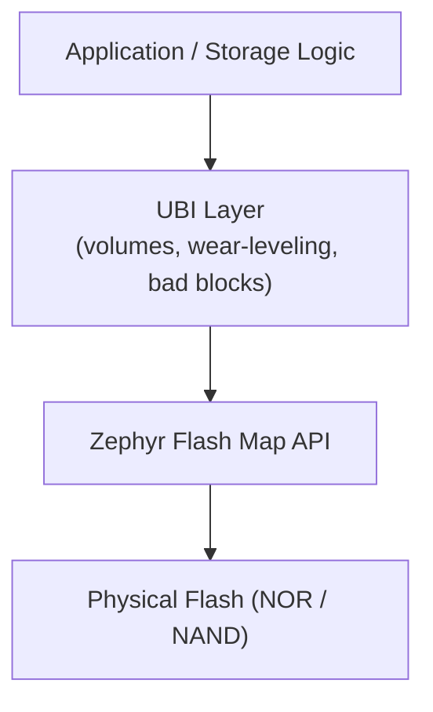

# Overview

**What this page covers:** The core mental model behind UBI — what it is, the key abstractions, and how a read/write cycle works at a high level.

**Prerequisites:** None. This is the recommended starting point.

**After reading this:** You will understand UBI's role in the storage stack, its five key concepts, and the basic lifecycle of data. For implementation details, continue to the [Plain Architecture Guide](plain_architecture.md).

---

## What is UBI?

UBI (Unsorted Block Images) is a **thin volume management layer for raw flash** on Zephyr RTOS. It solves three problems that raw flash imposes on application developers:

1. **Wear-leveling** — flash cells have limited erase cycles. UBI distributes writes so no single block wears out early.
2. **Bad block handling** — flash blocks can fail at any time. UBI detects and isolates them transparently.
3. **Logical volumes** — UBI maps multiple named volumes onto a single flash partition, each independently readable, writable, and resizable.

UBI is **not** a filesystem. It provides raw block-level I/O (read/write entire logical erase blocks), not file-level operations. Think of it as LVM for flash.

## Where UBI Sits in the Stack

UBI consumes a single Zephyr flash partition and exposes multiple logical volumes to the application. The application never touches the flash hardware directly.

## Five Key Concepts

| Concept | Abbreviation | What it is |
|---------|-------------|------------|
| Physical Erase Block | **PEB** | A hardware erase unit on the flash chip (e.g., 8 KB). The smallest unit that can be erased. |
| Logical Erase Block | **LEB** | A virtual block exposed to the application through a volume. Maps to exactly one PEB at a time. |
| Erase Counter | **EC** | A per-PEB counter tracking how many times that block has been erased. Used for wear-leveling decisions. |
| Volume Identifier | **VID** | A header on each data PEB that links it to a specific volume and LEB number. |
| Erase Block Association | **EBA** | The in-RAM mapping table from LEBs to PEBs. Rebuilt from VID headers during initialization. |

**The fundamental relationship:** an application writes to **LEBs** (logical). UBI maps each LEB to a **PEB** (physical), choosing the least-worn free block. The **VID** header on each PEB records which volume and LEB it belongs to. The **EC** header records how many times it has been erased.

## How It Works in 6 Steps

### 1. Initialization — scan and rebuild

UBI scans every PEB on the flash partition, reads EC and VID headers, and rebuilds the in-RAM state: which PEBs are free, which belong to volumes, which are dirty (stale), and which are bad.

### 2. Free, dirty, and bad pools

After scanning, each PEB is classified into exactly one pool:

| Pool | Meaning |
|------|---------|
| **Free** | Erased, ready for new writes. Stored in a red-black tree keyed by erase count. |
| **Mapped** | In use by a volume (tracked in that volume's EBA table). |
| **Dirty** | Contains stale data from a previous write. Needs erasure before reuse. |
| **Bad** | Failed I/O. Permanently excluded. |

### 3. Writing — pick the least-worn PEB

When writing to a LEB, UBI selects the free PEB with the **lowest erase counter** (wear-leveling). It writes the EC header, VID header, and user data to the new PEB, then updates the EBA mapping. If the LEB was previously mapped, the old PEB moves to the dirty pool.

### 4. Reading — look up the EBA

Reading is a direct lookup: find the PEB mapped to the requested LEB in the EBA table, then read from the correct offset on flash.

### 5. Reclaiming — erase dirty PEBs

Dirty PEBs are reclaimed by erasing them, incrementing their erase counter, writing a new EC header, and moving them back to the free pool. The application controls when this happens by calling `ubi_device_erase_peb()`.

### 6. Recovery — sequence numbers resolve conflicts

If a power loss occurs mid-write, two PEBs may claim the same LEB. During the next initialization, UBI compares their sequence numbers (`sqnum` in the VID header) — the higher sqnum wins, and the loser is moved to dirty.

## What is Configurable?

| Aspect | Kconfig option | Default |
|--------|---------------|---------|
| Reserved PEBs for metadata | `CONFIG_UBI_DEV_HDR_NR_OF_RES_PEBS` | 2 (range 2–4) |
| Max volumes per device | `CONFIG_UBI_MAX_NR_OF_VOLUMES` | 10 |
| Write retry attempts | `CONFIG_UBI_PEB_WRITE_RETRY_COUNT` | 3 (range 1–5) |
| Bad block torture cycles | `CONFIG_UBI_BAD_PEB_TORTURE_CYCLES` | 3 (range 1–10) |

See [Configuration](configuration.md) for the full reference.

## Next Steps

- [Introduction](introduction.md) — deeper context on why UBI exists, comparison with other Zephyr storage options, and resource usage profile.
- [Plain Architecture Guide](plain_architecture.md) — on-flash layout, header formats, in-RAM structures, operation flows, dual-bank mechanism, and failure handling.
- [Secure Architecture Guide](secure_architecture.md) — authenticated encryption, key hierarchy, counter continuity, and application-facing freshness.
- [Getting Started](getting_started.md) — build, test, and evaluate UBI on the simulator in minutes.
