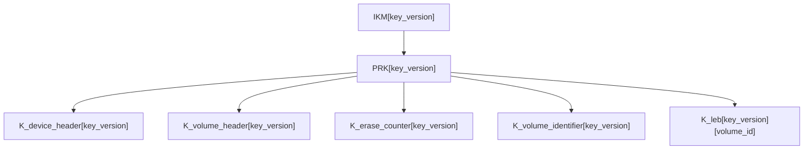
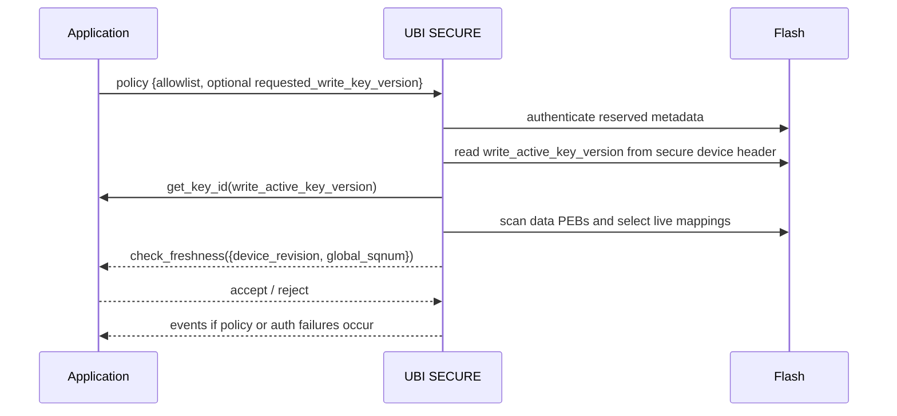
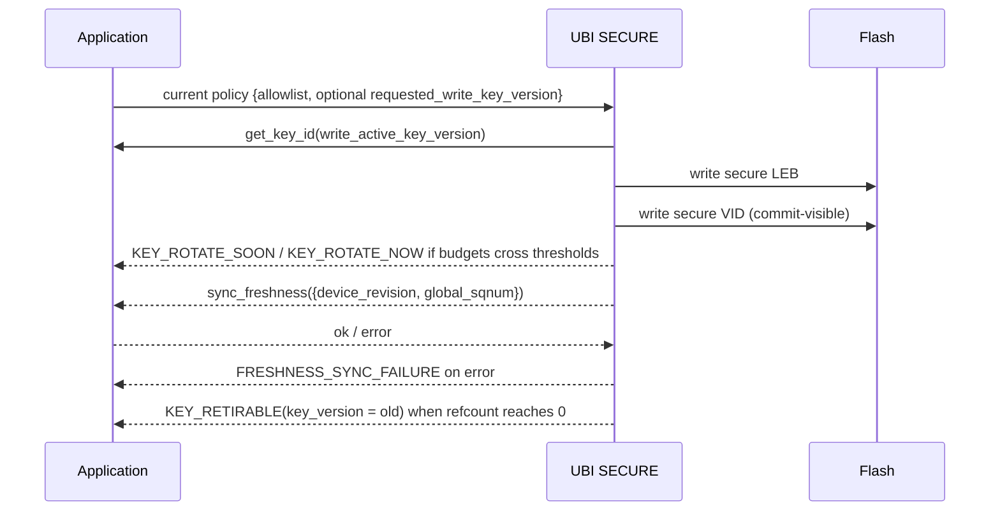

# UBI Secure Architecture Guide

```{note}
**Legacy page.** Content is being split into {doc}`secure_overview`
(developer-targeted, ≤ 5 pages) and {doc}`onflash_format_spec` (normative
specification) as part of the v1.0.0 documentation restructure (PR 4).
This URL stays reachable until the split lands.
```

**What this page covers:** SECURE on-flash format for UBI — encrypted device and volume metadata, encrypted EC/VID/data records, key hierarchy, nonce/AAD rules, counter continuity, anchors, and application-facing freshness.  
**Prerequisites:** Read [What is UBI?](what_is_ubi.md) and the [Plain Architecture Guide](plain_architecture.md) first for the plain UBI mental model, `volume_id`, `sqnum`, reserved PEB mirroring, and the `DATA -> VID` crash model.  
**What you will learn:** What SECURE mode changes, what it gives the application, how rollback detection plugs into UBI, and how future-write counters survive reclaim and volume removal.

---

## 1. 30-second summary

A UBI device works in exactly one mode: **PLAIN** or **SECURE**.

SECURE keeps the plain UBI object model and crash model, but wraps every commit-visible object in authenticated encryption:

- secure device header,
- secure volume header,
- secure erase-counter (EC) header,
- secure volume-identifier (VID) header,
- secure LEB record.

The inner plain payloads stay the same; only their on-flash representation, keying, authentication, and recovery rules change.

### 1.1 What SECURE changes at a glance

| Pillar | What SECURE changes | What the application gets |
|--------|---------------------|---------------------------|
| Same UBI semantics | The secure record wraps the existing plain payload instead of replacing the UBI model. | Wear-leveling, logical volumes, `sqnum`-based recovery, and the plain crash model still apply. |
| Full encrypted format | Device metadata, volume metadata, EC, VID, and user LEB data are encrypted and authenticated. Only the 32-byte common prefix stays parseable before authentication. | No meaningful UBI metadata or user payload is left in plaintext on flash. |
| Versioned key hierarchy | One `IKM[key_version]` fans out into device, volume, EC, VID, and per-volume LEB child keys. | Strong domain separation and per-volume isolation for LEB data. |
| Key lifecycle built into the format | SECURE tracks `write_active_key_version`, allowlisted versions, usage budgets, refcounts, retirement, and continuity floors. | The application does not need to reinvent key-rotation safety inside the filesystem or database. |
| Freshness exported to the application | UBI exports authenticated `(device_revision, global_sqnum)` and provides freshness callbacks. | The application can implement rollback / replay detection against its own trusted freshness store. |
| Future-write continuity is explicit | Hidden per-volume anchors preserve per-volume LEB floors, and the secure device header preserves the global VID-domain floor. | Secure writes can continue safely after reclaim, `unmap`, `shrink`, and even after removing all volumes. |

### 1.2 Why this is hard to tamper with

An attacker who controls raw flash, but does not know an accepted `IKM[key_version]`, cannot make arbitrary modified state look valid to SECURE UBI:

- changing ciphertext or authenticated plaintext fields breaks tag verification,
- moving a record to another physical location or another logical identity breaks AAD binding,
- replaying older authenticated state still has to pass the application's freshness policy,
- an accepted user mapping depends on authenticated secure EC, secure VID, and secure LEB state, not on one ciphertext blob in isolation.

In practice, accepted reads and writes are protected by:

- domain-separated child keys,
- authenticated record linkage,
- location and identity binding in AAD,
- monotonic counter usage and usage budgets,
- application-visible freshness for rollback / replay decisions.

### 1.3 Plain-core baseline assumed by this document

This specification assumes that the plain UBI core already provides these baseline properties:

- reclaimed data PEBs receive a valid EC header before they re-enter the free pool, and the mapping-visible write order on such a PEB is `DATA -> VID`,
- initialization distinguishes `free` from `uncommitted` by checking both the VID area and the beginning of the LEB area,
- erased-state checks use the runtime flash erased value and never hardcode `0xFF`,
- all commit-visible mutating operations pass through one central mutation gate,
- `volume_id` is a durable, monotonically allocated identifier that is not reused during the lifetime of one formatted device.

Those assumptions matter because SECURE mode reuses the same logical object model and the same recovery points. In particular, the secure design relies on `VID` being the commit-visible mapping record and on `volume_id` being a stable namespace input for per-volume key derivation, usage recovery, and retirement decisions.

### 1.4 Mode detection and out-of-scope transitions

PLAIN and SECURE are different on-flash formats.

The library is **multi-backend capable**: both plain and secure backends may be compiled into the same binary. However, **each `ubi_device` handle operates in exactly one mode** — the mode is selected at runtime during `ubi_device_init()` based on the caller-supplied `crypto_cfg` pointer and the detected on-flash format:

- `crypto_cfg == NULL` requests plain mode,
- `crypto_cfg != NULL` requests secure mode,
- for blank media the requested mode determines the format,
- for non-blank media the detected on-flash format must match the requested mode.

This runtime selection model allows a single firmware image to manage both a plain UBI partition on internal flash and a secure UBI partition on external flash, each with its own independent `ubi_device` handle.

Normative rule:

- a secure-mode attach shall accept only SECURE-formatted media,
- a plain-mode attach shall accept only plain-formatted media,
- a mode mismatch between the caller's request and the detected format is a hard error,
- silent fallback is forbidden,
- automatic reformat is forbidden,
- in-place migration between PLAIN and SECURE is out of scope and must be rejected.

This document intentionally does **not** define mixed-mode operation on one partition, automatic reformat, or any attach-time conversion path. If a product ever needs migration, that flow must be an explicit offline tool or explicit maintenance procedure outside the normal attach path.

The practical detection point is the reserved area. SECURE media are identified by the secure wrapper magic at the reserved-header locations. A mode mismatch is a format mismatch, not a conversion opportunity.

Periodic runtime re-audit of the medium against the freshness store is intentionally out of scope. The `check_freshness` callback remains an attach-time-only interaction. If a product needs active periodic auditing, that should be a separate API or maintenance path, not a change to the `check_freshness` semantics.

## 2. High-level picture

### 2.1 Layer view

```text
+--------------------------------------------------------------------------------------+
| Application / filesystem / database / trusted freshness store                        |
| - provides key IDs, allowlist, and policy callbacks                                  |
| - stores trusted freshness state and decides rollback policy                         |
+--------------------------------------------------------------------------------------+
| UBI SECURE                                                                           |
| - same UBI semantics: volume management, EBA mapping, wear-leveling, reclaim         |
| - secure wrappers: device, volume, EC, VID, LEB                                      |
| - key hierarchy, nonce/AAD, budgets, refcounts, hidden anchors, VID floor            |
+--------------------------------------------------------------------------------------+
| Raw flash partition                                                                  |
| - reserved PEBs: secure device header + secure volume headers                        |
| - data PEBs: secure EC + secure VID + secure LEB, plus hidden anchors                |
+--------------------------------------------------------------------------------------+
```

Boundary summary:

| Direction | Interface |
|-----------|-----------|
| Application → UBI | PSA key identifiers for versioned root keys, allowlist of acceptable key versions, optional request to advance the write-active key version, init-time freshness policy callback, optional post-commit freshness-sync callback, event callback |
| UBI → Application | authenticated `write_active_key_version`, authenticated freshness values (`device_revision`, `global_sqnum`), key lifecycle events, security events, retirement notifications, post-commit freshness-sync requests |

SECURE mode assumes that the plain-core central mutation gate already exists. Secure policy hooks attach to that same gate so that all commit-visible mutating operations are observed at one place.

Because the library supports runtime backend selection, a single firmware image may hold both a plain and a secure `ubi_device` simultaneously. Each handle uses its own backend, its own configuration, and its own lock. There is no shared mutable state between handles and no cross-talk between the plain and secure backends.

### 2.2 Flash view

```text
UBI partition
================================================================================

Reserved PEB area (CONFIG_UBI_DEV_HDR_NR_OF_RES_PEBS, range 2..4)
+--------------------------------------------------------------------------------------+
| Reserved PEB 0 | secure device header + secure volume headers                        |
| Reserved PEB 1 | secure device header + secure volume headers                        |
| Reserved PEB 2 | optional spare mirror bank                                          |
| Reserved PEB 3 | optional spare mirror bank                                          |
+--------------------------------------------------------------------------------------+

Data PEB area
+--------------------------------------------------------------------------------------+
| Data PEB N   | secure EC header | secure VID header | secure LEB record              |
| Data PEB N+1 | secure EC header | secure VID header | secure LEB record              |
| ...          | ...              | ...               | ...                            |
+--------------------------------------------------------------------------------------+

Hidden anchor PEBs
+--------------------------------------------------------------------------------------+
| Internal per-volume data PEBs using the same secure EC / secure VID / secure LEB    |
| layout. `vid_hdr.lnum = INTERNAL_ANCHOR_LNUM`; secure LEB payload is zero-length.   |
+--------------------------------------------------------------------------------------+
```

### 2.3 One data PEB

```text
Offset from start of physical eraseblock
================================================================================

0x0000  +---------------------------------------------------------------+
        | secure EC header                                              |
        | prefix32 | ciphertext(ec_hdr) | tag16                         |
        +---------------------------------------------------------------+

0x0040  +---------------------------------------------------------------+
        | secure VID header                                             |
        | prefix32 | ciphertext(vid_hdr + vid_secure_meta) | tag16      |
        +---------------------------------------------------------------+

0x00A0  +---------------------------------------------------------------+
        | secure LEB record                                             |
        | single-tag : prefix32 | ciphertext(payload_bytes) | tag16     |
        | chunked    : prefix32 | chunk0 ciphertext | tag0 | ...        |
        +---------------------------------------------------------------+
```

For the base single-tag layout, secure data-PEB metadata consumes **208 B**:

- secure EC header: **64 B**
- secure VID header: **96 B**
- secure LEB prefix: **32 B**
- secure LEB tag: **16 B**

---

## 3. What SECURE mode gives and what it does not

### 3.1 What the application gets

SECURE UBI combines one secure on-flash format with the existing UBI storage model:

| Area | What the application gets |
|------|---------------------------|
| Confidentiality at rest | User data and UBI metadata are encrypted. |
| Integrity and authenticity | Every secure record is authenticated before it is trusted. |
| Plain UBI behavior | Logical volumes, wear-leveling, bad-block handling, dual-bank reserved metadata, and `sqnum`-based recovery remain. |
| Rollback / replay hook | UBI exports authenticated `(device_revision, global_sqnum)` so the application can compare them against its trusted freshness store. |
| Key lifecycle handling | `write_active_key_version`, allowlist enforcement, budgets, refcounts, retirement, and continuity floors live in UBI instead of being rebuilt above it. |
| High-write orientation | The format is designed for repeated writes; nonce use, authenticated-byte usage, rotation thresholds, and reclaim-time continuity are explicit parts of the architecture. |

### 3.2 Security consequence in plain language

An attacker with raw-flash access but without an accepted root key version cannot:

- read meaningful UBI metadata or user payload from secure ciphertext alone,
- modify authenticated payload fields, counters, or metadata without failing AEAD verification,
- move ciphertext to another physical eraseblock, volume, or logical number and still have it accepted,
- replay older authenticated state without also defeating the application's trusted freshness policy.

To make forged user data accepted, the attacker would need at least one of the following:

- compromise an accepted `IKM[key_version]`, which yields all child keys for that version,
- break the relevant AEAD checks across the secure EC -> secure VID -> secure LEB chain,
- or defeat the application's trusted freshness store so that stale `(device_revision, global_sqnum)` is accepted.

Knowledge of one child key alone is not sufficient to build a complete accepted mapping; accepted data depends on the authenticated chain and AAD binding, not on one record in isolation.

### 3.3 Explicit boundary

SECURE mode is intentionally scoped:

- UBI does not assume a global journal or a hardware monotonic counter,
- UBI does require fresh cryptographic randomness for every secure write,
- UBI does export authenticated freshness values to the application,
- complete anti-rollback still requires an external trusted freshness store or equivalent trust anchor.

So SECURE mode provides authenticated on-flash encryption plus the continuity state and policy hooks needed to keep writing safely. It does not claim that rollback can be prevented without any external trust anchor.

## 4. Terminology and invariants

### 4.1 Terms

**Physical eraseblock index**  
The numeric index of a physical eraseblock inside the UBI partition. This document writes it out in full; it does not rely on the shorter `pnum` nickname.

**Flash offset**  
A byte offset from the beginning of the UBI partition.

**Commit-visible**  
State that survives power loss and is visible to init without consulting transient RAM state.

**Authenticated object**  
A secure record whose AEAD verification succeeded with an allowlisted key version.

**Live mapping**  
The winning `(volume_id, lnum)` mapping selected by the highest authenticated `vid_sqnum`.

**Dirty PEB**  
A data PEB that still contains stale or interrupted state and must be erased before reuse.

**Free data PEB**  
A data PEB with a valid secure EC header, an erased secure VID area, and an erased secure LEB-prefix area. "Erased" always means equal to the flash device's configured erased value. It must never be hardcoded to `0xFF`.

**Uncommitted data PEB**  
A data PEB with a valid secure EC header and an erased secure VID area, but with non-erased bytes in the secure LEB-prefix area. This represents an interrupted `DATA -> VID` write and must not be classified as free.

**Hidden anchor PEB**  
A live, internal, non-user-addressable data PEB owned by one secure volume. It uses a dedicated internal logical number, stores a zero-length secure LEB record, and can carry the authoritative per-volume LEB usage floor when user mappings disappear.

**Volume identifier (`volume_id`)**  
A durable identifier assigned when a volume is created. `volume_id` is monotonic, persists across reboot, and is not reused during the lifetime of one formatted device. SECURE mode uses `volume_id` as the per-volume cryptographic identity.

**VID next-counter floor**  
The monotonic floor for future secure VID writes under the current authenticated `write_active_key_version`. SECURE stores this value in the secure device header as `vid_next_counter_floor`.

**Naming note**  
The term `volume_id` in this document names the durable per-volume identity currently carried by the plain-core `vol_id` field. The longer name is intentional: it makes the cryptographic identity explicit and avoids overloading local scan or RAM bookkeeping ordinals.

**Export-width note for `device_revision`**  
The API may expose `device_revision` as a widened integer type for convenience. If a concrete implementation stores a narrower on-flash revision field, widening must preserve the numeric value and ordering semantics.

### 4.2 Core invariants

After successful initialization:

1. Every live user LEB maps to exactly one data PEB.
2. Every secure volume also owns exactly one live hidden anchor mapping, identified by a dedicated internal logical number that is never exposed through the user API.
3. Among competing authenticated VIDs for the same `(volume_id, lnum)`, the higher `vid_sqnum` wins.
4. A dirty PEB must be erased before it can re-enter the free pool.
5. Reserved PEBs are used only for secure device and volume metadata.
6. The authenticated secure device header stores:
   - `write_active_key_version`
   - `vid_next_counter_floor`
7. For secure LEB writes, the authoritative next write counter and total authenticated bytes are recovered from authenticated VID-side metadata, including the hidden anchor when user mappings disappear.
8. `volume_id` is unique for the lifetime of one formatted device and is the only per-volume cryptographic identity. No reusable RAM index or scan-local ordinal may appear in LEB key derivation, LEB usage recovery state, or retirement logic.
9. The write-active key version is monotonic and must never move back to an older value on the same formatted device.
10. A key version becomes **retirable** only when no authenticated on-flash object still references it.
11. The device must not perform a secure write if it cannot construct a fresh nonce from cryptographically secure randomness.
12. All commit-visible mutating operations pass through one central mutation gate so that secure policy and freshness hooks observe the same transition points.
13. SECURE must preserve a path to one emergency free data PEB for hidden-anchor maintenance. It shall either keep one free data PEB available or first reclaim a dirty PEB that is not the last current writable witness before reclaiming a protected witness. It must never erase the last current writable witness first and only afterwards discover that there is nowhere to commit the inherited anchor state.

---

## 5. Cryptographic profile

### 5.1 Algorithm choice

UBI SECURE uses **AES-128-CCM** for all authenticated-encryption records.

This is a good match for UBI because UBI stores explicit records, not streams:

- metadata records are naturally packet-sized,
- AAD is explicit,
- the nonce is explicit,
- the format naturally fits the "authenticate then decrypt one complete record" model,
- embedded platforms that expose hardware AEAD support commonly support CCM for this workload.

The child AEAD key size is therefore fixed:

```text
AES child key size = 128 bits
```

This is independent from the root-key requirement for `IKM[v]`.

### 5.2 CCM parameters

This architecture fixes:

- nonce length = **13 bytes**
- tag length = **16 bytes**

That implies the standard CCM relation:

```text
n + q = 15
13 + 2 = 15
```

With `q = 2`, one CCM invocation can cover:

```text
payload_len < 2^(8*q) = 65536 bytes
```

So the architecture requires:

```text
secure_leb_payload_bytes < 65536
```

This must be enforced both:

- as a compile-time guard for supported geometries, and
- as a runtime rejection if a larger geometry is somehow presented.

For the base single-tag secure LEB layout, the maximum logical payload on one data PEB is:

```text
secure_leb_payload_bytes_single = peb_size - 208
```

Therefore single-tag mode is valid only if:

```text
peb_size - 208 < 65536
```

If that condition is false for the selected geometry, SECURE must either:

- require chunked LEB mode for that geometry, or
- reject SECURE mode at build time or initialization time.

### 5.3 Why UBI tracks both AEAD invocations and authenticated bytes

CCM has two properties that matter here:

1. every invocation under one key requires a unique nonce,
2. the security margin degrades as more authenticated data are processed under the same key.

For **LEB keys**, UBI therefore tracks two monotonic usage dimensions:

- **number of AEAD invocations already consumed under `{key_version, volume_id}`**
- **total authenticated bytes already processed under `{key_version, volume_id}`**

Those two dimensions are represented as:

- `leb_write_counter`
- `leb_total_auth_bytes`

`leb_write_counter` is the next unused AEAD / nonce-counter value for that `{key_version, volume_id}`. `leb_total_auth_bytes` is the cumulative authenticated-byte volume:

```text
AAD bytes + payload plaintext bytes
```

For **metadata keys**, UBI also evaluates both dimensions, but the accounting is different:

- metadata AEAD-invocation count is recovered directly from authenticated `prefix32.counter` values,
- metadata authenticated-byte usage is derived, not persisted, because each metadata record type has a fixed plaintext size and a fixed AAD shape.

That asymmetry is intentional:

- metadata records have fixed sizes, so authenticated-byte usage can be reconstructed from `{domain, key_version}` and the next counter value,
- LEB records have variable payload size, so cumulative authenticated-byte usage must be persisted in secure VID metadata,
- the architecture budgets on AEAD invocations and authenticated bytes because those are the monotonic quantities directly visible at the UBI layer.

The design does **not** persist an internal AES-128 block-operation count. If an implementation wants a block-level estimate, it can conservatively derive it from authenticated bytes and the fixed CCM per-record formatting cost. The architectural policy surface, however, is expressed in:

- AEAD invocations,
- authenticated bytes.

Both dimensions are checked before a new write is committed.

### 5.4 Entropy source requirement

Every secure record prefix carries a fresh 6-byte salt. That salt must come from a **cryptographically secure random source**.

The architectural requirement is:

- SECURE writes use PSA random generation or an equivalent cryptographically secure RNG,
- non-cryptographic RNG APIs and test RNG backends are forbidden for secure nonce construction,
- if secure randomness is unavailable, the write must fail closed.

In other words, the device must not attempt a secure write unless it can produce a fresh unpredictable nonce salt for that write.

---

## 6. Key material and key hierarchy

### 6.1 Root key model and minimum requirement

The root key material for one key version is written conceptually as:

```text
IKM[v]
```

SECURE mode is **PSA-only**. `IKM[v]` remains a conceptual term in the architecture, but the normal implementation contract is:

- the application provides a **PSA key identifier** for key version `v`,
- that PSA key refers to device-unique secret root material,
- UBI does not receive raw root-key bytes through its normal API surface,
- child keys should remain non-exportable PSA keys whenever the platform supports that flow.

The root-key requirement is:

- `IKM[v]` shall represent at least **256 bits** of secret, device-unique input key material,
- `IKM[v]` must have high effective entropy,
- `IKM[v]` must be unique per device,
- the application may satisfy that by provisioning a device-unique root secret directly,
- or by deriving `IKM[v]` from a device-unique secret such as HUK/DHUK.

The following are **not** acceptable by themselves:

- serial number,
- MAC address,
- UUID,
- devicetree data,
- any other low-entropy identifier.

This is mandatory. Without device-unique keying, a full flash clone could be readable on another device with the same root key material.

If a platform cannot provide all of the following, SECURE mode is unsupported on that platform:

- PSA AEAD for `AES-128-CCM`,
- PSA key derivation for `HKDF-SHA-256`,
- cryptographically secure random generation.

### 6.2 Child keys

UBI derives child keys from `IKM[v]` using **HKDF-SHA-256**.

The KDF encoding is normative.

Extract step:

```text
PRK[v] = HKDF-Extract(salt = "", IKM[v])
```

Expand-step output length:

```text
L = 16 bytes
```

Exact expand labels in the current format:

```text
K_device_header[v]
    = HKDF-Expand(PRK[v],
                  "UBI" || 0x00 || "DEVICE-HEADER" || 0x00 || 0x01,
                  L)

K_volume_header[v]
    = HKDF-Expand(PRK[v],
                  "UBI" || 0x00 || "VOLUME-HEADER" || 0x00 || 0x01,
                  L)

K_erase_counter[v]
    = HKDF-Expand(PRK[v],
                  "UBI" || 0x00 || "ERASE-COUNTER" || 0x00 || 0x01,
                  L)

K_volume_identifier[v]
    = HKDF-Expand(PRK[v],
                  "UBI" || 0x00 || "VOLUME-IDENTIFIER" || 0x00 || 0x01,
                  L)

K_leb[v][volume_id]
    = HKDF-Expand(PRK[v],
                  "UBI" || 0x00 || "LEB" || 0x00 || 0x01 || be32(volume_id),
                  L)
```

Normative rules:

- HKDF salt is the zero-length string in the definitions above,
- `0x01` is the current format/KDF compatibility byte,
- all integer fields inside KDF context are big-endian,
- `volume_id` is encoded as `be32(volume_id)`,
- the exact label bytes above are part of on-flash compatibility and must not change without an explicit format-version change.

The LEB key is volume-specific. That is why the LEB usage budget is tracked per:

```text
{key_version, volume_id}
```

The key hierarchy itself is:



Runtime accounting is attached to those domains, but it is **not** part of the derived key material itself:

```text
K_device_header[key_version]
    -> next_counter[{device_header, key_version}]

K_volume_header[key_version]
    -> next_counter[{volume_header, key_version}]

K_erase_counter[key_version]
    -> next_counter[{erase_counter, key_version}]

K_volume_identifier[key_version]
    -> next_counter[{volume_identifier, key_version}]

secure device header
    -> write_active_key_version
    -> vid_next_counter_floor

K_leb[key_version][volume_id]
    -> next_leb_write_counter
    -> next_leb_total_auth_bytes
```

This separation is intentional:

- child keys come from HKDF only,
- counters and usage floors are runtime / on-flash accounting state associated with those keys,
- the counters are never fed back into HKDF as additional key-derivation input.

`volume_id` is the only durable per-volume namespace input allowed in LEB key derivation. Any reusable RAM index or scan-local ordinal is explicitly out of scope for secure identity.

By contrast, the VID-domain key remains global for one key version:

```text
K_volume_identifier[key_version]
```

That is why SECURE preserves future secure VID-write continuity with the authenticated `vid_next_counter_floor` stored in the secure device header, instead of attempting to namespace the VID key by `volume_id`.

### 6.3 Chunked mode reuses the base LEB key

Chunked mode does **not** derive a second per-chunk key hierarchy.

The base key remains:

```text
K_leb[v][volume_id]
```

and that same key is reused for every chunk of the current secure LEB record.

Nonce uniqueness comes from the combination of:

- one fresh per-record `salt`,
- one monotonic `counter_base` stored in `prefix32.counter`,
- one per-chunk counter increment,
- `chunk_index` included in AAD.

This is sufficient because CCM requires nonce uniqueness per key. It does **not** require a different key per chunk.

The design therefore keeps chunked mode simple:

- one LEB key per `{key_version, volume_id}`,
- one prefix for the whole record,
- no extra chunk-key table,
- no extra HKDF work during reads or writes beyond the normal LEB-key derivation.

Chunked mode still increases the LEB usage budget because one logical write can consume more than one AEAD invocation. That accounting is described in sections 8.2 and 9.7.

### 6.4 Why secure records are separate types

The architecture keeps **plain** and **secure** record types separate.

That is deliberate.

The plain structures remain the semantic payloads already used by UBI:

- `struct ubi_dev_hdr`
- `struct ubi_vol_hdr`
- `struct ubi_ec_hdr`
- `struct ubi_vid_hdr`

The secure records are distinct wrapper types that add:

- common prefix,
- secure-only metadata,
- tag,
- AAD rules,
- versioning.

This makes the secure format easier to maintain, easier to version, and easier to reason about than trying to overload the plain record definitions themselves.

---

## 7. Secure record formats

### 7.1 Common prefix

Every secure record begins with the same **32-byte prefix**:

```c
struct ubi_crypto_prefix32 {
    uint32_t magic;           /* format magic */
    uint8_t  wrapper_version; /* current on-flash format version */
    uint8_t  domain;          /* DEVICE_HEADER / VOLUME_HEADER / ERASE_COUNTER / VOLUME_IDENTIFIER / LEB */
    uint8_t  key_version;     /* version of IKM[v] */
    uint8_t  flags;           /* record flags */
    uint8_t  salt[6];         /* fresh RNG salt */
    uint8_t  counter[6];      /* monotonic AEAD counter or counter base */
    uint8_t  reserved[12];    /* zero in the current format */
};
```

Properties:

- `magic` is **32 bits**,
- `wrapper_version` is fixed for the current on-flash format; every secure
  read path validates it immediately after the magic check and rejects
  records whose `wrapper_version` does not match the build-time
  `UBI_SECURE_WRAPPER_VERSION` with `-EBADMSG`, before any key
  derivation or AEAD work — an unknown format version is a parse-time
  error, never an authentication failure,
- `salt` stays **6 bytes**,
- `counter` stays **6 bytes**,
- the prefix is plaintext for parsing,
- the prefix becomes trustworthy only after AEAD verification succeeds,
- all multi-byte integers in the prefix are serialized in **big-endian**.

### 7.2 Secure record names

The document uses these names consistently:

- **secure device header**
- **secure volume header**
- **secure erase-counter (EC) header**
- **secure volume-identifier (VID) header**
- **secure LEB record**

### 7.3 Secure device header

The secure device header encrypts two payloads together:

- inner `struct ubi_dev_hdr`
- secure device-side crypto metadata

```c
struct ubi_dev_secure_meta {
    uint8_t  write_active_key_version; /* authenticated current write-active version */
    uint8_t  reserved0[7];             /* zero in the current format */
    uint64_t vid_next_counter_floor;   /* next unused VID counter for write_active_key_version */
};
```

Normative rules:

- `write_active_key_version` is part of authenticated on-flash policy state,
- in the current format, `write_active_key_version` shall match the authenticated `prefix32.key_version` of the secure device header record,
- `vid_next_counter_floor` is monotonic and never decreases,
- when the write-active key version advances to a newer value, `vid_next_counter_floor` is reinitialized to that newer version's first valid VID counter and the old version never becomes write-active again.

```text
+----------+------------------------------------------+--------+
| prefix32 | ciphertext(dev_hdr + dev_secure_meta)    | tag16  |
+----------+------------------------------------------+--------+
   32 B                     48 B                          16 B     total = 96 B
```

### 7.4 Secure volume header

```text
+----------+------------------------+--------+
| prefix32 | ciphertext(vol_hdr)    | tag16  |
+----------+------------------------+--------+
   32 B              48 B               16 B     total = 96 B
```

### 7.5 Secure EC header

```text
+----------+------------------------+--------+
| prefix32 | ciphertext(ec_hdr)     | tag16  |
+----------+------------------------+--------+
   32 B              16 B               16 B     total = 64 B
```

### 7.6 Secure VID header

The secure VID header contains two plaintext domains encrypted together:

- inner `struct ubi_vid_hdr`
- secure VID-side LEB metadata

```c
struct ubi_vid_secure_meta {
    uint64_t leb_write_counter;       /* next unused AEAD counter for {key_version, volume_id} */
    uint64_t leb_total_auth_bytes; /* cumulative authenticated bytes (AAD + payload) for {key_version, volume_id} */
};
```

```text
+----------+----------------------------------------+--------+
| prefix32 | ciphertext(vid_hdr + vid_secure_meta)  | tag16  |
+----------+----------------------------------------+--------+
   32 B                     48 B                        16 B      total = 96 B
```

These two fields are the **authoritative** write-usage recovery state for:

```text
{key_version, volume_id}
```

They exist for one reason:

- init already needs to authenticate secure VID records,
- therefore init can recover future LEB write state without reading and authenticating every LEB payload.

Every committed secure VID record and its corresponding secure LEB record use the same `key_version`.

`vid_hdr.volume_id` is the durable, never-reused volume identity provided by the plain core. It is the LEB key-derivation input and the identity used by runtime usage accounting.

### 7.7 Secure LEB record (single-tag mode)

```text
+----------+---------------------------+--------+
| prefix32 | ciphertext(payload_bytes) | tag16  |
+----------+---------------------------+--------+
```

Important points:

- `payload_bytes` is the current logical payload length,
- `payload_bytes` is taken from authenticated `vid_hdr.data_size`,
- if authenticated `vid_hdr.data_size == 0`, SECURE still writes a zero-length secure LEB record using the base `prefix32 || tag16` layout with zero ciphertext bytes,
- for that zero-length case, one AEAD invocation is still consumed and `leb_total_auth_bytes` advances by the fixed zero-length LEB AAD size,
- single-tag mode is valid only when authenticated `payload_bytes < 65536`,
- this CCM payload limit is enforced at runtime: `ubi_secure_leb_data_write` rejects `len > UBI_SECURE_LEB_SINGLE_TAG_MAX_PAYLOAD` (65535) with `-EFBIG`, `ubi_secure_leb_data_read` rejects `vid_hdr.data_size > UBI_SECURE_LEB_SINGLE_TAG_MAX_PAYLOAD` with `-EBADMSG`, and in non-chunked builds device init rejects geometries with `leb_size > UBI_SECURE_LEB_SINGLE_TAG_MAX_PAYLOAD` with `-EINVAL`,
- the architecture does **not** require buffering the full maximum LEB capacity when the logical payload is shorter,
- but single-tag mode still requires full authentication of the complete recorded payload before any plaintext may be returned,
- if flash write alignment requires a longer terminal write, any extra bytes must appear only after `tag16`, must be written as the flash erased value, and are outside the authenticated record,
- read-side record length comes only from authenticated `vid_hdr.data_size`; trailing tail bytes after `tag16` are ignored.

### 7.8 Secure LEB record (chunked mode)

Chunked mode keeps the same prefix and the same secure VID metadata. Only the payload body changes:

```text
+----------+--------------------+------+--------------------+------+-----+
| prefix32 | chunk0 ciphertext  | tag0 | chunk1 ciphertext  | tag1 | ... |
+----------+--------------------+------+--------------------+------+-----+
```

Rules:

- chunk size is fixed by Kconfig,
- chunk index starts at `0`,
- all chunks use the same base key `K_leb[key_version][volume_id]`,
- chunk index is included in AAD,
- the chunk count is derived from authenticated `vid_hdr.data_size`:

```text
chunk_count = ceil(data_size / chunk_size)    for data_size > 0
```

- if `data_size == 0`, SECURE falls back to the zero-length base record `prefix32 || tag16`; no per-chunk tags are present,
- for `data_size > 0`, `leb_write_counter` advances by `chunk_count` and `leb_total_auth_bytes` advances by `data_size + chunk_count * fixed_leb_aad_bytes_chunked`,
- for the zero-length fallback, `leb_write_counter` advances by `1` and `leb_total_auth_bytes` advances by `fixed_leb_aad_bytes_single`,
- if chunk ciphertext is written directly to flash, `chunk_size` should be a multiple of the flash write alignment,
- if one `(chunk ciphertext || tag)` write would violate the target flash alignment rule, the implementation must either use an aligned staging buffer or reject the configuration.

Chunked mode is optional only for geometries where single-tag mode is valid. For geometries that violate the single-tag CCM payload limit, chunked mode becomes mandatory if SECURE is supported at all.

### 7.9 Hidden per-volume anchor PEB

Each secure volume owns one hidden anchor PEB.

Properties:

- it is **not** user-addressable,
- it uses the same secure EC / secure VID / secure LEB record types as an ordinary data PEB,
- it uses a dedicated internal logical number `INTERNAL_ANCHOR_LNUM` that is outside the user-visible `lnum` range,
- its secure LEB record always uses the zero-length base layout `prefix32 || tag16`,
- its secure VID metadata carries the same two per-volume recovery fields:
  - `leb_write_counter`
  - `leb_total_auth_bytes`
- user-visible `leb_count` excludes the hidden anchor.

The anchor exists for one purpose:

- if all user mappings of a volume are later unmapped or shrunk away,
- or if the last dirty user witness carrying the newest per-volume floor is about to be erased,
- SECURE still has one authenticated, commit-visible carrier that can preserve the per-volume LEB usage state.

Because the anchor uses the normal secure VID and secure LEB layouts, it benefits from the same properties as ordinary mappings:

- `DATA -> VID` commit order,
- higher `vid_sqnum` wins,
- authenticated parent binding,
- authenticated recovery of `leb_write_counter` and `leb_total_auth_bytes`.

Anchor-liveness policy:

- SECURE shall preserve one emergency free data PEB for secure maintenance writes such as hidden-anchor rescue.
- If that invariant is temporarily broken, reclaim shall first erase a dirty PEB that is **not** the last current writable witness for any protected per-volume floor in order to re-establish one.
- SECURE must never erase the last current writable witness and only afterwards discover that no free data PEB exists for the required anchor rewrite.
- If neither a free data PEB nor a safe non-witness dirty PEB exists, the operation must be deferred or rejected by policy. SECURE does not break counter continuity to make progress.

### 7.10 Integrity semantics of inner CRC fields

The inner plain payloads may still contain fields such as `hdr_crc`. In SECURE mode, their meaning is reduced to **compatibility and optional format-consistency**, not primary security.

Normative rule:

- AEAD verification is the authoritative integrity and authenticity decision.
- Inner CRC fields are not an independent trust primitive in SECURE mode.
- If retained, inner CRC fields may be recomputed on write so that the embedded plain payload stays self-consistent.
- If checked on read, an inner CRC mismatch after successful AEAD verification is a **format violation of authenticated plaintext**, not a separate authenticity result.
- Inner CRC fields must not be used for nonce construction, AAD cross-record binding, rollback logic, or key-retirement logic.

**Implementation note (UBI SECURE).** The secure read path deliberately does **not** re-verify inner `hdr_crc` fields after a successful AEAD verification. The 16-byte CCM tag already authenticates the entire serialized record (prefix + plaintext, including any inner CRC fields), so a second CRC check would be redundant for security and would only catch internal serializer bugs already covered by unit tests. Inner CRC fields are still computed on write so that the embedded plain payload stays self-consistent for plain-backend interop and external tooling, but the secure backend treats them as opaque authenticated bytes.

---

## 8. Nonce and AAD

### 8.1 Base nonce

For all non-chunked secure records:

```text
nonce = domain(1 B) || salt(6 B) || counter(6 B)
```

So the entire 13-byte CCM nonce comes directly from authenticated prefix fields.

### 8.2 LEB write counter identity

For secure LEB writes, these two values are intentionally related but **not identical**:

- `prefix32.counter`
- `vid_secure_meta.leb_write_counter`

They mean:

```text
prefix32.counter              = counter_base used by this committed record
vid_secure_meta.leb_write_counter = next unused counter after this committed record
```

So:

- single-tag write or zero-length write  
  `next = counter_base + 1`
- chunked write with `chunk_count = N`  
  `next = counter_base + N`

Why both exist:

- `prefix32.counter` is required immediately to build the current record nonce or nonce sequence,
- `vid_secure_meta.leb_write_counter` is the authenticated, commit-visible copy that init trusts when reconstructing the next write state.

This split is what allows chunked mode to consume multiple AEAD invocations while still keeping recovery state in the secure VID record.

### 8.3 Chunked-mode nonce

Chunked mode keeps the prefix unchanged and reuses the same base LEB key for all chunks of the record.

Let:

```text
counter_base = be48(prefix32.counter)
```

For chunk `i` (`0 <= i < chunk_count`), UBI derives:

```text
chunk_nonce_i = domain(1 B) || salt(6 B) || be48(counter_base + i)
```

Chunk index is also included in AAD.

This keeps the on-flash structure simple:

- one common prefix,
- one key version,
- one counter field,
- one LEB key per `{key_version, volume_id}`,
- optional chunking without inventing a second prefix layout or a second key hierarchy.

### 8.4 AAD encoding rule

All AAD inputs must be serialized in a canonical binary form:

- fixed-width fields only,
- big-endian integers,
- no text formatting such as `%u`,
- no platform-dependent structure layout,
- no `packed` dependency.

### 8.5 AAD by record type

AAD fields are serialized in the exact order shown below.

- **Secure device header — 44 B total**
  - `prefix32`: **32 B**
  - reserved-PEB physical eraseblock index `be32(...)`: **4 B**
  - device-header flash offset from the start of the UBI partition `be64(...)`: **8 B**

- **Secure volume header — 53 B total**
  - `prefix32`: **32 B**
  - reserved-PEB physical eraseblock index `be32(...)`: **4 B**
  - volume-header flash offset from the start of the UBI partition `be64(...)`: **8 B**
  - authenticated `device_header.revision` `be64(...)`: **8 B**
  - authenticated parent secure-device `key_version` `u8`: **1 B**

- **Secure EC header — 44 B total**
  - `prefix32`: **32 B**
  - data-PEB physical eraseblock index `be32(...)`: **4 B**
  - EC-header flash offset from the start of the UBI partition `be64(...)`: **8 B**

- **Secure VID header — 53 B total**
  - `prefix32`: **32 B**
  - data-PEB physical eraseblock index `be32(...)`: **4 B**
  - VID-header flash offset from the start of the UBI partition `be64(...)`: **8 B**
  - authenticated `ec_hdr.ec` `be64(...)`: **8 B**
  - authenticated parent secure-EC `key_version` `u8`: **1 B**

- **Secure LEB record, single-tag or zero-length — 74 B total**
  - `prefix32`: **32 B**
  - data-PEB physical eraseblock index `be32(...)`: **4 B**
  - LEB-data flash offset from the start of the UBI partition `be64(...)`: **8 B**
  - authenticated `ec_hdr.ec` `be64(...)`: **8 B**
  - authenticated parent secure-EC `key_version` `u8`: **1 B**
  - authenticated `vid_hdr.volume_id` `be32(...)`: **4 B**
  - authenticated `vid_hdr.lnum` `be32(...)`: **4 B**
  - authenticated `vid_hdr.sqnum` `be64(...)`: **8 B**
  - authenticated `vid_hdr.data_size` `be32(...)`: **4 B**
  - authenticated parent secure-VID `key_version` `u8`: **1 B**

- **Secure LEB record, chunked — 78 B total**
  - all fields from the single-tag / zero-length LEB AAD: **74 B**
  - `chunk_index` `be32(...)`: **4 B**

For hidden anchors, `vid_hdr.lnum` is the dedicated internal anchor logical number. Because that value is authenticated both inside the secure VID payload and inside child AAD, an anchor record cannot be reinterpreted as a user-visible LEB mapping.

## 9. Freshness and recovery state

### 9.1 Reserved-area freshness

Reserved-area freshness is represented by authenticated:

```text
device_header.revision
```

UBI exports that as:

```text
device_revision
```

In the current format, `device_revision` advances on every commit-visible reserved metadata rewrite, including:

- volume create,
- volume delete,
- volume resize,
- write-active key-version change,
- any other device-header mutation.

UBI itself uses `device_revision` to select the newest authenticated reserved generation.

### 9.2 Data-area freshness

Each inner `struct ubi_vid_hdr` contains:

```text
vid_sqnum = vid_hdr.sqnum
```

UBI initialization computes:

```text
global_sqnum = max(vid_sqnum over all live authenticated mappings)
```

So:

- `vid_sqnum` is a field in one secure VID record,
- `global_sqnum` is the reconstructed device-wide high-watermark exported to the application.

`global_sqnum` advances only when a data mapping becomes commit-visible. Reserved-only mutations may advance `device_revision` while leaving `global_sqnum` unchanged.

Hidden anchor VIDs are internal and are excluded from the user-visible EBA table, but they are still live authenticated secure VID mappings. If one of them has the highest authenticated `vid_sqnum`, it contributes to `global_sqnum`.

### 9.3 Exported freshness descriptor

The exported freshness state is the pair:

```text
(device_revision, global_sqnum)
```

The architecture exports both values because reserved metadata and live data mappings evolve on different timelines.

The architecture **does not impose one mandatory total order** over that pair.

Instead, UBI guarantees only that:

- `device_revision` is authenticated and selected from the winning reserved generation,
- `global_sqnum` is authenticated and reconstructed from winning live mappings,
- both values describe the same selected secure device state.

The application may then define product policy, for example by using:

- a lexicographic comparison,
- per-field minimum accepted values,
- or stricter product-specific rules.

This keeps the on-flash format simple and keeps anti-rollback policy in the application, where product trust assumptions already live.

### 9.4 Authoritative per-volume LEB usage-recovery state

For each `{key_version, volume_id}`, UBI needs to continue writing without reusing a nonce and without losing sight of cumulative key usage.

The authoritative per-volume state is:

```text
leb_write_counter
leb_total_auth_bytes
```

These values are always carried by authenticated secure VID metadata.

There are two carriers:

- ordinary live secure VID records of user mappings,
- the hidden anchor secure VID of that volume.

That is why the secure VID header contains more than the plain VID payload: it is both

- the logical mapping record,
- and the trusted recovery state for future LEB writes.

The secure hidden anchor exists precisely so that this per-volume floor can remain commit-visible even when user mappings disappear.

### 9.5 Where the counters come from

There are four counter families relevant to future writes.

#### Secure device header / secure volume header / secure EC header

For these metadata keys, the next counter is reconstructed from authenticated secure records themselves.

For each:

```text
{domain, key_version}
```

UBI computes:

```text
next_counter = 1 + max(authenticated prefix32.counter for that domain and key_version)
```

Metadata authenticated-byte usage is then derived from that `next_counter` and from the fixed per-domain record sizes.

#### Secure VID header

`K_volume_identifier[key_version]` is global for the VID domain. Future VID writes are needed only for the current authenticated `write_active_key_version` stored in the secure device header.

UBI therefore reconstructs:

```text
next_vid_counter[write_active_key_version] =
    max(device_header.vid_next_counter_floor,
        1 + max(authenticated prefix32.counter over all live secure VID records
                whose key_version == write_active_key_version))
```

Important points:

- `device_header.vid_next_counter_floor` is the durable floor carried by dual-bank reserved metadata,
- live authenticated secure VID records may raise that floor further,
- older non-write-active VID key versions may still be needed for reads, inventory, and retirement,
- but future writes never return to an older write-active key version.

#### Secure LEB record

For LEB keys, init does **not** trust the data-area prefix to reconstruct future write state.

Instead it recovers:

```text
next_leb_write_counter
next_leb_total_auth_bytes
```

from the maximum authenticated values found in secure VID metadata for the given:

```text
{key_version, volume_id}
```

The recovery sources can be read as:

```text
authenticated secure device / volume / erase-counter headers
    -> prefix32.counter
    -> next_counter[{domain, key_version}]

authenticated secure device header
    -> write_active_key_version
    -> vid_next_counter_floor
    -> next_vid_counter[write_active_key_version]

authenticated secure VID header for one {key_version, volume_id}
    -> vid_secure_meta.leb_write_counter
    -> vid_secure_meta.leb_total_auth_bytes
    -> next_leb_write_counter[{key_version, volume_id}]
    -> next_leb_total_auth_bytes[{key_version, volume_id}]
```

For LEB recovery, the secure VID sources include:

- live user mappings for that `volume_id`,
- the live hidden anchor mapping for that `volume_id`, if present.

### 9.6 Why there are two LEB metrics

`leb_write_counter` answers:

> what is the next unused AEAD / nonce-counter value under this LEB key?

Equivalently, it captures how many AEAD invocations have already been consumed under that `{key_version, volume_id}`.

`leb_total_auth_bytes` answers:

> how many authenticated bytes have already been processed under this LEB key?

That total is:

```text
AAD bytes + payload plaintext bytes
```

UBI keeps both persisted values because neither one alone is sufficient:

- AEAD-invocation count is needed for nonce uniqueness and counter overflow checks,
- cumulative authenticated bytes are needed for usage budgets that reflect total CCM work under that key.

### 9.7 Write-budget enforcement

UBI maintains runtime usage state:

```text
metadata_usage[{domain, key_version}] -> next_counter
vid_usage[write_active_key_version]   -> next_counter
leb_usage[{key_version, volume_id}]   -> next_write_counter, next_total_auth_bytes
```

Before a write is committed, UBI computes **projected post-write** values.

For metadata, where `metadata_auth_bytes_per_record[domain]` means plaintext bytes plus AAD bytes for that metadata domain:

```text
projected_next_counter = next_counter + 1
projected_metadata_auth_bytes =
    projected_next_counter * metadata_auth_bytes_per_record[domain]
```

For the current write-active VID domain, the same rule applies:

```text
projected_next_vid_counter = next_vid_counter + 1
projected_vid_auth_bytes   =
    projected_next_vid_counter * metadata_auth_bytes_per_record[volume_identifier]
```

For LEB:

```text
aead_invocations_this_write =
    1                                 for zero-length or single-tag mode
    ceil(payload_bytes / chunk_size)  for chunked mode with payload_bytes > 0

leb_auth_bytes_this_write =
    fixed_leb_aad_bytes_single                           for zero-length mode
    fixed_leb_aad_bytes_single + payload_bytes          for single-tag mode
    payload_bytes + aead_invocations_this_write *
        fixed_leb_aad_bytes_chunked                     for chunked mode

projected_next_write_counter = next_write_counter + aead_invocations_this_write
projected_total_auth_bytes   = next_total_auth_bytes + leb_auth_bytes_this_write
```

Then UBI maps those to usage percentages with implementation policy limits:

```text
metadata_invocation_pct = projected_next_counter / metadata_counter_budget
metadata_bytes_pct      = projected_metadata_auth_bytes / metadata_total_auth_bytes_budget
metadata_usage_pct      = max(metadata_invocation_pct, metadata_bytes_pct)

vid_invocation_pct      = projected_next_vid_counter / metadata_counter_budget
vid_bytes_pct           = projected_vid_auth_bytes / metadata_total_auth_bytes_budget
vid_usage_pct           = max(vid_invocation_pct, vid_bytes_pct)

leb_invocation_pct      = projected_next_write_counter / leb_write_budget
leb_bytes_pct           = projected_total_auth_bytes / leb_total_auth_bytes_budget
leb_usage_pct           = max(leb_invocation_pct, leb_bytes_pct)
```

Important clarification:

- `metadata_invocation_pct`, `vid_invocation_pct`, and `leb_invocation_pct` refer to **AEAD invocations / consumed nonce-counter values**,
- they do **not** refer directly to the internal AES-128 block-operation count,
- authenticated-byte percentages cover the cumulative AAD + plaintext volume processed under the key,
- if an implementation wants a conservative AES-block estimate, it can derive it from authenticated bytes and the fixed CCM per-record framing cost.

Policy thresholds:

- `ROTATE_SOON` fires when the projected percentage crosses the configured soft threshold,
- `ROTATE_NOW` fires when it crosses the configured hard threshold.

Hidden-anchor maintenance writes use the same LEB accounting as ordinary zero-length writes:

- they consume one AEAD invocation under `K_leb[key_version][volume_id]`,
- they advance `leb_write_counter` by `1`,
- they advance `leb_total_auth_bytes` by `fixed_leb_aad_bytes_single`.

The architecture deliberately does **not** hardcode one numeric AES-CCM budget in this document. Products can choose different acceptable margins, but the budgeting dimensions and the enforcement points remain the same.

### 9.8 Counter lifecycle and continuity guarantees

Freshness values such as `device_revision` and `global_sqnum` must not be confused with AEAD-usage floors.

A counter continuity problem appears only when the **last authenticated carrier of the newest committed value** disappears from flash before another authenticated carrier inherits it.

#### 9.8.1 Continuity matrix

| Counter family | Latest committed carrier | Threat window | Continuity mechanism |
|---|---|---|---|
| secure device header / secure volume header | dual-bank reserved generation | reserved rewrite interrupted by crash | authenticated highest `device_revision` wins |
| secure EC header | live secure EC headers on data PEBs | crash around `ERASE -> EC` | accepted best-effort continuity; child binding to authenticated `ec_hdr.ec` remains the main security property |
| secure VID header for current write-active key version | live secure VID headers plus `device_header.vid_next_counter_floor` | `volume_remove`, including removing all volumes | save the last VID-domain floor in the secure device header on every reserved metadata rewrite |
| secure LEB usage state for `{key_version, volume_id}` | live secure VID metadata of user mappings plus the hidden anchor | `unmap/shrink -> erase -> reboot/crash`, or all user LEBs unmapped | hidden per-volume anchor PEB with zero-length secure LEB record |

The continuity mechanisms are intentionally different because the domains have different scopes:

- LEB usage state is per volume and therefore uses a per-volume carrier,
- VID usage state is global for one key version and therefore uses the secure device header,
- DEV/VOL already live in dual-bank reserved metadata,
- EC is accepted as best-effort and does not get an additional anchor.

#### 9.8.2 Threat: `unmap/shrink -> erase -> reboot/crash`

The per-volume LEB floor can be lost only if all of these become true:

1. a dirty user PEB still carries the newest committed `{leb_write_counter, leb_total_auth_bytes}` for one `{key_version, volume_id}`,
2. no other live user mapping of that volume carries the same or newer floor,
3. the dirty PEB is physically erased,
4. and the device then reboots before another authenticated carrier has inherited that floor.

Without another authenticated carrier, init could reopen an older per-volume floor for that `{key_version, volume_id}`. That is exactly the class of scenario that the hidden anchor solves.

#### 9.8.3 Hidden per-volume anchor PEB

Each secure volume owns one hidden anchor PEB.

The anchor is:

- a normal secure data PEB,
- identified by `INTERNAL_ANCHOR_LNUM`,
- not part of the user-visible `lnum` range,
- always encoded as a zero-length secure LEB record,
- authenticated and selected by the same `vid_sqnum` rules as ordinary mappings.

Its job is to keep one authenticated, commit-visible floor alive for:

```text
{key_version, volume_id} -> leb_write_counter, leb_total_auth_bytes
```

Lifecycle:

```text
Per-volume LEB floor lifecycle
================================================================================

volume create
    |
    +--> allocate hidden anchor PEB
    |    anchor secure LEB payload   = zero-length
    |    anchor VID metadata         = {initial next counter after anchor create,
    |                                   initial zero-length authenticated bytes}
    |
ordinary user write
    |
    +--> new user secure VID becomes commit-visible
    |    user VID metadata           = newer {next_counter, total_auth_bytes}
    |    old user PEB                = dirty
    |
unmap / shrink
    |
    +--> user PEB may become dirty
    |    while it still exists on flash, its VID metadata still carries the floor
    |
erase of dirty PEB that is the last writable witness
    |
    +--> rewrite hidden anchor first
    |    anchor secure LEB payload   = zero-length
    |    anchor total_auth_bytes     = old_total_auth_bytes + fixed_leb_aad_bytes_single
    |    anchor next_counter         = old_next_counter + 1
    |
    +--> only after committed anchor VID:
         erase old dirty PEB
```

Normative rule:

- before erasing a dirty PEB that is the **last current writable witness** of the newest per-volume floor, UBI shall first rewrite the hidden anchor so that the anchor inherits that floor,
- SECURE shall keep one emergency free data PEB available for that rewrite whenever possible,
- if the free pool is empty, reclaim shall first try to erase a dirty PEB that is **not** the last current writable witness for any protected per-volume floor, thereby recreating one free data PEB,
- if no such safe candidate exists, the protected erase must be deferred or rejected by policy,
- init reconstructs the per-volume floor as the maximum authenticated value over live user mappings and the live hidden anchor of that volume.

This solves the cases that motivated the anchor:

- brand-new empty secure volumes,
- volumes with only one user LEB,
- volumes whose user LEBs were all unmapped,
- shrink paths that leave only internal state behind.

The anchor is intentionally local and uses the same record types already present in SECURE. It is **not** rewritten on every user write; it is refreshed when create-time initialization or reclaim-time continuity requires it. No external journal is required.

#### 9.8.4 Threat: `volume_remove`, including removing all volumes

The secure VID key is intentionally global for one key version:

```text
K_volume_identifier[key_version]
```

So `volume_id` does **not** namespace the future-write counter for the VID domain.

That means `volume_remove` has a separate risk window:

- reclaim can eventually erase every live secure VID record of the removed volumes,
- if the device removes all remaining volumes, there may be **zero live secure VID records left**,
- without another authenticated carrier, init could lose the newest committed global VID-domain floor for the current write-active key version.

A per-volume anchor does not solve this global VID-domain case by itself, because removing the volume also removes its hidden anchor.

#### 9.8.5 Saving the last VID-domain floor in the secure device header

SECURE therefore stores the current global VID-domain floor in the secure device header:

```text
device_header.write_active_key_version
device_header.vid_next_counter_floor
```

The rule is simple:

- on every reserved metadata rewrite, UBI snapshots the current in-RAM VID-domain next counter for the authenticated `write_active_key_version`,
- that snapshot is written into the new secure device header before removed volumes are reclaimed,
- init later reconstructs the future VID-domain counter as the maximum of:
  - the authenticated device-header floor,
  - and the authenticated live VID records that still exist for the current write-active key version.

Lifecycle:

```text
Global VID counter lifecycle
================================================================================

live secure VID writes
    |
    +--> RAM state:
         next_vid_counter[write_active_key_version]
    |
reserved metadata rewrite
    |
    +--> snapshot RAM next_vid_counter into:
    |        device_header.vid_next_counter_floor
    +--> commit new secure device header
    +--> then reclaim removed volumes / stale data
    |
reboot / init
    |
    +--> next_vid_counter[write_active_key_version] =
         max(device_header.vid_next_counter_floor,
             1 + max(live authenticated VID prefix32.counter))
```

Because the authenticated `write_active_key_version` is monotonic and never moves backward, one device-header floor slot is sufficient in the current format. When the write-active key version advances to a newer value, SECURE starts the VID-domain floor for that newer key version from its first valid counter value and never returns to the older one for future writes.

This is why the current design chooses the secure device header for global VID continuity:

- the state is global, not per volume,
- the secure device header already has crash-safe dual-bank semantics,
- the solution works even when the device temporarily has zero volumes.

#### 9.8.6 Why this design is chosen

The chosen continuity mechanisms are intentionally minimal:

- **hidden per-volume anchor PEB** for the per-volume LEB floor,
- **device-header VID floor snapshot** for the global VID-domain floor of the current write-active key version.

This design is preferred because it keeps every continuity problem at the narrowest existing carrier:

- per-volume state stays with a per-volume secure VID carrier,
- global VID state stays in the dual-bank secure device header,
- no external journal is introduced,
- no new unauthenticated side channel is introduced,
- the crash model continues to rely on existing UBI commit-visible objects and `vid_sqnum` ordering.

### 9.9 External trusted freshness store contract

Complete anti-rollback requires an external trusted freshness store or an equivalent trust anchor.

The architecture therefore defines two separate interactions with the application:

1. **Init-time freshness check**
   - after UBI selects the authenticated device state,
   - before UBI enables writes,
   - UBI calls the freshness-check callback once with the current authenticated descriptor:
     - `device_revision`,
     - `global_sqnum`.

2. **Post-commit freshness synchronization**
   - after a commit-visible mutating operation,
   - UBI may call a freshness-sync callback so the application can update an external trusted store.

These callbacks remain separate on purpose:

- the init-time callback returns an **accept / reject verdict** before writes are enabled,
- the post-commit callback persists already-authenticated freshness after flash has already been committed,
- failure of the second callback must **not** imply flash rollback,
- runtime out-of-band media modification is later surfaced as authentication failure on access, not as a second freshness-verdict callback.

The sync cadence is controlled by `freshness_sync_delta`:

- `freshness_sync_delta == 0`  
  UBI calls the sync callback after every commit-visible mutating operation.
- `freshness_sync_delta > 0`  
  UBI maintains an internal counter of commit-visible mutations since the last successful sync and calls the sync callback when that counter reaches the configured delta.

## 10. Initialization and recovery

### 10.1 Initialization overview

```text
1. Scan reserved PEBs
2. Authenticate secure device header candidates
3. Select highest authenticated device_revision
4. Authenticate secure volume headers tied to that device revision
5. Scan all data PEBs
6. Authenticate secure EC headers
7. Classify secure VID area
8. Build:
   - free / dirty / bad pools
   - live user EBA mappings
   - live hidden-anchor mappings
   - global_sqnum
   - per-key usage state, including device-header VID floor
   - per-key object refcounts
9. Build exported freshness descriptor
10. Call init freshness policy
11. Emit policy and lifecycle events
```

### 10.2 Reserved-area selection

Reserved PEBs are mirrored copies. Initialization must:

1. enumerate all reserved PEBs configured by `CONFIG_UBI_DEV_HDR_NR_OF_RES_PEBS`,
2. authenticate secure device header candidates,
3. reject unauthenticated candidates,
4. select the highest authenticated `device_revision`,
5. authenticate the secure volume headers that belong to the selected generation,
6. extract from the authenticated secure device header:
   - `write_active_key_version`
   - `vid_next_counter_floor`.

### 10.3 Data-PEB classification

For every data PEB:

1. authenticate the secure EC header,
2. inspect the secure VID region,
3. if needed, inspect the beginning of the secure LEB region using the flash device's erased value.

Classification rules:

| Condition | Classification |
|---|---|
| secure EC authenticates, secure VID area erased, secure LEB-prefix area erased | free data PEB |
| secure EC authenticates, secure VID area erased, secure LEB-prefix area not erased | uncommitted / dirty data PEB |
| secure EC authenticates, secure VID authenticates | mapped or stale data PEB, resolved by `vid_sqnum` |
| secure EC cannot be authenticated | bad / unreadable according to policy |

This rule is critical.

Without the extra check on the secure LEB start, a `DATA -> VID` interrupted write could be misclassified as free.

If an authenticated secure VID carries `INTERNAL_ANCHOR_LNUM`, initialization tracks it as the hidden anchor of that `volume_id`, not as a user-visible EBA entry. Its `vid_sqnum` still participates in live/stale selection for the anchor mapping, and its secure VID metadata still participates in per-volume LEB usage recovery.

### 10.4 Why the mapping-visible write order is DATA -> VID

A free data PEB already carries a valid secure EC header before it is selected for a new mapping. Therefore the commit-visible order for one mapping update is:

```text
DATA -> VID
```

Across the longer PEB lifecycle, reclaim still follows:

```text
ERASE -> EC -> free-pool -> DATA -> VID
```

Reason:

- EC must already exist so the data and VID AAD can bind to authenticated erase-count state,
- data are written before VID so that a half-written newer payload is not made live by an earlier VID commit,
- VID is written last because VID is the commit-visible mapping record.

This is also why initialization must distinguish:

- `VID erased + data erased`  -> free
- `VID erased + data present` -> interrupted, must not be free

### 10.5 Recovery flow diagram

```text
Data PEB init
================================================================================

read secure EC
    |
    +-- auth fail ------------------------------> bad / unreadable / policy action
    |
    +-- auth ok
          |
          +-- VID area erased?
                 |
                 +-- yes --> is secure LEB-prefix area erased?
                 |             |
                 |             +-- yes --> free
                 |             |
                 |             +-- no  --> dirty (interrupted DATA->VID)
                 |
                 +-- no --> authenticate secure VID
                               |
                               +-- auth fail --> security event / policy action
                               |
                               +-- auth ok
                                     |
                                     +-- use vid_sqnum for live/stale selection
                                     +-- update global_sqnum
                                     +-- update VID / LEB usage recovery state
                                     +-- update key refcounts
```

---

## 11. Secure write paths

### 11.1 Central mutation gate

SECURE mode assumes that plain UBI already funnels all commit-visible mutating operations through one central mutation gate.

In SECURE mode, that gate is where UBI:

1. checks that the write-active key version is available,
2. checks projected key-usage budgets,
3. checks that fresh cryptographic randomness is available,
4. executes the commit-visible mutation,
5. updates the exported freshness descriptor,
6. schedules or performs post-commit freshness synchronization,
7. emits lifecycle or security events,
8. optionally transitions to read-only mode when strict policy requires that.

Read-only operations do not pass through this gate.

### 11.2 Reserved metadata update

When reserved metadata changes, UBI writes a new authenticated reserved generation.

That includes:

- creating or deleting a volume,
- resizing a volume,
- changing the write-active key version,
- any operation that changes the device header.

A reserved metadata update must:

1. increment `device_header.revision`,
2. snapshot the current VID-domain runtime floor:

   ```text
   vid_next_counter_floor = next_vid_counter[write_active_key_version]
   ```

3. write the new secure device header carrying:
   - `write_active_key_version`
   - `vid_next_counter_floor`
4. write the new secure volume headers,
5. switch the selected reserved generation only after the new generation is complete,
6. update the exported freshness descriptor,
7. schedule or perform a post-commit freshness sync according to policy.

This ordering is especially important for `volume_remove`: the secure device header snapshot must commit before reclaim starts erasing the removed volume's data PEBs. That remains true even when the operation removes the last remaining volume and leaves the device in the zero-volume state.

### 11.3 Key rotation and reserved metadata

Changing the write-active key version must itself trigger a reserved metadata rewrite.

This is important because otherwise secure device and secure volume objects could remain forever on an older key version if the volume layout never changes.

So key rotation is not just "future writes use a new key". It also means:

- `device_revision` advances,
- reserved metadata is immediately rewritten under the new key version,
- the secure device header updates `write_active_key_version`,
- `vid_next_counter_floor` is reinitialized to the newer write-active key version's first valid VID counter,
- older key versions may remain readable until retirement, but they never become write-active again.

### 11.4 Volume creation and hidden-anchor initialization

A successful secure volume creation shall establish exactly one live hidden anchor for that volume before user writes are accepted.

The hidden anchor:

- uses `INTERNAL_ANCHOR_LNUM`,
- writes a zero-length secure LEB record,
- initializes per-volume LEB recovery state for the current `{write_active_key_version, volume_id}` using the post-commit values of that initial zero-length secure write,
- does not change the user-visible `leb_count`.

If anchor creation cannot be completed, the volume creation is not complete for SECURE write purposes. Implementations may fail the create operation or keep the new volume unwritable until the anchor is materialized, but they must not allow ordinary secure user writes to that volume without a live authenticated anchor.

Anchor creation also participates in the emergency-free-PEB policy:

- SECURE should keep one free data PEB available for later hidden-anchor rescue,
- if creating the new volume's anchor would consume the last free data PEB, reclaim shall first try to refresh the reserve by erasing a dirty PEB that is not a last current writable witness,
- if that cannot be done safely, volume creation must fail or be deferred.

### 11.5 Data write path

For a secure LEB write:

1. choose a free data PEB while preserving the emergency-free-PEB reserve; if the write would consume the last free data PEB, reclaim shall first try to recreate the reserve by erasing a dirty PEB that is not a protected last current writable witness,
2. keep the chosen PEB's existing secure EC header,
3. choose the secure LEB encoding:
   - if `payload_bytes == 0`, build the zero-length base record `prefix32 || tag16`,
   - else if single-tag mode is valid for the selected geometry, build the single-tag secure LEB record,
   - else if chunked mode is enabled, build the chunked secure LEB record,
   - else reject the write,
4. compute `aead_invocations_this_write`:
   - `1` for zero-length or single-tag mode,
   - `ceil(payload_bytes / chunk_size)` for chunked mode with `payload_bytes > 0`,
5. compute `leb_auth_bytes_this_write`:
   - `fixed_leb_aad_bytes_single` for zero-length mode,
   - `fixed_leb_aad_bytes_single + payload_bytes` for single-tag mode,
   - `payload_bytes + aead_invocations_this_write * fixed_leb_aad_bytes_chunked` for chunked mode,
6. check projected VID-domain and LEB-domain usage before any flash mutation:
   - if the projected usage crosses `ROTATE_SOON`, emit `KEY_ROTATE_SOON`,
   - if the projected usage crosses `ROTATE_NOW`, emit `KEY_ROTATE_NOW` and reject the write before any flash mutation,
7. reserve `counter_base = next_leb_write_counter[{key_version, volume_id}]`,
8. verify that the reserved AEAD counter range fits in the 48-bit nonce counter field:
   - if `counter_base + aead_invocations_this_write - 1 > 0xFFFFFFFFFFFF`, emit `KEY_ROTATE_NOW` and reject the write before any flash mutation,
9. write the secure LEB record using `counter_base`,
10. build the secure VID header using:
   - new `vid_sqnum`,
   - new `leb_write_counter = counter_base + aead_invocations_this_write`,
   - new `leb_total_auth_bytes = old_total_auth_bytes + leb_auth_bytes_this_write`,
11. write the secure VID header,
12. update the in-RAM EBA mapping so the new PEB becomes live,
13. mark the old PEB dirty,
14. update the exported freshness descriptor,
15. schedule or perform a post-commit freshness sync according to policy.

At the moment of step 11, the new write becomes commit-visible.

For zero-length writes, the empty secure LEB record is still written before VID so that the normal `DATA -> VID` classification and nonce/counter semantics remain unchanged.

Ordinary user writes do **not** need to rewrite the hidden anchor immediately. The newest per-volume floor may live in the newest user secure VID until the reclaim path detects that the last such witness would otherwise disappear.

### 11.6 Erase / reclaim path with hidden-anchor preservation

When a dirty data PEB is selected for erase, SECURE performs one extra continuity check before reclaim destroys the old secure contents.

For the current authenticated `write_active_key_version`, reclaim must determine whether the dirty PEB is the **last current writable witness** of the newest per-volume LEB floor for its `{key_version, volume_id}`.

If it is **not** the last current writable witness:

1. erase the PEB,
2. decrement refcounts of the old secure objects,
3. write a fresh secure EC header under the current write-active EC key version,
4. count the new secure EC object,
5. return the PEB to the free pool.

If it **is** the last current writable witness:

1. choose a free data PEB for the hidden anchor rewrite,
2. rewrite the hidden anchor first:
   - secure LEB payload remains zero-length,
   - `leb_total_auth_bytes` is copied forward and then advanced by `fixed_leb_aad_bytes_single`,
   - `leb_write_counter` advances by `1` because the anchor rewrite itself consumes one AEAD invocation under the same `K_leb[key_version][volume_id]`,
   - the new anchor secure VID receives a higher `vid_sqnum`,
3. commit the new anchor secure VID,
4. only then erase the old dirty PEB,
5. decrement refcounts of the old secure objects,
6. write a fresh secure EC header and return the reclaimed PEB to the free pool.

SECURE should reach this point with one emergency free data PEB already available. If that reserve is missing, reclaim shall first try to erase a dirty PEB that is **not** the last current writable witness for any protected per-volume floor, write its fresh secure EC header, and return it to the free pool. Only then may reclaim process the protected dirty PEB.

If no such safe candidate exists and no free data PEB is available for the required anchor rewrite, the protected erase must be deferred or rejected by policy. SECURE must not destroy the last current writable witness and only afterwards discover that there was no place to commit the inherited anchor state.

Because the anchor rewrite is a normal secure VID + secure LEB commit, it may also advance `global_sqnum`.

### 11.7 Unmap and shrink semantics inherited from plain UBI

SECURE mode inherits the persistence semantics of the plain core:

- `ubi_leb_unmap()` is an in-memory transition from `mapped` to `dirty`; it does **not** write a new on-flash tombstone or replacement mapping,
- therefore, until the dirty PEB is physically erased, the old authenticated secure VID and secure LEB record still exist on flash,
- after a reboot before that erase, initialization may rediscover that surviving authenticated VID and reconstruct the old mapping again,
- `ubi_volume_resize()` with shrink is different: the smaller `leb_count` is committed in reserved metadata first, so tail PEBs whose authenticated `lnum` is now out of range are recovered as dirty after reboot even if they were not erased yet.

This distinction matters for secure lifecycle reasoning: logical unmap / shrink and physical disappearance at erase time are not the same event.

The hidden anchor is what turns that distinction into a strict continuity mechanism for the per-volume LEB floor: the newest user-carried floor may disappear during reclaim, but the anchor can inherit it first.

---

## 12. Secure read paths

### 12.1 Metadata reads

Secure metadata reads are simple:

- authenticate,
- then decrypt,
- then return the plaintext payload.

### 12.2 Single-tag LEB reads

In single-tag mode, no plaintext may be returned before the entire recorded payload has been authenticated.

So a partial logical read means:

1. read the complete secure payload for that LEB,
2. authenticate the complete secure payload,
3. decrypt the complete secure payload,
4. return only the requested slice.

This is why single-tag mode is simple but RAM- and latency-heavy. Implementations may satisfy that RAM need with one reusable eraseblock-sized SECURE cache / staging buffer instead of ad-hoc heap allocation.

If authenticated `data_size == 0`, the read path authenticates the zero-length base record and returns length `0`.

### 12.3 Chunked LEB reads

In chunked mode, UBI authenticates only the chunks that cover the requested byte range.

That allows:

- lower RAM requirements,
- lower read latency for small slices,
- no need to authenticate unrelated chunks.

The cost is:

- more tags,
- more flash overhead,
- more AEAD operations,
- more implementation complexity.

If authenticated `data_size == 0`, chunked mode uses the same zero-length base record as single-tag mode.

## 13. Key lifecycle, inventory, and retirement

### 13.1 Allowlist

The application supplies an explicit allowlist of acceptable key versions.

The on-flash `key_version` field is 8-bit. The runtime API therefore models the allowlist as:

- `const uint8_t *allowed_key_versions`
- `size_t allowed_key_versions_len`

Normative rules:

- each element is one allowed `key_version` value,
- `allowed_key_versions_len` is the number of valid entries in that array,
- duplicate entries are invalid input,
- an authenticated on-flash key version that is not present in the allowlist is a policy error,
- the implementation may bound the maximum number of allowlist entries with Kconfig, but the wire value of one key version remains 8-bit.

### 13.2 Retirement means "no object anywhere still needs the key"

A key version is **retirable** only when no authenticated object on flash still uses it.

That includes:

- reserved secure device headers,
- reserved secure volume headers,
- secure EC headers on free, dirty, and live data PEBs,
- secure VID headers,
- secure LEB records.

This point matters.

Changing the write-active key version does **not** instantly retire the old key. Old EC headers on untouched PEBs, stale reserved generations, and stale dirty data can keep the old key alive until those objects are reclaimed.

### 13.3 Refcount lifecycle

UBI maintains a runtime object refcount per key version:

```text
key_object_refcount[key_version]
```

The count is over **authenticated on-flash objects**, not over logical volumes and not over live mappings only.

That means the counted objects are:

- secure device headers,
- secure volume headers,
- secure EC headers,
- secure VID headers,
- secure LEB records.

A key becomes retirable only when all of those objects have disappeared from flash.

#### Step 1: initialization

During initialization, UBI authenticates present secure objects and increments `key_object_refcount[key_version]` once per authenticated object that still exists on flash and can matter for future initialization or recovery.

Examples:

- free data PEB  
  counts its secure EC header,
- mapped data PEB  
  counts secure EC + secure VID + secure LEB,
- dirty data PEB  
  still counts the stale secure objects until erase removes them,
- reserved metadata  
  counts every authenticated secure device / secure volume object that still exists in a reserved generation and can still be encountered during recovery.

#### Step 2: what is counted for one data PEB

```text
free PEB
    [EC:v2]
    refcount[v2] += 1

live mapped PEB
    [EC:v2] [VID:v4] [LEB:v4]
    refcount[v2] += 1
    refcount[v4] += 2

dirty old PEB after overwrite elsewhere
    [EC:v2] [VID:v4] [LEB:v4]
    still counted exactly the same
```

A practical consequence is important here:

- taking a free PEB for a new write does **not** decrement the old EC object's refcount,
- the old EC object is still physically present and still matters until that PEB is erased or rewritten.

#### Step 3: runtime overwrite

When a new mapping supersedes an old one:

- the new secure VID and secure LEB become countable immediately,
- the old PEB remains physically present and therefore still counted,
- nothing is decremented yet.

#### Step 4: runtime erase

When that old PEB is erased:

- its old secure objects disappear,
- their counts are decremented,
- the freshly written secure EC header for the reclaimed PEB is counted under the current EC key version.

For one common transition:

```text
before erase:
    [EC:v2] [VID:v4] [LEB:v4]

after erase + fresh EC write under v5:
    old objects removed  -> refcount[v2] -= 1, refcount[v4] -= 2
    new free-PEB EC      -> refcount[v5] += 1
```

#### Step 5: retirement edge

When:

```text
key_object_refcount[v] == 0
```

UBI emits:

```text
UBI_CRYPTO_EVENT_KEY_RETIRABLE
```

This is a **lifecycle / informational event**, not a tamper event.

### 13.4 Why runtime retirement detection is possible

UBI can detect retirement during runtime because it owns the object lifecycle:

- it knows when new secure objects are committed,
- it knows when old mappings become dirty,
- it knows when erase physically removes old objects,
- it knows when reserved generations are replaced.

So retirement is not only an init-time scan result. It can also be discovered later as garbage collection and maintenance progress.

### 13.5 Key-version reuse

`key_version` is 8-bit on flash.

Normal rule:

- no wrap-around reuse during the lifetime of one formatted device,
- the authenticated `write_active_key_version` stored in the secure device header may move only to a newer value and must never return to an older one.

SECURE does **not** define normal-operation reuse of a previously used `key_version`.

If a future external provisioning or full-device scrub flow ever exists outside this specification, that flow would need to define its own reset semantics explicitly. Until then, a previously used `key_version` is treated as unavailable for reuse.

### 13.6 Ownership of key destruction and zeroization

SECURE mode does not expose a raw-root-key API. That keeps raw `IKM[v]` buffers out of the normal UBI interface.

That means the ownership split is:

- UBI detects **when** a key version becomes retirable,
- the application decides **when** to destroy, purge, or otherwise retire the corresponding PSA-managed key material,
- zeroization of root material is the responsibility of PSA, the secure element, or the application provisioning system.

UBI should therefore report retirement opportunities, but it should not claim ownership over the lifetime of raw root-key bytes that it never receives.

Implementation hygiene requirements:

- any UBI-owned plaintext scratch buffer, aligned staging buffer, or software-derived child key material that exists outside PSA must be zeroized before release or reuse,
- if derived child keys are cached in RAM, cache lifetime must be bounded to one attach session and entries must be invalidated on device detach, init failure, or when the corresponding key version is no longer usable,
- platforms that can keep child keys as non-exportable PSA objects should prefer that flow.

### 13.7 Lazy rekey versus forced rekey after compromise

If the application considers one root key version compromised, two broad strategies exist:

- **lazy rekey**  
  future writes use a new key version and old objects age out naturally,
- **forced rekey**  
  the application proactively rewrites all live objects under a new key version.

UBI provides the mechanisms needed for either strategy:

- allowlist,
- write-active key version,
- usage budgets,
- retirement detection,
- crash-safe rewrite paths.

A critical operational point is that rewriting all live mappings under a new key version is **not** the same thing as retiring the old key immediately. Old EC headers on free PEBs, stale reserved generations, and dirty data pending erase can still keep the old key version operationally required.

So if a key version is considered compromised and the product wants immediate retirement semantics, the application may need more than ordinary live-data rewrite:

- accelerated reclaim,
- explicit scrub of stale media state,
- stricter allowlist changes only after the old key refcount reaches zero.

Lazy rewrite alone is not a sufficient compromise-response guarantee.

The policy choice between lazy and forced rekey remains with the application.

### 13.8 Operational retirement levels

For operator clarity, SECURE should distinguish four states:

1. **soft rotation**  
   New writes use a newer key version.
2. **live rewrite completed**  
   All currently live mappings have been rewritten under the newer key version.
3. **media scrub completed**  
   Stale reserved generations, dirty data, and free-PEB EC objects that still reference the old key version have been eliminated.
4. **key retired**  
   The old key version has on-flash refcount zero and can be removed from the allowlist.

`KEY_RETIRABLE` corresponds to the transition into state 4.


**Implementation note (UBI SECURE).** This taxonomy is informational ("SECURE *should* distinguish ... for operator clarity"). The current implementation emits only `KEY_RETIRABLE` for state 4 — the security-relevant transition that authorizes purging key material. States 1–3 are not surfaced as dedicated events because they are already observable from the application side without library support: state 1 (soft rotation) corresponds to the application's own `requested_write_key_version` change, optionally combined with `KEY_ROTATE_NOW` and `ubi_secure_get_write_active_key_version()`; states 2 and 3 are intermediate progress markers with no security action attached. A future revision may add `KEY_SOFT_ROTATION`, `KEY_LIVE_REWRITE_COMPLETED`, and `KEY_MEDIA_SCRUB_COMPLETED` events if operator tooling needs them.

---

## 14. Events, policy, and read-only transitions

### 14.1 Event classes

Recommended event types:

- `AUTH_FAILURE`
- `FORMAT_VIOLATION`
- `KEY_VERSION_NOT_ALLOWLISTED`
- `KEY_VERSION_UNAVAILABLE`
- `ROLLBACK_POLICY_MISMATCH`
- `FRESHNESS_SYNC_FAILURE`
- `RNG_FAILURE`
- `KEY_ROTATE_SOON`
- `KEY_ROTATE_NOW`
- `KEY_RETIRABLE`

### 14.2 Which cases force write shutdown or read-only mode

The architecture should state this explicitly.

| Condition | Minimum required action |
|---|---|
| RNG cannot provide fresh salt for a secure write | reject write; if strict policy says so, enter read-only |
| 48-bit LEB nonce counter range would overflow on the requested write | emit `KEY_ROTATE_NOW` and reject write before flash mutation |
| no write-active key material is available | reject write; optionally enter read-only |
| projected usage crosses `ROTATE_NOW` and no replacement key is provisioned | reject write; optionally enter read-only |
| no authenticated reserved generation can be selected | init fails |
| SECURE attach policy requires an object that cannot be authenticated | init fails or read-only, per policy |
| authenticated init freshness callback rejects the selected descriptor | init fails or read-only, per policy |
| post-commit freshness sync callback fails | emit `FRESHNESS_SYNC_FAILURE`; optionally enter read-only, but do not roll back committed flash state |
| event callback explicitly requests escalation | enter read-only for subsequent writes |

### 14.3 Events that imply tamper suspicion

These should be surfaced to the application as security-relevant events:

- authentication failure,
- unexpected wrapper version,
- impossible layout / offset / length combination,
- key version not allowlisted for an on-flash object,
- key version required by an object but unavailable from the application.

This is stronger than merely "mark unreadable". It allows the application to treat the situation as tamper-suspected if that matches product policy.

### 14.4 Read-only semantics

When SECURE UBI enters read-only mode at runtime, that state is **sticky for the lifetime of the current attach session**.

That means:

- no further commit-visible writes are accepted,
- authenticated reads and inventory operations may continue,
- UBI does not silently leave read-only mode on its own,
- leaving read-only requires detach / reattach, reboot, or explicit reinitialization.

Read-only mode is **not** itself persisted as an on-flash flag. After reboot or reattach, SECURE re-evaluates the medium again. Depending on the cause and on policy, the next attach may:

- succeed normally,
- fail,
- or enter read-only again.

### 14.5 Who decides whether UBI keeps running

The design intentionally separates three roles:

- **Kconfig** defines mandatory automatic behavior for classes such as RNG failure, policy failure, or freshness-sync failure,
- **direct API return codes** decide the fate of the current operation,
- **event callbacks** are notifications plus an optional escalation hook for future writes.

So the event callback may request:

- continue,
- or enter read-only for subsequent writes,

but it must **not** be able to override a mandatory rejection that the architecture already requires for the current operation.

---

## 15. Kconfig surface

Recommended Kconfig knobs for SECURE mode:

| Kconfig symbol | Meaning |
|---|---|
| `CONFIG_UBI_CRYPTO` | Enables SECURE mode support. |
| `CONFIG_UBI_CRYPTO_MAX_KEY_VERSIONS` | Maximum number of distinct key versions that one attach session may inventory and track internally, and maximum number of entries accepted in the runtime allowlist array. The on-flash `key_version` field itself remains 8-bit. |
| `CONFIG_UBI_CRYPTO_ROTATE_SOON_PCT` | Soft threshold for usage-budget warnings. Crossing it emits `KEY_ROTATE_SOON`. |
| `CONFIG_UBI_CRYPTO_ROTATE_NOW_PCT` | Hard threshold for usage-budget exhaustion. Crossing it emits `KEY_ROTATE_NOW` and may reject further writes by policy. |
| `CONFIG_UBI_CRYPTO_METADATA_COUNTER_BUDGET` | Maximum allowed metadata AEAD invocation count per `{domain, key_version}`. |
| `CONFIG_UBI_CRYPTO_METADATA_TOTAL_AUTH_BYTES_BUDGET` | Maximum allowed authenticated metadata bytes per `{domain, key_version}`. This is derived from fixed record sizes; no extra on-flash byte counter is needed. |
| `CONFIG_UBI_CRYPTO_LEB_WRITE_BUDGET` | Maximum allowed AEAD invocation count per `{key_version, volume_id}`. |
| `CONFIG_UBI_CRYPTO_LEB_TOTAL_AUTH_BYTES_BUDGET` | Maximum allowed cumulative authenticated LEB bytes per `{key_version, volume_id}`. |
| `CONFIG_UBI_CRYPTO_LEB_CHUNKED` | Enables chunked secure LEB layout for geometries where single-tag mode is invalid or undesirable. |
| `CONFIG_UBI_CRYPTO_LEB_CHUNK_SIZE` | Chunk size used by chunked LEB layout. It drives chunk count, tag overhead, RAM profile, and alignment requirements. |
| `CONFIG_UBI_CRYPTO_PEB_CACHE` | Enables one reusable eraseblock-sized SECURE staging / cache buffer. This avoids mandatory heap allocation in paths that need full-PEB staging. |
| `CONFIG_UBI_CRYPTO_PEB_CACHE_STATIC` | Allocates the SECURE eraseblock-sized cache statically. This is the expected choice for a static-memory model. In a dynamic-memory model it may stay optional, especially when chunked mode avoids full-PEB staging. |
| `CONFIG_UBI_CRYPTO_FRESHNESS_SYNC_DELTA` | Number of commit-visible mutations between post-commit freshness-sync callbacks. `0` means sync after every commit-visible mutation. |
| `CONFIG_UBI_CRYPTO_STRICT_RO_ON_RNG_FAILURE` | Forces read-only or write shutdown when fresh secure-write salt cannot be generated. |
| `CONFIG_UBI_CRYPTO_STRICT_RO_ON_POLICY_FAILURE` | Forces read-only or init failure when freshness policy rejects the authenticated flash state. |
| `CONFIG_UBI_CRYPTO_STRICT_RO_ON_FRESHNESS_SYNC_FAILURE` | Forces read-only after post-commit freshness synchronization failures if product policy requires that. |

Existing plain UBI geometry knobs remain authoritative for:

- reserved PEB count,
- maximum volume count,
- erase-block size constraints.

The current repository already constrains:

- reserved PEB count to **2..4**,
- maximum volume count to **1..128**.

The secure format must respect those existing bounds.

The hidden per-volume anchor and the secure-device-header VID floor are mandatory parts of the current format. They are therefore intentionally **not** optional Kconfig knobs.

### 15.1 Reserved-generation fit check

For one secure reserved generation:

```text
reserved_generation_bytes = 96 + 96 * volume_count
```

where `volume_count` means the number of secure volume headers present in that generation.

SECURE is valid only if:

```text
reserved_generation_bytes <= peb_size
```

This shall be enforced:

- at build time for fixed geometries,
- or at initialization time for runtime-discovered geometries.

Example maximum `volume_count` values for one reserved generation:

| Reserved PEB size | Max `volume_count` |
|---|---:|
| 4 KiB  | 41 |
| 8 KiB  | 84 |
| 16 KiB | 169 |

If the configured or discovered geometry cannot satisfy this bound, SECURE mode must be rejected.

### 15.2 Single-tag CCM geometry check

For single-tag secure LEB mode, the maximum logical payload on one data PEB is:

```text
secure_leb_payload_bytes_single = peb_size - 208
```

Because AES-CCM with `nonce_len = 13` implies `q = 2`, single-tag SECURE requires:

```text
peb_size - 208 < 65536
```

If this bound is violated for the selected geometry, single-tag mode shall not be used. The implementation must either require chunked mode for that geometry or reject SECURE mode.

### 15.3 Chunked-mode geometry check

If chunked secure LEB mode is enabled, the implementation must verify that the selected geometry still leaves space for user payload.

For a data PEB with physical size `peb_size`, chunk size `C`, tag size `T = 16`, and payload `S`, the secure layout must satisfy:

```text
64 + 96 + 32 + S + T * ceil(S / C) <= peb_size
```

Equivalently:

```text
192 + S + 16 * ceil(S / C) <= peb_size
```

If this cannot be satisfied for the configured geometry, SECURE chunked mode must be rejected at build time or at initialization time.

## 16. API shape (summary)

The detailed illustrative API is in Appendix A, but the architectural expectations are:

1. SECURE mode is **PSA-only**.
2. There is **one public initialization entry point** for both plain and secure mode:
   ```c
   int ubi_device_init(const struct ubi_flash_desc *flash,
                       const struct ubi_crypto_config *crypto_cfg,
                       struct ubi_device **ubi);
   ```
   - `crypto_cfg == NULL` → attach or format as plain,
   - `crypto_cfg != NULL` → attach or format as secure.
   The public header `ubi.h` forward-declares `struct ubi_crypto_config` so that plain callers do not need to include `ubi_crypto.h`.
3. The application provides (via `ubi_crypto_config`):
   - a callback that returns the PSA key identifier for one key version,
   - allowlist,
   - an optional request to advance the write-active key version,
   - init-time freshness-check callback,
   - optional post-commit freshness-sync callback,
   - event callback.
4. UBI exports:
   - the authenticated `write_active_key_version` from the secure device header,
   - the authenticated freshness descriptor,
   - lifecycle events such as `KEY_RETIRABLE`,
   - security events such as `AUTH_FAILURE`,
   - optional event-driven escalation to read-only mode for future writes.
5. There is no raw `IKM` buffer callback in the normal API surface.
6. If the application provides no external trusted freshness store, SECURE mode may still provide authenticated encryption and authenticated freshness signals, but it does not provide complete anti-rollback protection.
7. When `CONFIG_UBI_CRYPTO` is not enabled and the caller passes `crypto_cfg != NULL`, the library returns a stable, documented error (`-ENOTSUP`).

The summary below omits a dedicated getter for the authenticated on-flash `write_active_key_version`, but the architecture expects that state to be available to the application.

Attach-time interaction:



Runtime interaction:



---

## 17. Cost model

### 17.1 Reserved-area overhead

Compared with plain UBI:

- secure device header: `32 B -> 96 B` (**+64 B**)
- secure volume header: `48 B -> 96 B` (**+48 B**)

One complete secure reserved generation therefore occupies:

```text
reserved_generation_bytes = 96 + 96 * volume_count
```

Examples:

| Volume count | Secure reserved generation bytes |
|---|---:|
| 1 | 192 B |
| 8 | 864 B |
| 32 | 3168 B |
| 128 | 12384 B |

If an implementation stages one entire reserved generation in RAM before writing it, the same formula is a conservative upper bound for that staging buffer. A streaming implementation may use less.

This is not only a cost figure. It is also a hard format constraint: one secure reserved generation must fit inside one reserved PEB.

### 17.2 Data-area overhead (single-tag mode)

Compared with plain UBI:

- plain metadata per data PEB: **48 B**
- secure metadata per data PEB: **208 B**
- additional cost: **160 B per data PEB**

### 17.3 Usable payload by erase-block size

Base single-tag mode:

| Erase-block size | Plain usable payload | Secure usable payload | Lost bytes | Loss vs raw block | Loss vs plain usable |
|---|---:|---:|---:|---:|---:|
| 4 KiB  | 4048 B  | 3888 B  | 160 B | 3.91% | 3.95% |
| 8 KiB  | 8144 B  | 7984 B  | 160 B | 1.95% | 1.97% |
| 16 KiB | 16336 B | 16176 B | 160 B | 0.98% | 0.98% |

The two percentage columns use different denominators:

```text
Loss vs raw block    = lost_bytes / erase_block_size
Loss vs plain usable = lost_bytes / plain_usable_payload
```

`Loss vs plain usable` is therefore slightly larger, because `plain_usable_payload` is already smaller than the raw block by the plain UBI metadata cost.

Chunked mode adds:

```text
16 B * (number_of_chunks - 1)
```

extra tag overhead beyond the base single-tag layout.

### 17.4 Hidden-anchor capacity cost

The hidden anchor is intentionally simple, but it is not free.

Each secure volume permanently reserves one additional **data PEB** for its hidden anchor.

SECURE also preserves one **global emergency free data PEB** so that reclaim can rewrite a hidden anchor before erasing a protected last current writable witness.

So the structural capacity cost is:

```text
anchor_raw_capacity_cost            = secure_volume_count * peb_size
emergency_free_reserve_raw_cost     = peb_size
total_secure_continuity_raw_cost    = (secure_volume_count + 1) * peb_size
```

In single-tag terms, the user-visible payload opportunity cost is approximately:

```text
anchor_user_payload_cost_single         = secure_volume_count * (peb_size - 208)
emergency_free_reserve_payload_cost     = peb_size - 208
total_secure_continuity_payload_cost    = (secure_volume_count + 1) * (peb_size - 208)
```

because each hidden anchor PEB and the emergency free reserve could otherwise have hosted one ordinary secure user LEB.

The hidden-anchor continuity design therefore trades one full data PEB per secure volume plus one per-device reserve PEB for strict continuity of:

- `leb_write_counter`
- `leb_total_auth_bytes`
- a live secure VID witness even when all user LEBs of that volume are unmapped.

### 17.5 Why this cost is accepted

The architecture accepts this cost because it avoids a heavier design:

- no separate journal area,
- no extra per-volume state packed into reserved metadata,
- no unauthenticated side channel for counters,
- no dependence on hidden recovery heuristics after `unmap/shrink -> erase -> reboot`.

The hidden anchor plus the one-PEB emergency reserve are therefore a deliberate space-for-simplicity trade-off.

For `64 KiB` data PEBs, the base single-tag secure payload is still below the CCM `q = 2` limit. For larger data PEBs, single-tag mode ceases to be valid and chunked mode becomes mandatory if SECURE is supported.

The exact maximum payload in chunked mode is the greatest `S` that satisfies:

```text
192 + S + 16 * ceil(S / chunk_size) <= peb_size
```

### 17.6 RAM and latency

Let:

```text
S = authenticated payload_bytes for one LEB
C = CONFIG_UBI_CRYPTO_LEB_CHUNK_SIZE
N = ceil(S / C)
T = 16
```

#### Single-tag mode

One secure LEB record occupies:

```text
LEB_record_single = 32 + S + T
```

A committed data rewrite writes at least:

```text
(32 + S + 16) + 96 = S + 144 bytes
```

of new secure payload and secure VID metadata to the target data PEB, not counting later reclaim of the old PEB.

For reads, the critical property is:

- a partial logical read still requires authenticating the entire secure record,
- so the flash read cost is the full secure LEB record:
  - `S + 48` bytes.

RAM implication:

- the relevant data-length bound is `S`, not the physical maximum LEB capacity,
- but single-tag mode still has an **O(S)** authentication/latency profile for reads,
- whether the extra RAM is caller-owned, UBI scratch, or crypto-backend scratch depends on the implementation.

#### Chunked mode

One chunked secure LEB record occupies:

```text
LEB_record_chunked = 32 + S + T * N
```

The extra overhead beyond single-tag mode is:

```text
chunked_extra = 16 * (N - 1)
```

For a logical read of `len` bytes at offset `off`, the number of chunks that must be authenticated is:

```text
chunks_touched = ceil((off mod C + len) / C)
```

So chunked mode changes the read profile from "authenticate the whole `S`" to "authenticate only the touched chunks".

A practical upper bound for UBI-owned per-read chunk scratch is:

```text
chunk_scratch <= C + 16
```

plus whatever opaque scratch the crypto backend itself needs.

This is why chunked mode trades:

- higher flash overhead,
- more AEAD calls,
- more complex geometry checks,

for:

- lower per-read RAM,
- lower partial-read latency.

### 17.7 Alignment constraints for single-tag and chunked mode

Single-tag mode rules:

- authenticated record length is exactly `32 + data_size + 16`,
- if flash write alignment requires a longer terminal write, extra bytes may appear only after `tag16`,
- those tail bytes must be written as the flash erased value,
- tail bytes are outside ciphertext and AAD,
- read-side record length is determined only from authenticated `vid_hdr.data_size`.

Chunked mode minimum rules:

- `CONFIG_UBI_CRYPTO_LEB_CHUNK_SIZE` should be a multiple of the target flash write alignment.

If the implementation writes each `(chunk ciphertext || tag)` tuple directly to flash, it must also ensure that each such write obeys the target flash alignment and write-size rules.

If that is not true for the selected geometry, the implementation must do one of two things:

- use an aligned staging buffer and split or pad writes as needed, or
- reject the configuration.

This is a write-path constraint. Read alignment is usually less restrictive and does not change the on-flash format.

---

## 18. References

- [NIST SP 800-38C](https://csrc.nist.gov/pubs/sp/800/38/c/upd1/final) for AES-CCM.
- [RFC 5869](https://www.rfc-editor.org/rfc/rfc5869) for HKDF.
- [Zephyr PSA Crypto documentation](https://docs.zephyrproject.org/latest/services/crypto/psa_crypto.html).
- [Zephyr random number generation documentation](https://docs.zephyrproject.org/latest/services/crypto/random/index.html).
- [Zephyr flash map alignment API documentation](https://docs.zephyrproject.org/latest/doxygen/html/group__flash__area__api.html).
- Current UBI architecture guide for plain UBI geometry, `sqnum`, and data-PEB classification assumptions.
- Current UBI codebase for plain-core commit order, reserved-generation revision behavior, and durable `volume_id` assumptions.

---

## Appendix A. Illustrative API surface with Doxygen

### A.1 Runtime backend selection

The library uses **one public initialization entry point**. The `crypto_cfg` pointer selects the backend at runtime:

```c
/**
 * @brief Initialize a UBI device on the given flash partition.
 *
 * Scans the flash partition, formats it on first use, and builds the
 * in-memory PEB and volume tables. On success, *ubi points to the
 * allocated device handle; on failure, *ubi is set to NULL.
 *
 * Backend selection:
 * - @p crypto_cfg == NULL  →  attach or format as plain.
 * - @p crypto_cfg != NULL  →  attach or format as secure.
 *
 * If the detected on-flash format does not match the requested mode,
 * initialization fails with a mode-mismatch error. Silent fallback and
 * automatic reformat are forbidden.
 *
 * Only one active handle per flash partition is allowed.
 *
 * @param[in]  flash        Flash partition descriptor (caller retains ownership).
 * @param[in]  crypto_cfg SECURE configuration, or NULL for plain mode.
 *                        The caller retains ownership; UBI copies what it needs.
 * @param[out] ubi        Pointer to receive the UBI device handle (NULL on failure).
 *
 * @retval 0        Success.
 * @retval -EINVAL  NULL pointer or invalid geometry.
 * @retval -ENOTSUP crypto_cfg != NULL but CONFIG_UBI_CRYPTO is disabled.
 * @retval -EBUSY   A handle for this partition is already active.
 * @retval -EILSEQ  Mode mismatch (plain media vs secure request, or vice versa).
 * @retval -ENOMEM  Allocation failure.
 * @retval -EIO     Unrecoverable flash I/O error.
 */
int ubi_device_init(const struct ubi_flash_desc *flash,
                    const struct ubi_crypto_config *crypto_cfg,
                    struct ubi_device **ubi);
```

The `ubi.h` public header forward-declares `struct ubi_crypto_config` without including `ubi_crypto.h`. Plain callers never see PSA types.

### A.2 Callbacks, types, and configuration

These callbacks remain separate on purpose:

- init-time freshness validation returns an accept/reject verdict before writes are enabled,
- post-commit freshness synchronization persists already-committed freshness and must not imply flash rollback,
- event callbacks are notification and optional escalation hooks for future writes, not a replacement for deterministic write-path return codes.

The authenticated current `write_active_key_version` lives on flash in the secure device header. The illustrative API below therefore models the application field as an optional **forward-rotation request**, not as the source of truth for the currently active version.

`ubi_crypto_sync_freshness_cb_t` intentionally returns only success / failure, not `ubi_crypto_rollback_verdict`. The reason is architectural:

- rollback / replay acceptance is decided at attach, when UBI selects one authenticated flash state,
- post-commit freshness synchronization happens **after** UBI has already committed a new state,
- out-of-band media modification during runtime is surfaced later as authentication failure on access, not as a second freshness-verdict callback.

```c
/**
 * @brief Authenticated freshness descriptor exported by UBI SECURE.
 *
 * The pair intentionally exposes two dimensions of freshness:
 * - device_revision for reserved metadata
 * - global_sqnum for live data mappings
 *
 * The application defines the acceptance policy for this pair.
 */
struct ubi_crypto_freshness {
    /** Authenticated reserved-metadata revision selected at attach time. */
    uint64_t device_revision;
    /** Highest authenticated data-mapping sequence number selected at attach time. */
    uint64_t global_sqnum;
};

/**
 * @brief Security and lifecycle event types emitted by UBI SECURE.
 */
enum ubi_crypto_event_type {
    /** Authentication of a secure record failed. */
    UBI_CRYPTO_EVENT_AUTH_FAILURE,
    /** The on-flash secure format violated a structural rule. */
    UBI_CRYPTO_EVENT_FORMAT_VIOLATION,
    /** An authenticated on-flash key version is outside the allowlist. */
    UBI_CRYPTO_EVENT_KEY_VERSION_NOT_ALLOWLISTED,
    /** An authenticated on-flash key version is required but not provisioned. */
    UBI_CRYPTO_EVENT_KEY_VERSION_UNAVAILABLE,
    /** The authenticated freshness descriptor was rejected by product policy. */
    UBI_CRYPTO_EVENT_ROLLBACK_POLICY_MISMATCH,
    /** Post-commit freshness synchronization failed. */
    UBI_CRYPTO_EVENT_FRESHNESS_SYNC_FAILURE,
    /** Fresh randomness required for a secure write was unavailable. */
    UBI_CRYPTO_EVENT_RNG_FAILURE,
    /** A projected usage budget crossed the soft rotation threshold. */
    UBI_CRYPTO_EVENT_KEY_ROTATE_SOON,
    /** A projected usage budget crossed the hard rotation threshold. */
    UBI_CRYPTO_EVENT_KEY_ROTATE_NOW,
    /** No authenticated on-flash object still references this key version. */
    UBI_CRYPTO_EVENT_KEY_RETIRABLE,
};

/**
 * @brief One security or lifecycle event emitted by UBI SECURE.
 *
 * The event uses a tagged union so that each event type carries only the
 * fields relevant to it. The discriminator is @c type.
 *
 * @note KEY_RETIRABLE is informational. It indicates that no authenticated
 * on-flash object still references the given key version. The application may
 * then remove that key version from the allowlist and purge the corresponding
 * PSA-managed key material.
 */
struct ubi_crypto_event {
    /** Event discriminator. */
    enum ubi_crypto_event_type type;
    /** Authenticated freshness descriptor at the time of the event. */
    struct ubi_crypto_freshness freshness;
    /** Per-event-type payload. */
    union {
        /** Payload for AUTH_FAILURE, FORMAT_VIOLATION. */
        struct {
            uint32_t peb_index;   /**< Physical eraseblock where the failure was detected. */
            uint8_t  domain;      /**< Secure record domain (EC, VID, LEB, DEV, VOL). */
        } auth;
        /** Payload for KEY_VERSION_NOT_ALLOWLISTED, KEY_VERSION_UNAVAILABLE, KEY_RETIRABLE. */
        struct {
            uint8_t key_version;  /**< Key version relevant to the event. */
        } key;
        /** Payload for KEY_ROTATE_SOON, KEY_ROTATE_NOW. */
        struct {
            uint8_t  key_version; /**< Key version whose budget is exhausted. */
            uint32_t volume_id;   /**< Volume ID if LEB budget, or 0 for metadata/VID. */
            uint8_t  usage_pct;   /**< Projected usage percentage (0..100). */
        } rotation;
        /** Payload for FRESHNESS_SYNC_FAILURE. */
        struct {
            int sync_errno;       /**< errno returned by the sync callback. */
        } sync;
        /** Payload for RNG_FAILURE. */
        struct {
            int rng_errno;        /**< errno returned by the RNG subsystem. */
        } rng;
        /** Payload for ROLLBACK_POLICY_MISMATCH (informational, no extra fields). */
        struct {
            uint8_t _reserved;
        } rollback;
    };
};

/**
 * @brief Rollback-policy verdict supplied by the application.
 *
 * The application receives authenticated freshness values exported by UBI and
 * decides whether they are acceptable for the product's trust model.
 */
enum ubi_crypto_rollback_verdict {
    /** Authenticated flash state is acceptable. */
    UBI_CRYPTO_ROLLBACK_ACCEPT = 0,
    /** Authenticated flash state must be rejected. */
    UBI_CRYPTO_ROLLBACK_REJECT = 1,
};

/**
 * @brief Event-handling verdict supplied by the application.
 *
 * This verdict applies only to future writes. It must not override a mandatory
 * rejection already required by the architecture for the current operation.
 */
enum ubi_crypto_event_verdict {
    /** Keep operating normally after the callback returns. */
    UBI_CRYPTO_EVENT_CONTINUE = 0,
    /** Enter read-only mode for subsequent writes. */
    UBI_CRYPTO_EVENT_ENTER_READ_ONLY = 1,
};

/**
 * @brief Per-device SECURE policy configuration.
 */
struct ubi_crypto_policy {
    /** Optional request to advance the on-flash write-active key version. 0 means no change requested. */
    uint8_t requested_write_key_version;
    /** Explicit allowlist of acceptable key versions. */
    const uint8_t *allowed_key_versions;
    /** Number of valid entries in allowed_key_versions. */
    size_t allowed_key_versions_len;
};

/**
 * @brief Callback that returns the PSA key identifier for one key version.
 *
 * @param key_version Requested secure key version.
 * @param key_id_out Returned PSA key identifier.
 *
 * @retval 0 Success.
 * @retval -ENOENT Key version is not provisioned.
 * @retval negative errno Other failure.
 */
typedef int (*ubi_crypto_get_key_id_cb_t)(uint8_t key_version,
                                          psa_key_id_t *key_id_out);

/**
 * @brief Callback that lets the application validate authenticated freshness
 *        during initialization.
 *
 * This callback is called once after UBI selects the authenticated on-flash
 * state and before SECURE writes are enabled.
 *
 * @param freshness Selected authenticated freshness descriptor.
 * @param user_data User pointer supplied during configuration.
 *
 * @return Application verdict for rollback policy.
 */
typedef enum ubi_crypto_rollback_verdict
(*ubi_crypto_check_freshness_cb_t)(const struct ubi_crypto_freshness *freshness,
                                   void *user_data);

/**
 * @brief Callback that lets the application synchronize authenticated
 *        freshness to an external trusted store after commit-visible writes.
 *
 * The callback is called after a commit-visible mutating operation according
 * to the configured freshness-sync cadence.
 *
 * Failure does not roll back the already-committed UBI flash state.
 *
 * @param freshness Current authenticated freshness descriptor.
 * @param user_data User pointer supplied during configuration.
 *
 * @retval 0 Success.
 * @retval negative errno Sync failed.
 */
typedef int (*ubi_crypto_sync_freshness_cb_t)(
    const struct ubi_crypto_freshness *freshness,
    void *user_data);

/**
 * @brief Callback used for security and lifecycle notifications.
 *
 * The callback may request escalation to read-only mode for future writes.
 *
 * @param event Event payload owned by UBI for the duration of the callback.
 * @param user_data User pointer supplied during configuration.
 *
 * @return Event-handling verdict for subsequent writes.
 */
typedef enum ubi_crypto_event_verdict
(*ubi_crypto_event_cb_t)(const struct ubi_crypto_event *event,
                         void *user_data);

/**
 * @brief SECURE configuration passed during device initialization.
 */
struct ubi_crypto_config {
    /** Per-device SECURE runtime policy, including allowlist and an optional forward-rotation request. */
    struct ubi_crypto_policy policy;
    /** Callback that returns the PSA key identifier for one key version. */
    ubi_crypto_get_key_id_cb_t get_key_id;
    /** Callback that validates authenticated freshness during attach. */
    ubi_crypto_check_freshness_cb_t check_freshness;
    /** Callback that persists authenticated freshness after commit-visible writes. */
    ubi_crypto_sync_freshness_cb_t sync_freshness;
    /** Callback that receives security and lifecycle events and may escalate to read-only mode. */
    ubi_crypto_event_cb_t event_cb;
    /** Opaque user pointer passed back to all callbacks. */
    void *user_data;
};
```

---

## Appendix B. Suggested roadmap items outside this spec

This specification assumes that the plain-core prerequisites are already implemented.

Remaining follow-up items that still sit outside the on-flash format itself are:

```text
1. native_sim synthetic power-cut tests
   - interrupt after DATA but before VID
   - interrupt zero-length DATA record before VID
   - interrupt reserved-generation writes at deterministic points
   - reboot and verify selection / classification outcomes

2. secure-mode policy tests
   - init freshness callback accept / reject
   - post-commit freshness sync callback success / failure
   - rollback freshness-store state older/newer than flash
   - delta-based freshness sync scheduling
   - strict read-only transitions on RNG or policy failure

3. secure-mode key lifecycle tests
   - KEY_RETIRABLE transitions
   - allowlist enforcement
   - unavailable key-version handling
   - mixed-key-version recovery during rotation
   - forced-rekey behavior while stale free/dirty/reserved objects still exist
   - key-usage exhaustion and `ROTATE_NOW`

4. replay / tamper validation
   - replay stale EC / VID / LEB objects into other locations
   - parent-child AAD binding failures
   - mode mismatch and wrong-format attach rejection

5. layout and geometry validation
   - zero-length LEB encoding
   - reserved-generation fit guard
   - single-tag CCM-size guard
   - single-tag tail-padding / alignment guard
   - chunked geometry guard
   - chunked alignment guard

6. chunked-mode validation
   - chunked partial-read correctness
   - chunked cost / latency characterization
   - 48-bit counter-overflow rejection for multi-chunk writes

7. lifecycle corner cases
   - unmap followed by reboot before erase
   - shrink followed by reboot before erase
   - unmap / shrink followed by erase and then reboot

8. local hardware validation
   - flash timing and latency measurements
   - RAM-footprint measurements
   - manual power-cut experiments on real boards
```


---

## Appendix C. Release checklist for SECURE

### C.1 Critical format constraints

- enforce reserved-generation fit against geometry,
- enforce the single-tag CCM payload limit and require chunked mode or reject SECURE,
- keep the zero-length LEB encoding fixed,
- keep single-tag tail-padding behavior fixed,
- reject cross-mode attach; mixed-mode migration and automatic reformat remain out of scope.

### C.2 Important implementation notes

- use the operational retirement levels from section 13.8 when describing key lifecycle,
- include authenticated parent `key_version` in every child AAD binding that has a parent,
- zeroize plaintext scratch and software-derived child-key buffers,
- keep `volume_id` as the durable cryptographic identity used by the secure design,
- keep the authenticated `write_active_key_version` monotonic and never move it backward,
- if the API widens `device_revision`, preserve on-flash numeric ordering semantics.

### C.3 Validation expected before upstream

- complete synthetic power-cut testing for `DATA -> VID`, zero-length writes, hidden-anchor rewrites, and reserved-generation rewrites,
- verify PSA-only failure paths, including RNG failure and missing key material,
- verify zero-length, mixed-key, chunked-mode, alignment, and hidden-anchor corner cases under recovery,
- verify `unmap/shrink -> erase -> reboot` when the erased PEB was the last current writable witness,
- verify `volume_remove`, including removing all remaining volumes and rebooting into the zero-volume state,
- verify device-header `vid_next_counter_floor` reconstruction and monotonic write-active-key transitions,
- verify refcount-driven `KEY_RETIRABLE` transitions during ordinary reclaim and rotation.

---

## Appendix D. Release checklist → ZTEST coverage

The table below maps every bullet from Appendix C onto the regression
test(s) that exercise the corresponding behaviour.  All tests live under
`tests/src/secure/` (secure ZTEST suite).  Items marked **review-only**
are design / code-review constraints with no direct runtime test
(intentional; documented here for traceability).

### D.1 → C.1 Critical format constraints

| Checklist bullet                                                         | ZTEST(s)                                                                                                                                                            |
|--------------------------------------------------------------------------|---------------------------------------------------------------------------------------------------------------------------------------------------------------------|
| Reserved-generation fit against geometry                                 | `ubi_secure_api::test_reserved_generation_fit_guard_rejects_small_eb`, `ubi_secure_defensive::test_init_erase_block_too_small`                                      |
| Single-tag CCM payload limit / require chunked or reject SECURE          | `ubi_secure_chunked::test_geometry_reject_tiny_erase_block`, `ubi_secure_chunked::test_geometry_leb_size`, `ubi_secure_chunked::test_chunked_write_overflow_rejected` |
| Zero-length LEB encoding fixed                                           | `ubi_secure_chunked::test_zero_length_map`                                                                                                                          |
| Single-tag tail-padding behaviour fixed                                  | `ubi_secure_chunked::test_partial_last_chunk`, `ubi_secure_chunked::test_overwrite_chunked`                                                                         |
| Reject cross-mode attach; mixed-mode migration out of scope              | `ubi_secure_attach::test_plain_then_secure_mismatch`, `ubi_secure_attach::test_secure_then_plain_mismatch`, `ubi_secure_coexistence::test_partition_guard_blocks_double_attach` |

### D.2 → C.2 Important implementation notes

| Checklist bullet                                                         | ZTEST(s)                                                                                                                                                            |
|--------------------------------------------------------------------------|---------------------------------------------------------------------------------------------------------------------------------------------------------------------|
| Operational retirement levels (§13.8)                                    | `ubi_secure_runtime_policy::test_reserved_metadata_budget_exhausts_blocks_until_rotation`, `ubi_secure_runtime_policy::test_leb_budget_exhausts_blocks_until_rotation`, `ubi_secure_runtime_policy::test_leb_budget_rotate_soon_emitted_below_now` |
| Authenticated parent `key_version` in every child AAD binding            | `ubi_secure_defensive::test_derive_domain_key_rejects_non_allowlisted_kv`, `ubi_secure_defensive::test_derive_leb_key_rejects_non_allowlisted_kv`                   |
| Zeroize plaintext scratch and software-derived child-key buffers         | review-only (audited in `ubi_secure_crypto.c`; relies on `psa_destroy_key` + scratch slab `memset`)                                                                 |
| `volume_id` as durable cryptographic identity                            | `ubi_secure_vol_id_watermark::test_volume_id_not_reused_after_remove_and_reinit`, `ubi_secure_vol_id_watermark::test_volume_id_not_reused_after_remove_same_boot`   |
| Authenticated `write_active_key_version` monotonic                       | `ubi_secure_attach::test_requested_write_kv_downgrade_rejected`, `ubi_secure_api::test_get_write_active_kv_after_format_and_rotation`                               |
| `device_revision` widening preserves on-flash numeric ordering           | review-only (locked by `BUILD_ASSERT` on serialized layout in `ubi_secure_ser.c`)                                                                                   |

### D.3 → C.3 Validation expected before upstream

| Checklist bullet                                                         | ZTEST(s)                                                                                                                                                            |
|--------------------------------------------------------------------------|---------------------------------------------------------------------------------------------------------------------------------------------------------------------|
| Power-cut testing: `DATA → VID`, zero-length, hidden-anchor, reserved-gen | `ubi_secure_recovery::test_interrupted_data_write_preserves_old_mapping`, `ubi_secure_recovery::test_interrupted_vid_commit_preserves_old_mapping`, `ubi_secure_recovery::test_interrupted_anchor_write_preserves_continuity`, `ubi_secure_recovery::test_interrupted_reserved_commit_no_ghost_volume`, `ubi_secure_recovery::test_reserved_generation_replay_rejected` |
| PSA-only failure paths (RNG fail, missing key material)                  | `ubi_secure_crypto_faults::test_rng_fail_on_leb_write`, `ubi_secure_crypto_faults::test_rng_fail_on_erase`, `ubi_secure_crypto_faults::test_get_key_id_fail_on_leb_write`, `ubi_secure_crypto_faults::test_hkdf_fail_on_leb_write`, `ubi_secure_attach::test_freshness_reject` |
| Zero-length, mixed-key, chunked, alignment, hidden-anchor recovery       | `ubi_secure_chunked::test_zero_length_map`, `ubi_secure_chunked::test_multi_chunk_with_reboot`, `ubi_secure_chunked::test_partial_read_cross_chunk`, `ubi_secure_recovery::test_interrupted_anchor_create_during_volume_create` |
| `unmap/shrink → erase → reboot` with last-witness PEB                    | `ubi_secure_map::test_unmap_erase_reboot`, `ubi_secure_volumes::test_shrink_erase_reboot`, `ubi_secure_erase::test_reclaim_preserves_continuity_witness`            |
| `volume_remove` including remove-all → reboot → zero-volume state        | `ubi_secure_coverage::test_volume_remove_basic`, `ubi_secure_coverage::test_volume_remove_persists`, `ubi_secure_volumes::test_vid_counter_floor_remove_create_reboot` |
| `vid_next_counter_floor` reconstruction; monotonic write-active-key      | `ubi_secure_volumes::test_vid_counter_floor_remove_create_reboot`, `ubi_secure_attach::test_requested_write_kv_downgrade_rejected`                                  |
| Refcount-driven `KEY_RETIRABLE` during reclaim and rotation              | `ubi_secure_runtime_policy::test_forced_rekey_with_stale_objects`, `ubi_secure_runtime_policy::test_reserved_refcount_no_spurious_key_retirable`                    |
